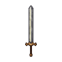
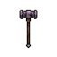
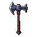

### Short-term gameplay - Fight Mechanics

As Kalev, you are limited to 8 keys (QWER/ASDF) to map unique **elements**.
When combined in a sequence of up to 4, you can create a **spell** or action.

*   **Fight with melee weapons:** Master the smith's hammer and other weapons of the era.
*   **Use magic:** Wield innate ancestral powers and learn new abilities from the factions of Reval.
*   **Control a team:** Recruit and command a party of up to 4 allies in battle.

## TODO
- MELEE VS RANGED
- MAGICK
- WEAPONS
- ARMOR

## 🔮 The Elements of Philosophy

Magic in Reval is not about chanting arcane words, but about imposing one's philosophical will upon reality. The world is shaped by the interplay of fundamental concepts. By mastering these **Elements of Philosophy**, Kalev can forge his own spells and actions.

There are 21 known Elements, grouped into three domains. While Kalev can learn to understand all of them, he can only hold 8 in his mind at any given time (mapped to QWER/ASDF keys).

#### Primal & Metaphysical Elements
*   🌱 **Life (Elu):** Growth, healing, vitality.
*   💀 **Death (Surm):** Decay, finality, undeath.
*   👻 **Spirit (Hing):** The soul, ghosts, ethereal forces.
*   ⏳ **Time (Aeg):** Haste, slowness, causality.
*   🌀 **Chaos (Kaos):** Unpredictability, randomness, entropy.
*   ⚖️ **Order (Kord):** Structure, law, predictability.
*   🧠 **Mind (Mõistus):** Thought, reason, psionics.

#### Natural & Worldly Elements
*   🔥 **Fire (Tuli):** Destruction, passion, warmth.
*   💧 **Water (Vesi):** Change, cleansing, depth.
*   🌍 **Earth (Maa):** Stability, nature, strength.
*   💨 **Air (Õhk):** Freedom, movement, sound.
*   🔗 **Metal (Metall):** Craft, defense, conductivity.
*   🩸 **Blood (Veri):** Lineage, sacrifice, life force.
*   🐾 **Beast (Elajas):** Instinct, ferocity, the wild.

#### Social & Moral Elements
*   🙏 **Faith (Usk):** Belief, devotion, divine power.
*   🎭 **Deception (Pettus):** Lies, illusion, trickery.
*   ✨ **Hope (Lootus):** Inspiration, morale, resilience.
*   😱 **Fear (Hirm):** Terror, control, paralysis.
*   👑 **Dominion (Valdus):** Control over others, territory, power.
*   🕊️ **Freedom (Vabadus):** Liberation, autonomy, breaking bonds.
*   💔 **Sacrifice (Ohver):** Giving up something for a greater cause.

##  blacksmithing: Forging Spells

Spells are not learned from tomes, but **forged** by combining Elements in a sequence of up to 4. The order and combination of Elements determine the final effect. The first Element in the sequence defines the spell's core **intent** or delivery method (e.g., a projectile, a self-buff, an area-of-effect), while subsequent Elements act as **modifiers**, adding properties or altering the effect.

This system allows for immense creativity and tactical flexibility. A player might enter a mission with a set of Elements focused on stealth and illusion, or go in prepared for open warfare with elements of destruction and defense.

### Spellforging Examples

The possibilities are nearly endless, but here are some examples of how Elements can be combined. The final power, cost, and cooldown of a spell are determined by the number and rarity of the Elements used.

| Sequence | Forged Spell | Effect |
| --- | --- | --- |
| `Fire` | **Spark** | A small, fast projectile of fire. |
| `Fire` + `Air` | **Fireball** | A larger, explosive projectile. The Air element gives it area of effect. |
| `Earth` + `Metal` | **Iron Skin** | (Self-cast) Hardens your skin, granting a significant armor bonus for a short time. |
| `Water` + `Life` | **Healing Mist** | (Area-cast) Creates a mist that heals allies who stand within it. |
| `Mind` + `Deception` | **Illusionary Double** | Creates a clone of yourself that draws enemy fire. |
| `Will` + `Dominion` | **Command: Flee** | (Targeted) Forces a single non-elite enemy to run in terror. |
| `Darkness` + `Space` | **Shadow Step** | Instantly teleport a short distance, remaining unseen. |
| `Hope` + `Light` + `Air` | **Beacon of Hope** | (Area-cast) Creates a beacon of light that heals allies, damages undead, and boosts Rebel Morale. The Air element makes it a wide-area pulse. |
| `Blood` + `Sacrifice` + `Death` | **Hemomancy Curse** | (Targeted) Sacrifice a portion of your own health to place a powerful damage-over-time curse on an enemy that weakens them and heals you if they die while it's active. |
| `Justice` + `Faith` + `Fire` | **Judgement** | Calls down a pillar of holy fire on a target. It deals extra damage to those with high "Fear" scores (e.g., oppressive guards). |
| `Time` + `Time` + `Order` | **Stasis Field** | Creates a zone where time is slowed to a crawl for all but the caster. The Order element stabilizes the effect. |
| `Freedom` + `Beast` + `Will` | **Unleash Spirit** | Temporarily transform into a powerful spectral wolf, gaining immense speed and attack power, breaking free from all bonds. |

### Faction Spell Examples

Here are some examples of spells that can be forged using the Elements taught by each faction.

#### Ancestral Legacy (Kalev)
*   🔥 **Forgefire Weapon (`Fire` + `Metal` + `Order`):** Imbues a melee weapon with controlled fire, adding fire damage to each strike.
*   🧱 **Earthen Wall (`Earth` + `Order` + `Order`):** Raises a structured wall of rock from the ground, blocking movement and projectiles.
*   💥 **Unstoppable Strike (`Mind` + `Metal` + `Chaos`):** A powerful melee attack, fueled by focus, that cannot be blocked and shatters enemy armor.
*   🌋 **Seismic Slam (`Earth` + `Chaos` + `Air`):** Slams the ground, sending out a chaotic shockwave that stuns and damages nearby enemies.
*   ✨ **Living Metal (`Metal` + `Life` + `Order`):** For a short duration, your armor regenerates from damage in a structured way.

#### Livonian Order
*   🙏 **Consecrated Ground (`Faith` + `Order` + `Earth`):** Creates an area where allies are healed and enemies take holy damage.
*   ⚔️ **Blade of Judgment (`Faith` + `Order` + `Fire`):** Summons a sword of pure judgment that strikes a single enemy for massive holy fire damage.
*   🛡️ **Shield of Faith (`Faith` + `Order` + `Air`):** Creates a stable, protective barrier around an ally that absorbs a significant amount of damage.
*   😠 **Wrathful Rebuke (`Faith` + `Order` + `Fire`):** An enemy that strikes you is blasted with holy fire, a punishment for their transgression.
*   📜 **Divine Decree (`Order` + `Dominion` + `Mind`):** Forces all enemies in an area to stop fighting and be pacified for a short time.

#### Pagan Cult of Metsik
*   🌳 **Grasp of the Wild (`Earth` + `Life` + `Beast`):** Living roots sprout from the ground, immobilizing all enemies in an area.
*   🐺 **Spirit of the Wolf (`Beast` + `Spirit` + `Air`):** Transform into a swift wolf, increasing movement speed and allowing you to pass through enemies.
*   🌿 **Blessing of the Wild (`Life` + `Water` + `Hope`):** Heals all allies in a large radius and removes negative effects.
*   🐝 **Swarm of Bees (`Beast` + `Chaos` + `Air`):** Summons a swarm of angry bees that attack and distract enemies.
*   🌲 **Uprooted Anger (`Earth` + `Beast` + `Order`):** Animate a tree to fight alongside you under your command for a limited time.

#### Veiled Council
*   🗣️ **Whispers of Madness (`Mind` + `Chaos` + `Deception`):** Causes an enemy to attack its own allies in a fit of paranoia.
*   💨 **Veil of Deception (`Deception` + `Spirit` + `Air`):** Creates a large area of magical shadow, confusing enemies and making you invisible within it.
*   🧠 **Mental Prison (`Mind` + `Order` + `Time`):** Traps an enemy in a psychic cage, freezing them in time and space.
*   ✨ **False Hope (`Deception` + `Hope` + `Spirit`):** Creates an illusion of a powerful ally, drawing enemy attention before exploding.
*   👻 **Erase Presence (`Mind` + `Time` + `Deception`):** Vanish from sight and mind, becoming completely undetectable for a period of time.

#### Black Cloaks
*   📢 **Riotous Shout (`Chaos` + `Hope` + `Air`):** A powerful shout that incites nearby civilians to join your cause and fight for a short time.
*   💔 **Martyr's Gift (`Sacrifice` + `Hope` + `Life`):** You take a large amount of damage, but in return, all nearby allies are fully healed and gain a damage boost.
*   ⛓️ **Chainbreaker (`Freedom` + `Metal` + `Chaos`):** A targeted strike that shatters all magical and physical bonds on an ally.
*   💨 **Smoke and Mirrors (`Deception` + `Fire` + `Air`):** Create a series of small explosions and smoke clouds, causing confusion and allowing for a quick escape.
*   💣 **Unseen Sabotage (`Deception` + `Order` + `Time`):** Place a curse on an enemy structure that will cause it to collapse after a set amount of time.

#### Hanseatic League
*   💰 **Golden Touch (`Dominion` + `Metal` + `Deception`):** Bribe an enemy with fake gold, causing them to fight for you for a short time.
*   📜 **Contractual Obligation (`Order` + `Dominion` + `Mind`):** Mark an enemy with a magical contract. If they move too far from their marked spot, they take massive damage.
*   🤝 **Hostile Takeover (`Dominion` + `Mind` + `Order`):** Permanently convert a non-elite human enemy to your side through force of will and magical law.
*   📈 **Investment Portfolio (`Order` + `Time` + `Metal`):** Place a magical ward on the ground. The longer it remains undisturbed, the more powerful the explosion when triggered.
*   🩸 **Mercenary's Price (`Dominion` + `Blood` + `Sacrifice`):** Pay with your own life force to summon a powerful, heavily armed mercenary to fight for you.

#### Pskov Agents
*   🙏 **Saint's Intervention (`Faith` + `Time` + `Order`):** For a brief moment, all incoming attacks against you are nullified and have no effect.
*   🔥 **Orthodox Zeal (`Faith` + `Order` + `Fire`):** Grant an ally a buff that causes their attacks to burn with holy fire and ignore enemy armor.
*   ⏳ **The Long Wait (`Time` + `Sacrifice` + `Order`):** Place a rune on the ground. After a long delay, it erupts, dealing immense damage to everything in a massive area.
*   👀 **Gaze of the Icon (`Faith` + `Spirit` + `Mind`):** A targeted enemy is frozen in fear, unable to act as they are judged by the saints.
*   🔔 **Kitezh's Bell (`Spirit` + `Air` + `Order`):** A spectral bell tolls, stunning all enemies in a wide radius and revealing their positions.

#### Novgorod Merchants
*   🔥 **Byzantine Fire (`Fire` + `Chaos` + `Water`):** Hurl a flask of volatile liquid that erupts into a sea of inextinguishable fire.
*   🐻 **Bear's Fury (`Beast` + `Blood` + `Chaos`):** Summon a spectral bear that mauls your enemies with savage, chaotic force.
*   💀 **Pskovian Gambit (`Deception` + `Death` + `Spirit`):** Feign death, becoming invisible and intangible. Your next attack deals massive bonus damage.
*   🍯 **Poisoned Honey (`Deception` + `Life` + `Water`):** Offer a "healing" potion to an enemy that instead poisons them, dealing damage over time.
*   🛶 **Ushkuinik Raid (`Chaos` + `Beast` + `Freedom`):** Summon a band of spectral river pirates to attack your enemies with reckless abandon.
