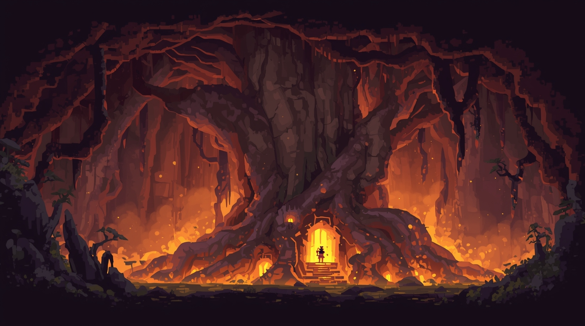
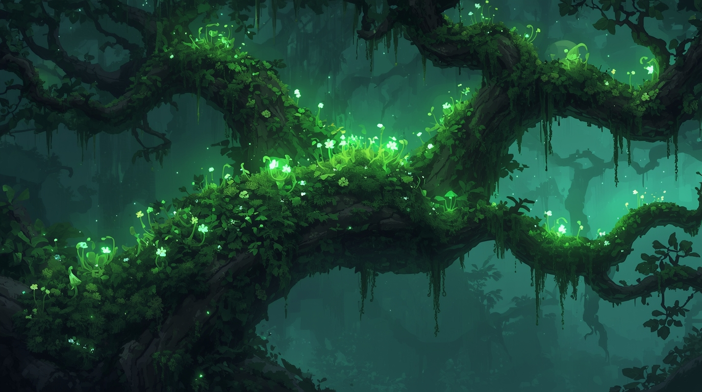

# 🌳 The Inner World: The Hingepuu

Beyond the physical conflict for Reval, there is a battle within Kalev's soul. This is represented by the **Hingepuu** (Soul Tree), a personal world tree that serves as the landscape of Kalev's psyche. The player can visit the Hingepuu during sleep or meditation to take stock of their inner state, commune with the facets of their personality, and grow their spiritual power.

The health and appearance of the Hingepuu are a direct reflection of Kalev's inner balance. A soul in harmony will have a mighty, vibrant oak, while a soul in turmoil will see the tree become withered, scorched, or overgrown with parasites.

## The Seven Hearths of the Soul

The Hingepuu is the source of Kalev's inner power, which is channeled through seven spiritual centers called **Hearths**. These are tangible locations on the tree that can be visited. By stoking these Hearths through experience, completing quests, or performing rituals, Kalev can grow his core attributes. Each Hearth's state directly impacts his abilities in combat, spellforging, and social interactions.

*   **Hearth of Roots** (Root System)
    *   **Core Stats:** Vitality, Stability, Endurance
    *   **Physical Influence:** Governs health pool, resistance to being knocked down.
    *   **Mental Influence:** Increases the power of `Earth` and `Metal` Elements. Increases duration of defensive spells.

*   **Hearth of the Heart** (Base of Trunk)
    *   **Core Stats:** Agility, Dexterity, Reaction Speed
    *   **Physical Influence:** Governs attack speed, dodge chance, and ranged accuracy.
    *   **Mental Influence:** Increases the power of `Water` and `Air` Elements. Reduces spell casting time.

*   **Hearth of the Sun** (Main Trunk)
    *   **Core Stats:** Strength, Raw Power, Intimidation
    *   **Physical Influence:** Governs melee damage, ability to break guards.
    *   **Mental Influence:** Increases the power of `Fire` and `Beast` Elements. Increases raw damage of offensive spells.

*   **Hearth of the Chest** (Large Branch)
    *   **Core Stats:** Charisma, Empathy, Healing Power
    *   **Physical Influence:** Governs effectiveness of ally-affecting shouts.
    *   **Mental Influence:** Increases the power of `Life` and `Hope` Elements. Increases potency of healing/support spells.

*   **Hearth of the Throat** (High Windy Branch)
    *   **Core Stats:** Persuasion, Deception, Leadership
    *   **Physical Influence:** Governs effectiveness of intimidation/rally cries.
    *   **Mental Influence:** Increases the power of `Deception` and `Dominion` Elements. Increases potency of crowd control spells.

*   **Hearth of the Brow** (Treetop Perch)
    *   **Core Stats:** Perception, Wisdom, Spell Cooldown
    *   **Physical Influence:** Governs ability to spot traps, critical hit chance.
    *   **Mental Influence:** Increases the power of `Mind` and `Time` Elements. Reduces spell cooldowns.

*   **Hearth of the Crown** (Sky Above Tree)
    *   **Core Stats:** Faith, Spirit, Elemental Connection
    *   **Physical Influence:** Governs "Willpower" (mana) pool.
    *   **Mental Influence:** Increases the power of `Faith` and `Spirit` Elements. Unlocks 4-Element spellforging.

## The Inner Council: The Four Faces of the Soul

The Hingepuu is inhabited by four archetypal figures from Jungian psychology, representing the core facets of Kalev's psyche. Interacting with them is the key to inner growth and resolving the consequences of your actions. The ultimate goal is **Individuation**: the integration of these faces into a balanced, whole Self.

*   **The Persona**
    *   **Represents:** The Mask / The Smith
    *   **In-Game Role:** The version of Kalev the world sees. His counsel is pragmatic, focused on reputation and fulfilling one's role. He represents **Volition** and **Logic**.
    *   **Associated Hearths:** Throat & Sun
    *   **Gameplay Impact:** Integrating the Persona improves persuasion and deception, strengthening `Dominion` and `Deception` Elements.

*   **The Shadow**
    *   **Represents:** The Unconscious / The Beast
    *   **In-Game Role:** Represents Kalev's repressed anger, fears, and raw power. He is not evil, but primal and untamed. He represents raw **Emotions**.
    *   **Associated Hearths:** Roots & Heart
    *   **Gameplay Impact:** Integrating the Shadow unlocks immense power, boosting "chaotic" Elements like `Fire`, `Beast`, and `Chaos`.

*   **The Anima**
    *   **Represents:** The Inner Feminine / The Muse
    *   **In-Game Role:** Represents Kalev's capacity for empathy, creativity, and intuition. She is the guide to the unconscious and represents **Empathy**.
    *   **Associated Hearths:** Chest & Brow
    *   **Gameplay Impact:** Integrating the Anima unlocks unique dialogue options and strengthening "connecting" Elements like `Life`, `Hope`, `Spirit`, and `Mind`.

*   **The Self**
    *   **Represents:** The Integrated Whole / The Sage
    *   **In-Game Role:** The **goal** of the inner journey. The Self emerges when the other three archetypes are in balance, representing true **Conscience** and enlightenment.
    *   **Associated Hearths:** Crown
    *   **Gameplay Impact:** Achieving moments of integration grants significant, permanent bonuses to all Hearths. Full integration is the key to Kalev's ultimate potential.

### The Gameplay Loop of the Psyche

1.  **Action & Consequence:** An action in the real world (e.g., a moral choice in a quest) creates ripples in the inner world.
2.  **Inner Turmoil:** The archetypes come into conflict, causing an imbalance in the Hingepuu and its Hearths (e.g., a violent act empowers The Shadow but distresses The Anima).
3.  **Confrontation & Dialogue:** The player must visit the Hingepuu, travel to the affected Hearths, and speak with the archetypes to understand and resolve the conflict.
4.  **Integration or Imbalance:** Successfully navigating these inner challenges leads to **Integration**, providing permanent bonuses. Ignoring them leads to **Imbalance**, which can result in gameplay penalties (e.g., failed speech checks, combat debuffs) until the inner conflict is resolved.
