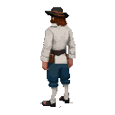

# Reval Rebel

Indie Action RPG withg rogue-like elements in semi-fictional 14th-century Estonia. 

A moody, atmospheric feel that blends Hanseatic trade, Baltic folklore, and early Christianity with a touch of gallows humor. 

Inspired by Hades, Fallout, Disco Elysium, Magicka, Skyrim, Conan the Cimmerian.

Current state: `Drafting game design document & concept art`

## 📖 Core Narrative
The year is 1342. A fragile peace hangs over Reval, but the air is thick with resentment. The St. George's Night Uprising is a spark waiting to ignite.

"Reval Rebel" casts you as __Kalev__, a smith from the lower town who stands at the crossroads of history. You want nothing more than to be left alone, but the city itself is a powder keg. Estonian peasants whisper of rebellion, Hanseatic merchants tighten their grip, and the knights of the Livonian Order watch over all with an iron fist. You are dragged into the simmering conflict when a secret is entrusted to you—a plan, a weapon, a truth—that could either start the uprising or crush it before it begins.  

Caught between the ruthless Livonian Order, the scheming merchants, and the ancient, chaotic power of the land itself, you must decide where your loyalties lie. Your choices will determine not if the rebellion happens, but how.

Will you become the hero your people whisper about — a new "Kalevipoeg", or will you forge your own path to order and civilization through the chaos, using your wits and your hammer to survive? The choices you make will determine whether the rebellion becomes a footnote in history or the dawn of a new era.

## 🦸 The Hero: Kalev the Smith

You are Kalev, an Estonian smith. To the German lords, you're just another pair of hands to shoe their horses. To your own people, you're a stubborn man with a strong back and a cynical tongue. But there's more to you than meets the eye.

- The Name of a Giant: Your name, "Kalev," is the same as the mythical giant-king. Your strength is unusual, and perhaps there's a flicker of ancient power in your bloodline.
- A Smith's Hands: You see the world through the eyes of a craftsman. Your hammer is not just a tool; it's an extension of your will.
- A Reluctant Rebel: You are not a hero by choice. The uprising is a nuisance that has overturned your life. Your journey is one of survival, but your actions might accidentally inspire hope... or bring about greater ruin. Your dialogue can be witty, sarcastic, or grimly pragmatic, reflecting a man caught in events far larger than himself.
- "Magical" forces. You have some supernatural powers (after you ate mushroom soup). Unlock more by aligning with factions.

## Game Details

- [FIGHT GAMEPLAY](./GAMEPLAY-FIGHT.md)
- [GAMEPLAY](./GAMEPLAY.md)
- [NPC FACTIONS](./assets/characters/README.md)
- [LOCATIONS](./scenes/)
- [STORYLINE](./STORY.md)
- [QUESTS](./QUESTS.md)
- [BESTIARY](./assets/bestiary/)
- [MINI-GAMES](./MINI_GAMES.md)
- [HISTORICAL CONTEXT](./HISTORY.md)

## 🎨 Visual Style
Color Palette: Earth tones, candlelight glow, icy blues and mossy greens.
Style: Inspired by Baltic woodcut art, stained-glass motifs, and illuminated manuscripts, but with surreal twists.
Architecture: Gothic and Hanseatic, but slowly overtaken by creeping pagan symbols.

## 🎻 Music & Sound
Soundtrack: Blend of medieval Baltic folk (kantele, runosong) with ambient electronics and minimalistic ritual drums.
Dynamic Sound Design: Pagan areas filled with whispers and wind chimes; Christian zones echo with choirs and bells.
