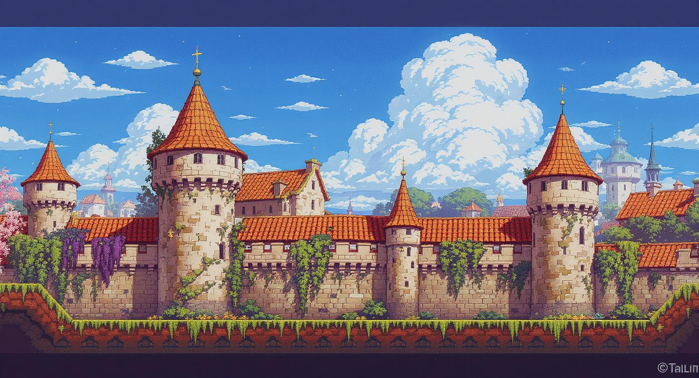

## Reval Rebel

2D Indie RPG game located in Tallinn, Estonia in medieval time
moody, atmospheric feel that blends Hanseatic trade, Baltic folklore, early Christianity, and pagan remnants. 

🎭 Core Narrative
"Reval Rebel" tells the story of a young outsider—possibly a bastard noble, runaway serf, or pagan orphan—caught between Hanseatic power, Livonian Order control, and pagan folklore in 14th-century Reval (Tallinn). As tensions rise between merchants, knights, and peasants, a rebellion simmers beneath the city’s cobbled streets.

Possible Main Plot Arcs:
The Hanseatic Uprising: Corrupt merchant guilds exploit the lower classes—can you organize a revolt, or infiltrate them to change from within?

The Hidden Forest: Explore pre-Christian Estonian beliefs still surviving in secret groves. Spirits, forest gods, and forgotten rites offer you aid… or madness.

The Dual Faiths: Caught between Germanic Christianity and native animism, you must choose how (or whether) to navigate and exploit both worlds.

The Disappearing Nobles: A secret order may be kidnapping/assassinating Baltic-German elites. Are they protectors or villains?

🏰 Setting & Exploration
Tallinn/Reval should feel alive, with distinct areas, including:

Upper Town (Toompea): Castle, cathedral, and knight order’s fortress.

Lower Town: Bustling with merchants, guildhalls, spies, and revolutionaries.

Harbor District: Smuggling routes, Hansa ships, and black markets.

Sacred Groves: Hidden areas outside the city walls for pagan rituals.

Undercity: Secret catacombs and tunnels beneath Tallinn (some real, some mythic).

Time should pass dynamically, with day/night cycles affecting patrols, secret meetings, and magical events (e.g., blood moon unlocking a forest path).

⚔️ Factions
The Hanseatic League: Wealthy German merchants. Provide tech, trade advantages, and espionage tools.

Livonian Order: Theocratic knights. Offer combat training and moral codes—but with authoritarian control.

The Pagan Cult of Metsik: Forest-dwelling mystics with ancient Estonian magic and cryptic motives.

The Black Cloaks: A peasant rebellion-in-the-making, hidden in plain sight among bakers, smiths, and fishermen.

The Veiled Council: Shadowy city elite pulling strings behind both church and guilds.

You can ally, betray, or infiltrate these groups. Actions affect how the city changes over time.

🧙 Gameplay Mechanics
Faction Alignment System: Dynamic shifting of alliances, not locked-in. Your actions and decisions sway outcomes more than dialogue trees.

Urban Rebellion Sim: Organize protests, sabotage shipments, bribe guards, spread leaflets (like magical “runes” or coded writings).

Ancestral Magic Tree: Unlock forgotten Estonian magic based on nature, runes, animal spirits, dreams.

Crafted Rituals: Not just spells—create your own rites (e.g., a storm dance that causes lightning if timed with real weather).

Historical Realism meets Folk Fantasy: No dragons, but a black elk might speak to you in riddles beneath the moon.

🎨 Visual Style
Color Palette: Earth tones, candlelight glow, icy blues and mossy greens.

Style: Inspired by Baltic woodcut art, stained-glass motifs, and illuminated manuscripts, but with surreal twists.

Architecture: Gothic and Hanseatic, but slowly overtaken by creeping pagan symbols.

🎻 Music & Sound
Soundtrack: Blend of medieval Baltic folk (kantele, runosong) with ambient electronics and minimalistic ritual drums.

Dynamic Sound Design: Pagan areas filled with whispers and wind chimes; Christian zones echo with choirs and bells.

📜 Quests (Examples)
"The Silent Baker": A mute baker's loaves cause hallucinations. Is he a prophet or a poisoner?

"The Elk with the Iron Eye": A mythical beast demands a debt from your ancestor—find its payment before it takes your soul.

"Ashes for Amber": A widow offers magical amber for her husband's bones from a knight’s crypt.

"The Copper Rat": Uncover the spy network hiding in Tallinn's sewers, using enchanted vermin.

🕯️ Optional Twist Ending Paths
Reval Burns: Lead a full uprising, overthrow all factions, and rule as a visionary—or tyrant.

The Pact: Merge pagan and Christian powers to create a secret cult that controls the city’s soul.

Forgetfulness: Choose to give up rebellion and vanish into the woods, becoming myth yourself.

