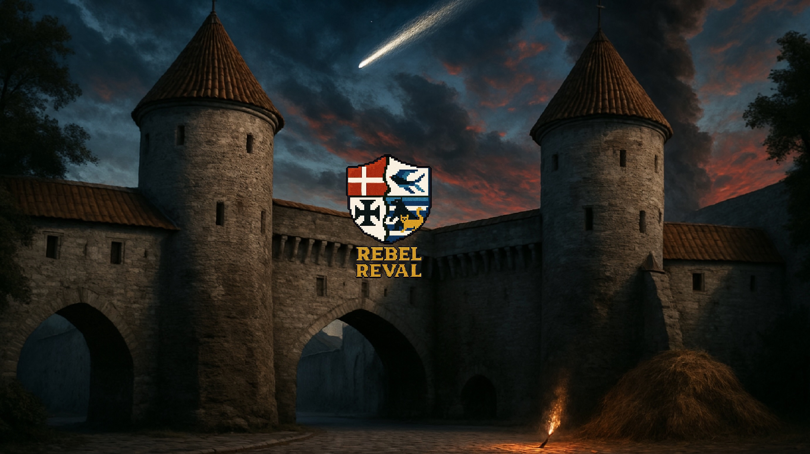
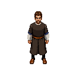
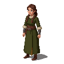
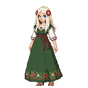

# Reval Rebel

**Reval Rebel** is a 2D narrative action RPG about a blacksmith caught in the middle of a war his own hands supply.

It is spring 1343 in Reval — present-day Tallinn — days before the St. George's Night Uprising. Kalev, a lower-town smith, takes commissions from every side of the coming conflict: knights, merchants, rebels, spies. He can do honest work, hide a useful feature, or introduce a flaw. What he forges comes back — as protection, evidence, betrayal, or a blade at someone's throat — through the uprising, the siege of Reval, the crushing of the rebellion, and the years of iron-fisted aftermath that end with the land itself being sold.

The history cannot be prevented. Who survives it, what each side carries into it, and what Kalev becomes — that is the game.



> Reval Rebel is in pre-production with an early playable Godot prototype. See [`TODO.md`](./TODO.md) for the executable roadmap, [`docs/SETUP.md`](./docs/SETUP.md) to run it, and [`docs/MAP_AUTHORING.md`](./docs/MAP_AUTHORING.md) for the production compact/chunked map workflow ([ADR 0009](./docs/adr/0009-map-blueprint-authoring-architecture.md), [ADR 0010](./docs/adr/0010-large-map-runtime-chunking.md)). The scope described here was widened from a single-district campaign to a three-act faction RPG by [ADR 0008](./docs/adr/0008-three-act-campaign-and-faction-scope.md); the playable MVP still ships first.

## The heart of the game

> Can a craftsman remain innocent when every object he makes becomes someone else's instrument of power?

Four ideas guide the project:

- **The forge is your lever.** Kalev is not the chosen warrior of the uprising; he is the man who makes its tools. Faction power flows through his anvil. A commission has a customer, a hidden purpose, and a small number of meaningful modifications — forging is narrative problem-solving, and it is how the player touches the war.
- **Objects and people remember.** Every forged object carries a persistent record. A spearhead sabotaged in spring shatters in someone's hand at the siege; a gate chain forged true holds when it matters. Consequences surface in named characters, changed districts, patrols, prices, and dialogue — never in a universal morality meter.
- **History holds its course; people don't have to.** Attested events — the signal fires, the siege of Reval, Kanavere Bog, Sõjamäe, the killing of the Four Kings at Paide, the 1346 sale of Estonia — happen on schedule. The player steers the human cost inside them: who lives, who trusts whom, what evidence remains, and how Kalev is remembered.
- **You fight with what you forged.** Combat is small, direct, and personal — hammer, guard, dodge, one equipped forge technique — and every piece of gear on Kalev's body, and much of what his enemies carry, passed through his hands. Your past choices are literally the weapons in play.

## How it plays

The game runs on a day/night rhythm inside authored story phases:

1. **By day**, take commissions, investigate who benefits and what customers hide, trade, and move through the districts talking to people whose allegiances are in motion.
2. **At the forge**, complete the work honestly, alter it, or sabotage it when Kalev has the knowledge and materials. Every choice writes a forged record.
3. **By night**, face the consequences in compact authored missions — sabotage, theft, escort, defense, escape — with combat and non-combat routes.
4. **In the aftermath**, watch people, places, faction standing, patrols, and supplies react.
5. **At Hingepuu**, reflect. The soul-tree gives choices emotional weight without grading them.

**Factions keep a ledger, not a score.** Each of the eight active factions tracks its standing with Kalev through explicit remembered events — works delivered, flaws discovered, favors, betrayals. Standing opens and closes quests, prices, routes, and protection. There is no join-a-team menu; allegiance emerges from the ledger until St. George's Night forces one decision that cannot stay ambiguous.

Time advances through authored phases, not a simulated clock. Dialogue is written and deterministic. Stealth comes from patrol avoidance and authored alternate routes, not a stealth simulation.

## Factions

Every faction believes it is in the right, and none is a clean moral team. Roster entries follow the confidence labels in [`docs/CANON.md`](./docs/CANON.md).

| Faction | Wants | Shadow |
|---|---|---|
| **The Danish Crown** | Keep its distant, indebted rule of Estonia | Taxes its subjects into ruin to fund a fading claim |
| **The Livonian Order** | A pious land under one faith and one law | Order becomes fanaticism; massacre becomes policy |
| **The Hanseatic guilds** | Trade above all; a profitable, quiet Reval | Lives and traditions priced like cargo |
| **The Harju Kings** | Freedom; the rural heart of the uprising | Liberation slides into indiscriminate slaughter |
| **The Black Cloaks** | Liberation from inside the walls — smiths, artisans, the underclass | Terror is a tool that doesn't stay aimed |
| **The Cult of Metsik** | The old ways, the sacred groves, the old gods | Would burn the new world whole to regrow the old |
| **Pskov & Novgorod emissaries** | Opportunity in the chaos; a weakened Order | Any ally is sellable at the right price |
| **The Vitalienbrüder** | Plunder; chaos is the business model | No flag, no loyalty, no restraint |

Remaining historical powers — the bishoprics, Lithuania, the Golden Horde, the Blackheads as a distinct body — stay present as background canon and dialogue, not as playable quest lines.

## The campaign

| | Act 1 — The Simmering City | Act 2 — The Fire of Rebellion | Act 3 — The Iron Harvest |
|---|---|---|---|
| **When** | Spring 1343, to the night of April 23 | April–May 1343 | 1344–1346 |
| **Where** | Lower Town, market & civic quarter, north quarter | Reval under siege; Harju village, rebel camp, sacred grove, Pärnu, the battlefields | The occupied forge; Padise, Paide, Saaremaa (Pöide) |
| **Focus** | Commissions, investigation, allegiance | Night missions, the siege, forged objects returning | Coerced work, quiet resistance, what remains |
| **Climax** | St. George's Night at Viru Gate — Open, Seal, or Break | The Four Kings at Paide | The sale of Estonia, 1346 |

The story begins when Captain Henning brings Kalev a seized spearhead bearing his maker's mark. Kalev's apprentice is missing, rejected iron has disappeared, and the forge ledger can implicate more than one person. Act 1's five day/night cycles and eight quests build to St. George's Night, where the Open/Seal/Break decision at Viru Gate is no longer the end of the story — it is the shape of the war Kalev must live through. Acts 2 and 3 replay his choices back at him: objects he forged resurface in siege encounters, people he saved or sold reappear on both sides, and the endings are families of outcomes for Kalev, the forge, the people, and the land.

Target length is 15–20 hours across the three acts, with replay value in branches and consequences, not procedural runs.

**The vertical slice is the MVP.** It covers the prologue and **A Bitter Brew** in four reusable spaces, and must prove that one forging choice changes a night encounter, the following phase, and at least two character reactions before any act-scale production begins.

## Characters

<p align="center">
  
  
  
</p>

The story follows seven core characters across all three acts: [Kalev](./docs/CHARACTERS/kalev.md), [Mart](./docs/CHARACTERS/mart.md), [Aita](./docs/CHARACTERS/aita.md), [Kaja](./docs/CHARACTERS/kaja.md), [Captain Henning](./docs/CHARACTERS/henning.md), [Jürgen Witte](./docs/CHARACTERS/jurgen.md), and [Ellen Luik](./docs/CHARACTERS/ellen.md). Around them, each active faction contributes a small cast of named figures promoted from the [legacy roster](./characters/README.md) through the character-brief process in [`docs/CHARACTERS/`](./docs/CHARACTERS/README.md).

Kalev is a fixed protagonist with no amnesia and no character creator; there is no party control — allies act in authored missions, not under player command.

## World and tone

Reval is a Danish-ruled, German-elite city with overlapping legal, religious, and linguistic communities, surrounded by a countryside on the edge of revolt. The game world is hub-based: dense handcrafted districts inside the walls, and a travel layer connecting authored world locations outside them — village, monastery, castles, groves, battlefields — most of which already exist in the repository as inactive, contract-tested map prototypes awaiting activation.

Rural violence, the siege, and the reprisals stay historically anchored; an uprising inside Reval's walls is treated as alternate history at the act boundary. Folklore is rare and ambiguous: fragmentary old-faith beliefs, never a complete fantasy religion or a spell system. Named people, events, institutions, buildings, and beliefs are marked as `attested`, `plausible composite`, `folklore`, or `invented` in [`docs/CANON.md`](./docs/CANON.md).

## Visual direction

The game presents as a fixed-camera 2:1 painted isometric view in the tradition of Fallout and Stoneshard, while gameplay logic (collision, navigation, interaction) stays on a simple orthogonal 2D plane. Maps are declarative, contract-tested definitions; the art that dresses them — terrain, buildings, props — is AI-generated under a locked style specification. Architecture draws from medieval Reval; candlelight, icy blues, earth tones, and mossy greens shape the mood.

Production characters come from a shared low-poly rig with per-character texture and equipment swaps, rendered through the fixed orthographic camera. The decision and its rationale live in [`docs/adr/0007-ai-generated-isometric-presentation.md`](./docs/adr/0007-ai-generated-isometric-presentation.md); scale, palette, pivots, shadows, and readability rules are tracked in [`docs/ART_BIBLE.md`](./docs/ART_BIBLE.md).

## Built by AI agents

This game is produced end to end by AI agents — code, content, art, music curation, and documentation — with a human maintainer acting as product owner and reviewer. That is a design constraint, and the architecture serves it:

- **Maps are data.** `MapBlueprint` is the compact human/AI source, compiled deterministically to the existing contract-tested `MapDefinition`; see the [map-authoring guide](./docs/MAP_AUTHORING.md) and [ADR 0009](./docs/adr/0009-map-blueprint-authoring-architecture.md).
- **Quests are data.** Dialogue, quests, items, and characters are schema-validated JSON packages; the quest-content pipeline (P4) turns "add a quest" into an agent task with generated branch-traversal tests. Content volume in Acts 2–3 depends on this, not on hand-wiring scenes.
- **Art is generated under contract.** Materials and textures come from the style-lock kit with provenance rows in [`assets/SOURCES.csv`](./assets/SOURCES.csv); characters are rig variants, not bespoke animation sets.
- **Dialogue is authored offline.** Agents write and validate it at development time; there is no runtime LLM, generated quest, or free-text NPC chat in the shipped game ([ADR 0003](./docs/adr/0003-authored-offline-dialogue-and-prohibit-runtime-llm.md)).
- **Every task is verifiable.** Work enters [`TODO.md`](./TODO.md) as `ID | deps | deliverable | verify` and closes only against its verification line, per the task contract in [`AGENTS.md`](./AGENTS.md).

## Scope

The three-act campaign includes:

- Kalev as fixed protagonist; the forge as hub; the commission → investigation → modification → consequence → reflection loop;
- eight active factions with ledger-based standing and quest lines; seven core characters plus faction casts;
- Reval districts (Lower Town, market/civic, north quarter) and authored world locations activated from existing prototypes;
- night-mission templates (sabotage, theft, escort, defense) with combat and non-combat routes;
- small hammer combat, self-forged gear, and no more than three forge techniques;
- authored dialogue, explicit consequence state, ambiguous folklore, and act-spanning forged-object recall;
- ending families for Kalev, the forge, the people, and the land.

It does **not** include:

- an open world, seamless Reval, or playable campaigns in Riga, Dorpat, or other cities;
- runtime LLM dialogue, generated quests, or procedural runs;
- party control, army or fleet battle simulation, tower-capture strategy, or survival simulation;
- Living City meters, NPC-allegiance arithmetic, or any universal morality score;
- sprawling crafting trees, randomized loot, weapon families, or a blacksmith rhythm minigame;
- a complete pagan magic system or the legacy 21-element and NATURAL-aspects systems;
- the non-canon 1351 plague epilogue.

Ideas outside this boundary are reference material, not promised features. A major addition must replace comparable scope, be recorded in an ADR, and receive a verifiable `TODO.md` entry before implementation ([ADR 0008](./docs/adr/0008-three-act-campaign-and-faction-scope.md) is the record for the current boundary).

## Development status

The repository currently has:

- a Godot 4.7 project with a main menu, player movement, scene transitions, the converted Lower Town slice rendering through the 3D orthographic view layer, and the persistent quick-access menu;
- **D-003 complete:** walkable eastern slice with the Kalev rig, Mart conversation, anvil spearhead pickup into the bag UI, and session re-entry that keeps placement/ownership in `GameState`;
- **D-004 open:** package that demo flow through the desktop export preset and capture a walkthrough linked from this README (export smoke alone is not enough);
- inactive contract-tested outdoor map prototypes (market/civic, north, south, Toompea, and others) awaiting act-gated activation;
- documented headless import and playable-room smoke checks, a hardened Godot test harness, schemas and Python validation for authored content, map-pipeline gates, and CI for the engine pin, content, tests, imports, and export smoke.

Vertical-slice systems beyond the demo loop (full combat room, enemies, night consequence, faction ledger) remain incomplete. Delivery order is strict: **playable demo → vertical-slice MVP → Act 1 → Act 2 → Act 3**, and the next work is deliberately ordered in [`TODO.md`](./TODO.md); legacy documents do not silently expand that scope.

## Run the project

Install the pinned Godot version from [`.godot-version`](./.godot-version), then open [`project.godot`](./project.godot) in the editor and press **F5**. Platform-specific setup and headless commands are in [`docs/SETUP.md`](./docs/SETUP.md).

Useful repository checks:

```bash
godot --headless --script tools/run_godot_tests.gd
python3 tools/validate_content.py content/examples/valid content/examples/support
python3 tools/validate_asset_sources.py
python3 tools/generate_active_docs_report.py --check
```

## Project guide

| Document | Purpose |
|---|---|
| [`TODO.md`](./TODO.md) | Ordered, executable work |
| [`AGENTS.md`](./AGENTS.md) | Repository map, commands, constraints, and task contract |
| [`docs/CANON.md`](./docs/CANON.md) | Timeline, terminology, names, and historical confidence |
| [`docs/CHARACTERS/`](./docs/CHARACTERS/README.md) | Active cast briefs and relationships |
| [`docs/ART_BIBLE.md`](./docs/ART_BIBLE.md) | Visual target, scale, palette, and readability rules |
| [`docs/SETUP.md`](./docs/SETUP.md) | Editor installation, import, startup, tests, and export |
| [`docs/MAP_AUTHORING.md`](./docs/MAP_AUTHORING.md) | Compact map-blueprint primitives, stable IDs, compiler architecture, validation, and migration policy |
| [`docs/adr/`](./docs/adr/) | Product and technical decisions |
| [`assets/SOURCES.csv`](./assets/SOURCES.csv) | Asset provenance, rights, and approval metadata |

Root design documents, much of `story/`, and the older faction and location indexes are preserved as research and legacy material. Individual seeds from them (faction hooks, quest ideas, locations) become active only through reconciliation with this README and a strict task in [`TODO.md`](./TODO.md).

## Map pipeline documentation

- [Compact map authoring, validation, migration, scale budgets, and limitations](./docs/MAP_AUTHORING.md)
- [ADR 0009: canonical MapBlueprint authoring](./docs/adr/0009-map-blueprint-authoring-architecture.md)
- [ADR 0010: compiled-map runtime chunking and persistence](./docs/adr/0010-large-map-runtime-chunking.md)

Use `tools/run_map_pipeline_ci.sh all` for the production parser/compiler/audit/persistence/parity/benchmark gates. Migrate maps individually and only with reviewed parity protection.
