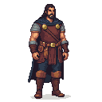
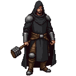

# Reval Rebel

Indie Action RPG withg rogue-like elements in semi-fictional 14th-century Estonia. Features rogue-like game elements, AI-NPCs, 2d (hex-isometric) views.

A moody, atmospheric feel that blends Hanseatic trade, Baltic folklore, and early Christianity with a touch of gallows humor. 

Inspired by Hades, Fallout, Skyrim, Conan the Cimmerian, Rome 42 AD.

Current state: `Drafting game design document & concept art`

## 📖 Core Narrative
The year is 1342. A fragile peace hangs over Reval, but the air is thick with resentment. The St. George's Night Uprising is a spark waiting to ignite.

"Reval Rebel" casts you as __Kalev__, a smith from the lower town who stands at the crossroads of history. You want nothing more than to be left alone, but the city itself is a powder keg. Estonian peasants whisper of rebellion, Hanseatic merchants tighten their grip, and the knights of the Livonian Order watch over all with an iron fist. You are dragged into the simmering conflict when a secret is entrusted to you—a plan, a weapon, a truth—that could either start the uprising or crush it before it begins.  

Caught between the ruthless Livonian Order, the scheming merchants, and the ancient, chaotic power of the land itself, you must decide where your loyalties lie. Your choices will determine not if the rebellion happens, but how.

Will you become the hero your people whisper about — a new "Kalevipoeg", or will you forge your own path to order and civilization through the chaos, using your wits and your hammer to survive? The choices you make will determine whether the rebellion becomes a footnote in history or the dawn of a new era.

## 🦸 The Hero: Kalev the Smith
You are Kalev, an Estonian smith. To the German lords, you're just another pair of hands to shoe their horses. To your own people, you're a stubborn man with a strong back and a cynical tongue. But there's more to you than meets the eye.

- The Name of a Giant: Your name, "Kalev," is the same as the mythical giant-king of Estonia. Some see it as a prophecy, others as a cruel joke. Your strength is unusual, and perhaps there's a flicker of ancient power in your bloodline.
- A Smith's Hands: You see the world through the eyes of a craftsman. Your hammer is not just a tool; it's an extension of your will. You can feel the secrets in stone and the stories in steel.
- A Reluctant Rebel: You are not a hero by choice. The uprising is a nuisance that has overturned your life. Your journey is one of survival, but your actions might accidentally inspire hope... or bring about greater ruin. Your dialogue can be witty, sarcastic, or grimly pragmatic, reflecting a man caught in events far larger than himself.
- Spiritual force. You have supernatural powers. Depending on the factions, you can align either with polytheistic or with monotheistic powers.

## ⚔️ Factions
You can ally, betray, or infiltrate these political forces. Your actions will determine the fate of Reval and the future of Estonia. Each faction offers unique quests, abilities, and endings.

**USER MUST CHOOSE TO JOIN EITHER RULERS OR REBELS**

### Ruling Factions

These factions represent the established, foreign powers ruling over Reval. 
They represent civilization, Christianity, stability, power, hierarchy, and advanced resources, but at the cost of natives freedom.

**The Danish Crown** 🇩🇰 
-   **Motivation:** To maintain their tenuous hold on the Duchy of Estonia, extract as much tax revenue as possible, and prevent the Livonian Order from seizing full control. They are a fading power, ruling in name only.
-   **Core NPC:** **Viceroy Konrad Preen**, the Danish governor (capitaneus Revalie). A weary, aging diplomat who is more interested in securing a comfortable retirement than in governing effectively. He is pragmatic and can be bribed or persuaded, but his loyalty is ultimately to a distant king who has all but forgotten this northern outpost.

-   **Presence:** Toompea Castle (Reval).

**The Hanseatic League** 🇪🇺
-   **Motivation:** Profit and control. The League's merchants, led by the powerful guilds of Reval, see the uprising as a threat to their trade monopolies. They are not warriors, but their wealth gives them immense influence. They fund the Livonian Order, bribe city officials, and use their extensive network of spies to protect their interests.
-   **Core NPC:** **Jürgen von League**, a wealthy and ruthless amber merchant who unofficially speaks for the League. He is a master of economic warfare, offering you advanced technology, access to smuggling rings, and vast sums of gold in exchange for services that secure the League's dominance.
-   **Presence:** St. Olaf's Guild Hall (Reval), The Sunken Harbor District (Reval).

**The Livonian Order** ✠
-   **Motivation:** Faith and purity. The Order sees itself as the sword of Christendom, tasked with rooting out paganism and imposing divine order on a savage land. They are the true military power in the region, and they view the Danish Crown with contempt and the Estonians as little more than heathens to be converted or crushed.
-   **Core NPCs:** **Brother Burchard von Dreileben**, a zealous and battle-hardened knight of the Order. He is a formidable warrior and a charismatic leader, offering you access to elite combat training, blessed weaponry, and the chance to fight for what he believes is a righteous cause. He is unyielding in his faith and merciless to his enemies.

- Brother Goswin von Herike - commander in Viljandi
- Arnd von Herke
-   **Presence:** Toompea Castle (Reval), The Cathedral of Saint Mary (Reval), Wesenberg (Rakvere), Viljandi Castle, Padise Monastery.

### The Rebel Factions

These factions represent the native Estonian resistance. 
They represent rebellion, decentralization, grassroot nature powers, flexibility.
They are outgunned and outmaneuvered, but they have the support of the people and a deep connection to the land itself.

**The Harju Kings** ✊🏻
-   **Motivation:** Freedom. The main, rural-based military force of the uprising, born in the fields of Harju County. They are farmers and villagers who have taken up arms against their oppressors. They are the heart of the rebellion's military power, fighting in open battles.
-   **Core NPCs:** 
    - **Lembit Helme**, A stern village elder from Harjumaa with a gift for oratory and negotiation. Known for rallying disparate clans with his "fire-sermons" in the forests near Padise.
    - **Kaja Lahekivi**, A cunning nobleman's daughter who turned against the Danish overlords. Led a covert network of messengers between Saaremaa and mainland rebels.
    - **Jüri Ratnik** A former manor blacksmith from Läänemaa who forged weapons and alliances alike. Called "Iron Hand" by his followers, feared by knights for his brutal efficiency.
    - **Urmas Laar** A zealot and mystic from the eastern marshlands, blending ancient Finno-Ugric rites with anti-crusader rhetoric. Claimed visions from Taara led him to battle.
-   **Presence:** A Peasant Village (Harju County), The Hill of the First Flame (Harju County), The Rebel Kings' Camp, Pärnu.

**The Black Cloaks** 🌃
-   **Motivation:** Liberation from the inside. Radicals. The urban guerilla arm of the rebellion within Reval's walls. Composed of smiths, artisans, and the city's underclass, they specialize in stealth, sabotage, intelligence, and street-level warfare.
-   **Core NPC:** **Lembit Helme**, a charismatic and impulsive blacksmith who has become the reluctant leader of the Reval uprising. He is a man of action, not words, and he offers you a place at the heart of the rebellion, fighting for the freedom of your people.
-   **Presence:** The Smith's Forge (Reval), The Whispering Market (Reval), The Sunken Harbor District (Reval).

**The Cult of Metsik** 🍀
-   **Motivation:** The Old Ways. A secretive cult of forest-dwellers who worship the ancient Estonian gods. They see the Christian invaders as a plague upon the land and believe that the uprising is a chance to restore the old ways. Their magic is powerful and chaotic, drawn from the sacred groves and the spirits of the earth.
-   **Core NPC:** **Ellen Luik**, the enigmatic high priestess of the cult. She is a powerful seer and a master of spirit magic, offering you access to ancient rituals, animal allies, and the raw, untamed power of the land itself. Her motives are cryptic, and her loyalty is to the spirits, not to any mortal cause. She seems to tell stories to children that surround her 
-   **Presence:** The Sacred Grove of Taara, The Sacred Lake of Saaremaa.

### The Neutral Factions

These factions are not directly involved in the conflict between the Rulers and the Rebels, but they have their own agendas and can be powerful allies or dangerous enemies.

**The Veiled Council** 🕷️
-   **Motivation:** The long game. A secret society of Reval's oldest and wealthiest German families who believe that both the Danes and the Livonian Order are temporary. They manipulate events from the shadows, seeking to create a new, independent state under their own control. They are masters of espionage, assassination, and political intrigue.
-   **Core NPC:** **"Mart the Weaver"** a mysterious figure who communicates only through coded messages and intermediaries. They offer you access to a network of spies, saboteurs, and assassins, but their true motives are always hidden, and their loyalty is only to the Council's ultimate ambition.
-   **Presence:** Operates secretly throughout Reval, with influence in high-society locations like St. Olaf's Guild Hall.

**The Vitalienbrüder** 🏴‍☠️
-   **Motivation:** Plunder and chaos. The remnants of a once-powerful pirate brotherhood, now reduced to a scattered band of raiders and mercenaries. They have no loyalty to any flag and are interested only in profiting from the chaos of the uprising. They are masters of naval combat and can be hired to attack shipping, smuggle goods, or create diversions.
-   **Core NPC:** **"Ironhand" Störtebeker**, a grizzled and pragmatic pirate captain who leads the largest band of Vitalienbrüder in the Baltic. He is a man of his word, but his word is always backed by a sharp axe and a lust for gold.
-   **Presence:** Paldiski (Rågervik), The Sunken Harbor District (Reval).

**The Pskov Agents** 🐆
-   **Motivation:** Opportunity and Destabilization. The Republic of Pskov, a powerful Russian principality, watches the chaos in Estonia with keen interest. Historically, the Estonian rebels sent envoys to Pskov, seeking an alliance. In the game, Pskov's motives are ambiguous. Are they genuine allies, or are they simply exploiting the uprising to weaken their Teutonic and Danish rivals?
-   **Core NPC:** **Михаил Коловрат**, a cunning and resourceful Pskovian agent operating under the cover of a fur trapper. He knows Reval's streets intimately and offers access to a network of spies, saboteurs, and assassins. He can provide intelligence on the Livonian Order, but his true allegiance remains shrouded in mystery.
-   **Presence:** The Whispering Market (Reval), operating undercover.

 **The Novgorod Republic Trade Delegation** 🌞
-   **Motivation:** Profit and Plausible Deniability. While historical records show no direct involvement from Novgorod in the uprising, this faction represents a "what if" scenario. The powerful Republic of Novgorod is officially neutral, concerned only with protecting its lucrative trade routes. However, they are not above profiting from chaos. They might secretly fund the rebels, the Order, or both, depending on which outcome best serves their economic interests.
-   **Core NPC:** **Яна Подаяльная**, the head of the Novgorodian trade delegation in Reval. A shrewd and calculating diplomat, she is a master of economic statecraft. She can be a powerful ally, offering vast resources, political influence, and a safe escape route—but her support always comes at a steep price, and her loyalty is ultimately to the bottom line.
-   **Presence:** St. Olaf's Guild Hall (Reval).

## 🏰 Setting & Exploration (scenes/levels) 🌍
The game world is a condensed, semi-fictionalized representation of 14th-century Estonia. Locations are divided into two types: Core Locations, which are always accessible, and Dynamic Locations, whose state or availability changes dramatically with the start of the uprising (Phase 2).

### Core Locations (Always Accessible)
These locations form the backbone of the game world. While their atmosphere may change based on the "Living City" meters, they are always present and explorable.

-   **The City of Reval (Lower Town):**
    -   **The Smith's Forge:** Your home base and workshop.
    -   **St. Olaf's Guild Hall:** The center of Hanseatic power and commerce.
    -   **The Whispering Market:** A hub for information, goods, and spies.
    -   **The Sunken Harbor District:** A maze of docks and smuggling tunnels.
    -   **Toompea Castle (Domberg):** The heavily guarded seat of Danish and Livonian power.
    -   **The Cathedral of Saint Mary:** The spiritual heart of the Livonian Order.
-   **Livonian Order Strongholds:**
    -   **Wesenberg (Rakvere):** A key Order fortress and regional base.
    -   **Viljandi Castle (Fellin):** A formidable stronghold symbolizing the Order's military might.
-   **The Wider World:**
    -   **The Sacred Grove of Taara:** A hidden pagan sanctuary of immense natural power.
    -   **A Peasant Village (Harju County):** The heart of the Estonian resistance, simmering with rebellion.

### Dynamic & Event-Based Locations
These locations are tied directly to the historical events of the uprising and change significantly between Phase 1 and Phase 2.

-   **The Padise Monastery:**
    -   **Phase 1 (Before Uprising):** A functioning Cistercian monastery. A place of quiet contemplation, but also a source of quests and information. You might interact with monks who are sympathetic to the Estonian cause or loyal to the Order.
    -   **Phase 2 (During Uprising):** A smoking ruin and a key battleground. After the historical massacre, it becomes a haunted, dangerous location, filled with the ghosts of the slain monks and opportunistic looters.
-   **Pärnu (Pernau):**
    -   **Phase 1:** A strategic coastal town focused on trade.
    -   **Phase 2:** The site of the "Battle of Pärnu," a major open-field conflict zone.
-   **The Hill of the First Flame (Harju County):**
    -   **Phase 1:** An unremarkable, windswept hill.
    -   **Phase 2:** Becomes a sacred site of pilgrimage for the rebels after the signal fire for the uprising is lit here. A symbol of hope and defiance.
-   **The Rebel Kings' Camp:**
    -   **Phase 1:** Does not exist.
    -   **Phase 2:** Appears as a sprawling, makeshift war camp hidden in the forests. Becomes a central hub for the Harju Kings faction, where you can train, gather intelligence, and prepare for large-scale battles.
-   **The Swedish Outpost:**
    -   **Phase 1:** Inaccessible.
    -   **Phase 2:** Becomes accessible during the "Swedish Gambit" questline. A clandestine meeting point on the coast to negotiate for aid.
-   **Paldiski (Rågervik):**
    -   **Phase 1:** A desolate, rocky coastline, known for shipwrecks and smugglers.
    -   **Phase 2:** Becomes a key strategic location for naval activities. The rebels may use it to await promised aid from Sweden, while the Vitalienbrüder pirates may use it as a base to plunder ships amidst the chaos.
-   **The Sacred Lake of Saaremaa:**
    -   **Phase 1:** Inaccessible.
    -   **Phase 2:** Becomes the final bastion of the rebellion in the late game. A mystical, fog-shrouded location for ancient rituals and a desperate last stand.

## Gameplay Levels / Story
### Prequel Chapter: The First Spark
A short, narrative-driven prologue where you play as one of Kalev's ancestors during the initial Danish conquest. This chapter would establish the historical context and the deep-seated resentment that fuels the main story, allowing the player to witness the forging of the chains that Kalev will later try to break.

### Chapter 1: The Simmering City (Levels 1-8)
- Gameplay Focus: Political intrigue, stealth, and character development. This phase is about building your power and choosing your allies.
- Player Goal: Navigate the treacherous social landscape of Reval. Your actions will build your reputation with different factions, unlocking unique abilities and story paths. Every choice you make determines who will stand with you—and who will stand against you—when the city finally erupts.
- Narrative Arc: This phase is a slow-burn thriller. You'll uncover conspiracies, perform secret missions for different factions, and make difficult choices that have no clear right answer. The "Living City" meters (Hope, Fear, Chaos) are your primary measure of progress.

### Chapter 2: The Fire of Rebellion (Levels 9-12)
- Gameplay Focus: Open warfare, tactical combat, and large-scale battles. This phase begins on St. George's Night, April 23, 1343.
- Player Goal: Survive and lead your chosen faction to victory. For the rebels, this means fighting for independence and driving out the foreign lords. For the rulers, this means crushing the uprising, restoring order, and punishing the seditious. Your missions will be based on the real-life timeline of the rebellion, allowing you to either follow history or rewrite it:
- The Siege of Reval: Help the Estonian rebels in their attempt to take the city, or side with the Livonian Order to break the siege.
- The Battle of Pärnu: Engage in a major field battle against the knights, either as a rebel warrior or an Order champion.
- The Swedish/Pskov Gambit: As a rebel, attempt to secure aid from neighbours. As a ruler, sabotage the rebels' efforts and ensure no foreign aid arrives.
- Narrative Arc: This phase is a desperate, action-packed struggle for the future of Estonia. The choices you made in Phase 1 will have dramatic consequences, determining which missions are available to you and what resources you have at your disposal.

### Chapter 3: The Livonian Crusade (Levels 13-16)
The conflict expands beyond Reval. The Teutonic Order, having bought the rights to Estonia, launches a full-scale crusade to solidify its control. The player would travel to new regions, from the swamps of Saaremaa to the fortified cities of Livonia, participating in large-scale battles and sieges. This chapter would introduce new factions, such as the Samogitians or other Baltic tribes, who could be potential allies or enemies.

## 🧙 Gameplay Mechanics

### The Living City: A World That Remembers
Your actions don't just complete quests; they ripple through the city of Reval, changing the world around you. The city's state is tracked through three interconnected meters, which are interpreted differently depending on your allegiance.

- **Rebel Morale (Hope):** Represents the confidence and boldness of the Estonian rebels and their sympathizers.
- Increases with: Public acts of defiance, successful sabotage against the rulers, distributing aid to the poor.
- Effects: More NPCs offer you shelter or information. Rebel graffiti appears on walls. Bards sing coded songs of rebellion. For rulers, this meter represents a rising tide of insurrection that must be stamped out.
- **Civic Order (Fear):** Reflects the grip and control of the ruling factions.
- Increases with: Public arrests, successful counter-insurgency missions, displays of military power.
- Effects: More guards patrol the streets. Harsher curfews are enforced. NPCs become tight-lipped and suspicious of rebel activity. For rebels, this meter represents a rising tide of oppression.
- **Chaos**: Measures the level of open conflict and instability in the city.
- Increases with: Starting riots, pitting factions against each other, large-scale destruction.
- Effects: Faction skirmishes break out in the streets. Looting opportunities arise. The city's elite may hire mercenaries, creating new, dangerous foes. The Undercity becomes a hotbed of frantic activity.

These meters are not mutually exclusive. A city can be both hopeful and chaotic, leading to a full-blown, bloody revolution. Or it can be fearful and chaotic, descending into a brutal, lawless free-for-all. Your actions as Kalev directly shape the kind of rebellion that unfolds.

### The Gameplay Loop: A Rebel's Day
The game operates on a dynamic day/night cycle, where each phase offers different opportunities and dangers, creating a core loop of preparation, action, and consequence. This loop remains consistent across both phases of the game, but the stakes and mission types will change dramatically.

- Day (The Smith's Mask): By day, you are Kalev the smith. The city is under the watchful eye of the Livonian Order.
- Crafting & Commerce: Fulfill orders for townsfolk and even the overlords to earn coin and gather intelligence. Crafting a perfect horseshoe for a knight's warhorse might reveal weaknesses in their patrols.
- Information Gathering: The streets are alive with gossip. Talk to merchants, beggars, and priests. Overhear conversations, bribe officials, and piece together the city's secrets.
- Preparation: Use your earnings and materials to upgrade your forge, craft better gear, or set up traps and dead-drops for your nighttime activities.

- Night (The Shadow of Conflict): When the sun sets, the city's true allegiances are revealed and the real work begins, whether for rebellion or for control.
- Missions & Covert Ops: Undertake quests for your chosen faction.
    - **Rebel Path:** Sabotage a Hanseatic crane, replace a knight's banner with a pig's head, or lead a jailbreak from the city dungeon.
    - **Ruler Path:** Infiltrate a rebel safe house, intercept a secret message from Pskov, or lead a night patrol to capture a key agitator.
- Exploration & Rituals: Explore forbidden areas like the Undercity or venture into the sacred groves to perform rituals that grant you new powers. The city's layout might change at night, with new paths opening and old ones becoming more dangerous.
- Action & Combat: Engage in fast-paced, top-down combat inspired by games like *Nox*. Use your smith's hammer, crafted weapons, and faction-granted abilities to overcome patrols, rival agents, and things that lurk in the dark.

### Fight Mechanics: The Art of Battle
Combat in "Reval Rebel" is designed to be deliberate and tactical, rewarding careful positioning and resource management.

-   **Core Combat Loop (Stamina-Based):** Every action in combat—attacking, dodging, blocking, and sprinting—consumes Stamina. Stamina regenerates over time, but running out leaves you vulnerable. This system encourages a thoughtful rhythm of offense and defense, preventing players from simply spamming attacks.
-   **Poise & Stagger System:** Both Kalev and his enemies possess a hidden "Poise" meter. Taking successive hits depletes this meter. Once broken, the character is staggered, interrupting their action and leaving them open to a devastating critical hit or a powerful follow-up attack. Heavier weapons are more effective at breaking poise.
-   **Weapon Archetypes:** Kalev can wield a variety of weapons, each with a unique moveset, attack speed, and damage type.
    -   **Smith's Hammer (Blunt):** Slow, heavy swings that excel at breaking enemy poise and shattering armor.
    -   **Short Sword (Slashing):** Fast, fluid attacks that allow for quick combos and high mobility.
    -   **Axe (Slashing/Blunt):** A balanced weapon that can cleave through multiple unarmored foes or deliver a powerful overhead chop.
    -   **Spear (Piercing):** Offers superior range, allowing you to poke at enemies from a safe distance. Effective against armored targets.
-   **Damage Calculation:** The damage dealt is determined by a combination of your weapon's power, your abilities, and the enemy's defenses. A simplified formula is:
    `Final Damage = (Base Weapon Damage + Ability Damage) * (1 - (Target's Armor Value / 100))`

### The Grudge System: Turning Failure into Vengeance
Defeat in "Reval Rebel" is not an end, but a new beginning. When Kalev is defeated, he doesn't just respawn. He awakens with a **Grudge**, a new, personal objective aimed at the person or faction that defeated him. This system transforms failure from a frustrating setback into a narrative and gameplay opportunity.

- How Grudges are Generated: A Grudge is generated whenever you are defeated in combat. The nature of the Grudge depends on who defeated you and where (e.g., defeated by a named knight, captured by the city guard).
- Grudge Mechanics: A Grudge appears as a unique quest. The target of your Grudge becomes a more significant presence in the world, and the Grudge unlocks unique gameplay paths to resolve the conflict.
- Resolving a Grudge: Completing a Grudge quest yields significant rewards, including unique loot, faction standing, and a major boost to the **Hope** meter.

### World-Impacting Abilities: Leaving Your Mark
Certain high-tier abilities, particularly faction ultimates, are designed to have a permanent or semi-permanent impact on the game world. These actions are significant and will cause major shifts in faction power, NPC behavior, and the physical environment. For example, the Pagan Cult's `Heart of the Forest` can create a permanent "Pagan Scar" on a city district, altering its appearance and the balance of power within it.

### Core Feature: AI-Driven NPCs
To create a truly living and unpredictable world, every NPC in Reval, from the highest-ranking knight to the lowliest beggar, is controlled by an independent AI model. This system moves beyond traditional, scripted behavior, allowing for emergent narratives and a deeply reactive game world.

- Dynamic Goals & Schedules: Each NPC has their own set of goals, fears, and relationships. A merchant's primary goal is profit, but he might also fear the Livonian Order and have a secret sympathy for the rebellion. These motivations dictate their daily schedules and how they react to the player and the changing state of the city.
- Reactive Dialogue: NPC conversations are not chosen from a pre-written tree. Instead, their responses are generated in real-time based on:
- Your Actions: If you've been seen brawling in the streets, NPCs will comment on it. If you've been generous, they'll thank you.
- The City State: In a city gripped by **Fear**, NPCs will be tight-lipped and suspicious. In a city filled with **Hope**, they will be more open and willing to share information.
- Their Personal Relationship with You: An NPC you've helped will greet you warmly, while one you've wronged will be hostile or dismissive.
- Emergent Behavior: Because NPCs are not on fixed scripts, they can react to events in unpredictable ways. A riot might cause a merchant to hire extra guards, or a food shortage might lead a normally law-abiding citizen to steal. This creates a world that feels alive and constantly evolving.
- Integration with Gameplay Systems: The AI-driven NPCs are the engine that drives the "Living City." Your attempts to manipulate the **Hope**, **Fear**, and **Chaos** meters are essentially attempts to influence the collective mood and behavior of the city's AI inhabitants.

## ⚡ Character Abilities & Magic
Abilities are divided into two main categories: the **Ancestral Magic Tree** (Kalev's innate skills) and **Faction-Specific Abilities** (unlocked through alignment).

### Ancestral Magic Tree: The Smith's Legacy
These abilities are unique to Kalev, reflecting his lineage and his craft. This tree is divided into two branches: **Runic Forging** and **Primal Power**. Players can invest points in either branch to customize their playstyle.

| Branch | Ability | Effect |
| --- | --- | --- |
| **Runic Forging** | `Rääkiv Raud (Talking Iron)` | Passive: When crafting, reveals one hidden property of a component material. |
| | `Runic Inscription` | Allows you to inscribe one elemental rune onto a weapon, adding +10% of its damage as Fire, Frost, or Shock damage. |
| | `Sacred Scrap Analysis` | Passive: Increases the chance of recovering rare materials from deconstructing items by 25%. |
| | `Hybrid Forging` | Allows a weapon to hold two Runic Inscriptions simultaneously. |
| | `The Living Forge` (Ultimate) | Crafted weapons have a 10% chance to gain a unique "living" property (e.g., 5% Lifesteal, chance to poison on hit). |
| **Primal Power** | `Karujõud (Bear Strength)` | Passive: Increases blunt weapon damage by 10% and poise by 15%. |
| | `Hundisõnad (Wolf Words)` | Active: A battle cry that causes a single non-elite enemy to flee in fear for 3s. Cooldown: 20s. |
| | `Earth-Sense` | Passive: You can sense the movement of nearby enemies, making them visible on the minimap even through walls. |
| | `Spirit Shield` | Active: Creates a temporary shield that absorbs up to 100 damage or lasts for 10s. Cooldown: 30s. |
| | `Kalev's Echo` (Ultimate) | Active: Perform a powerful ground slam. A spectral echo repeats the attack 1 second later, dealing 50% damage in a larger radius. |

### Faction-Specific Ability Trees
These abilities are unlocked by gaining favor with one of the six main factions. Each offers a unique philosophical and gameplay path.

| Faction | Ability | Effect on Player | Effect on Enemy |
| --- | --- | --- | --- |
| **Pagan Cult of Metsik** | `Uproot` | - | Immobilizes for 3s and deals 10 Nature damage/sec. Cooldown: 12s. |
| | `Animal Form` | Transforms into a wolf (fast, low damage) or a bear (slow, high damage, high health). Duration: 30s. Cooldown: 60s. | - |
| | `Spirit Ally` | Summons a spectral wolf to fight alongside you for 20s. Cooldown: 45s. | - |
| | `Metsavana's Blessing` | Regenerates 15% of max health over 10s and grants immunity to poison. Cooldown: 30s. | - |
| | `Heart of the Forest` (Ultimate) | Regenerates 50% of max health over 15s. | Creates a large AoE that slows all enemies by 50% and deals 25 Nature damage/sec for 15s. |
| **Livonian Order** | `Consecrate Ground` | Creates a zone for 10s. Inside, gain +25% armor and regenerate 5% of max health. Cooldown: 20s. | Enemies entering the zone are slowed by 20%. |
| | `Righteous Condemnation` | - | Marks a target for 8s. All attacks against the target deal +20% Holy damage. Cooldown: 15s. |
| | `Sacred Fire` | Imbues weapon with Holy Fire for 15s, adding 15% of weapon damage as bonus Holy damage. Cooldown: 25s. | - |
| | `Smite` | - | Calls down a bolt of holy energy, dealing 150 Holy damage and stunning the target for 2s. Cooldown: 18s. |
| | `Wrath of God` (Ultimate) | - | Unleashes a wave of divine energy, dealing 300 Holy damage to all nearby enemies and knocking them back. |
| **Black Cloaks** | `Face in the Crowd` | Become invisible for 8s or until you attack. Cooldown: 20s. | - |
| | `Whisper Network` | Reveals all enemy positions on the minimap for 30s. Cooldown: 60s. | - |
| | `Improvised Weaponry` | Passive: Grants +25% damage when wielding non-standard weapons (e.g., bottles, chairs). | - |
| | `Sabotage` | - | Places a trap that explodes for 100 damage when an enemy comes within 3m. Cooldown: 10s. |
| | `Call to Arms` (Ultimate) | - | Summons 3 rebel allies to fight for 30s. |
| **Hanseatic League** | `Calculated Bribery` | - | Pay 100 gold to bribe a non-elite human enemy to fight for you for 60s. Cooldown: 30s. |
| | `Strandrecht Repeal` | Passive: Defeated enemies drop 15% more gold. | - |
| | `Advanced Tools` | Passive: Crafting speed is increased by 30%. | - |
| | `Crossbow Turret` | - | Deploys a turret for 20s that fires at nearby enemies, dealing 20 damage per shot. Cooldown: 25s. |
| | `Hostile Takeover` (Ultimate) | - | Permanently convert a non-elite human enemy to your side. Cooldown: 120s. |
| **Veiled Council** | `A Whisper of Doubt` | - | Causes a non-elite human enemy to attack its allies for 10s. Cooldown: 25s. |
| | `False Identity` | Disguise yourself as a member of the target faction for 60s. Does not work if you initiate combat. Cooldown: 90s. | - |
| | `Blackmail` | - | Forces a targeted non-hostile NPC to give you a random valuable item. Can only be used on an NPC once. Cooldown: 5min. |
| | `Misdirection` | - | Creates an illusionary clone of yourself for 10s that draws enemy aggression. Cooldown: 30s. |
| | `The Puppet Master` (Ultimate) | - | Take direct control of a non-elite human enemy for 15s. |
| **Pskov Agents** | `Patron Saint's Blessing` | Become invulnerable to all damage for 5s. Cooldown: 45s. | - |
| | `Icon's Gaze` | - | Freezes a target enemy in place for 4s. Cooldown: 20s. |
| | `Pskovian Gambit` | Feign death, becoming invisible to enemies for 10s. Your next attack deals +50% damage. Cooldown: 30s. | - |
| | `Byzantine Fire` | - | Throws a projectile that creates a pool of fire for 8s, dealing 20 Fire damage/sec to enemies within it. Cooldown: 15s. |
| | `The Bell of Kitezh` (Ultimate) | - | Creates a massive AoE that deals 250 damage and stuns all enemies within it for 3s. |

## 🎨 Visual Style
Color Palette: Earth tones, candlelight glow, icy blues and mossy greens.
Style: Inspired by Baltic woodcut art, stained-glass motifs, and illuminated manuscripts, but with surreal twists.
Architecture: Gothic and Hanseatic, but slowly overtaken by creeping pagan symbols.

## 🎻 Music & Sound
Soundtrack: Blend of medieval Baltic folk (kantele, runosong) with ambient electronics and minimalistic ritual drums.
Dynamic Sound Design: Pagan areas filled with whispers and wind chimes; Christian zones echo with choirs and bells.

## 📜 Quests (Examples)
"The Silent Baker": A mute baker's loaves cause hallucinations. Is he a prophet or a poisoner?
"The Elk with the Iron Eye": A mythical beast demands a debt from your ancestor—find its payment before it takes your soul.
"Ashes for Amber": A widow offers magical amber for her husband's bones from a knight’s crypt.
"The Copper Rat": Uncover the spy network hiding in Tallinn's sewers, using enchanted vermin.

## 👹 Bestiary: Enemies of Reval
The world of Reval Rebel is populated by a host of dangerous foes, each with unique behaviors and abilities tied to their faction and the dark folklore of the land.

### Human Adversaries

-   **Livonian Order:** The military arm of the ruling factions, disciplined and heavily armed.
    -   **Order Footman (Low Threat):** The backbone of the Order's forces. Wields a sword and shield. Fights defensively, relying on numbers and formation.
    -   **Order Sergeant (Medium Threat):** A battle-hardened leader. Can perform a shield bash to break the player's poise and shouts commands to buff nearby footmen.
    -   **Order Knight (High Threat):** An elite warrior clad in full plate armor. Wields a greatsword or mace, capable of devastating, uninterruptible attacks. Highly resistant to stagger.
-   **Pagan Cult of Metsik:** Wild and unpredictable, drawing power from the ancient forest.
    -   **Forest Stalker (Low Threat):** A fast, lightly armored warrior who dual-wields axes. Attempts to flank the player and attacks in flurries.
    -   **Spirit-Caller (Medium Threat):** A shaman who summons spectral wolves and casts debilitating curses that slow the player or drain their stamina. Prefers to keep their distance.
-   **Black Cloaks & Urban Rebels:** Guerilla fighters who use the city itself as a weapon.
    -   **Street Thug (Low Threat):** Armed with improvised weapons like clubs or daggers. Fights dirty, throwing sand to blind the player or ganging up.
    -   **Saboteur (Medium Threat):** An agile rogue who uses smoke bombs to disappear and caltrops to control the battlefield. Attacks with a poisoned short sword from stealth.
-   **Vanapagan's Cultists:** Humans who have bartered their souls for a sliver of the Old Devil's power.
    -   **Rock-Thrower (Medium Threat):** Throws large stones with unnatural force and accuracy, capable of staggering the player.
    -   **Brute (High Threat):** Possesses minor supernatural strength, allowing for powerful shove attacks that can send the player flying.

### Mythological Creatures

-   **Kratt (Medium Threat):** A terrifying construct of hay, old bones, and farming tools, animated by a stolen soul. It is fast, erratic, and relentless.
    -   **Abilities:** Attacks with scythe-like arms, can disassemble into a pile of hay to avoid attacks before quickly reforming, and is extremely vulnerable to fire.
-   **Puuk (Low Threat):** A small, dragon-like demonic creature known for its greed. They are fast, annoying, and travel in packs.
    -   **Abilities:** Can steal items directly from the player's inventory, create illusions to disorient, and teleport in short bursts to evade attacks.
-   **Põhja Konn (Boss):** The "Northern Frog," a colossal, ancient amphibian covered in stone-like armor, guarding a forgotten bog.
    -   **Abilities:** A long, sticky tongue that can pull the player in for a devastating bite, a powerful ground-slam that creates a shockwave, and the ability to spit corrosive acid. Its soft underbelly is its only weak point, exposed briefly after its slam attack.
-   **The Leshy (Boss):** An ancient forest spirit bound to a sacred grove. A massive, hulking creature of wood and vine.
    -   **Abilities:** Can summon roots from the ground to immobilize the player, teleport in a cloud of leaves, and command packs of wolves. Its heart is exposed after it performs a powerful ground-slam attack.

## 🎭 Historical Context
The State of Estonia in 1342: On paper, Northern Estonia is the Duchy of Estonia, a dominion of the Danish Crown, ruled by a viceroy from Toompea Castle. In reality, Danish power is a hollow shell. The true authority lies with a web of competing interests:

- The German Vassals: Feudal lords who control the land and its people, loyal to the Danish king only when it suits them.
- The Livonian Order: A powerful, semi-independent military order of German knights who act as the region's de facto army and landlords. They have their own agenda and often operate in defiance of the Danish crown.
- The Hanseatic League: The wealthy German merchants of Reval, who operate with a high degree of autonomy and are primarily concerned with protecting their trade routes and profits.

This fractured power structure has created a powder keg of resentment and ambition, where the native Estonian population is caught between a distant king, foreign knights, and wealthy merchants, all of whom see the land and its people as a resource to be exploited.

The Seeds of Rebellion: The St. George's Night Uprising is not a sudden event, but the culmination of decades of simmering resentment. The key grievances include:
- Heavy Taxation: The Danish Crown, weakened and distracted by its own internal politics, has imposed increasingly heavy taxes on the Estonian population to fund its distant ambitions.
- Cultural and Religious Oppression: The German-speaking ruling class and the Catholic Church have systematically suppressed Estonian culture, language, and pagan beliefs.
- Economic Exploitation: The Hanseatic merchants of Reval control the flow of trade, enriching themselves while the local population sees little benefit.
- Loss of Land and Freedom: The rights of free Estonian peasants have been steadily eroded, with many forced into serfdom by the German feudal lords.

## The Uprising in Reality: A Brief Historical Account
The St. George's Night Uprising (1343–1345) was a widespread and brutal rebellion by the indigenous Estonian population against the Danish and German rulers who had dominated the land for over a century. It was not a single event, but a series of coordinated attacks that aimed to eradicate foreign influence and restore Estonian independence.

The rebellion began on St. George's Night, April 23, 1343, with a signal fire lit on a hill in Harju County. This sparked a wave of violence across Danish Estonia. Estonian forces, led by four self-proclaimed "kings," targeted German nobles, merchants, and clergy. They burned manors, destroyed churches, and laid siege to the city of Reval (Tallinn). One of the most infamous events was the massacre at Padise Monastery, where 28 Cistercian monks were killed.

Despite initial successes, the rebellion was ultimately crushed. The Estonian forces, though numerous, lacked the military sophistication of their enemies. Desperate for allies, the rebels sent envoys to both the Swedish bailiffs in Finland and the Russian city of Pskov. While the Swedes offered promises of support, no significant aid arrived in time. There is no historical record of Pskov providing any assistance. Left to fend for themselves, the Estonians were no match for the disciplined knights of the Teutonic Order, who intervened decisively to expand their own territory. By the end of 1343, the uprising in mainland Estonia was suppressed, though resistance continued on the island of Saaremaa until early 1345.

In the aftermath, the Danish Crown, its authority shattered, sold the Duchy of Estonia to the Teutonic Order in 1346. The uprising, while a failure, remains a powerful symbol of Estonian resistance and the enduring desire for self-determination.

