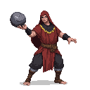
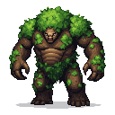

## 👹 Bestiary
The world of Reval Rebel is populated by a host of dangerous foes, each with unique behaviors and abilities tied to their faction and the dark folklore of the land.

-   **Myling (Murdered Child's Ghost):** The ghost of an unbaptized child who was murdered by its mother. It haunts the place of its death and seeks to be carried to a graveyard to find peace.

### Human Adversaries

-   **Spirit-Caller (Medium Threat):** A shaman who summons spectral wolves and casts debilitating curses that slow the player or drain their stamina. Prefers to keep their distance.

-   **Black Cloaks & Urban Rebels:** Guerilla fighters who use the city itself as a weapon.

-   **Street Thug (Low Threat):** Armed with improvised weapons like clubs or daggers. Fights dirty, throwing sand to blind the player or ganging up.

-   **Saboteur (Medium Threat):** An agile rogue who uses smoke bombs to disappear and caltrops to control the battlefield. Attacks with a poisoned short sword from stealth.

-   **Vanapagan's Cultists:** Humans who have bartered their souls for a sliver of the Old Devil's power.

-   **Rock-Thrower (Medium Threat):** Throws large stones with unnatural force and accuracy, capable of staggering the player.

-   **Brute (High Threat):** Possesses minor supernatural strength, allowing for powerful shove attacks that can send the player flying.

#### Bandits

### Mythological Creatures

-   **Kratt (Medium Threat):** A terrifying construct of hay, old bones, and farming tools, animated by a stolen soul. It is fast, erratic, and relentless.
    -   **Abilities:** Attacks with scythe-like arms, can disassemble into a pile of hay to avoid attacks before quickly reforming, and is extremely vulnerable to fire.

-   **Puuk (Low Threat):** A small, dragon-like demonic creature known for its greed. They are fast, annoying, and travel in packs.
    -   **Abilities:** Can steal items directly from the player's inventory, create illusions to disorient, and teleport in short bursts to evade attacks.

-   **Põhja Konn (Boss):** The "Northern Frog," a colossal, ancient amphibian covered in stone-like armor, guarding a forgotten bog.
    -   **Abilities:** A long, sticky tongue that can pull the player in for a devastating bite, a powerful ground-slam that creates a shockwave, and the ability to spit corrosive acid. Its soft underbelly is its only weak point, exposed briefly after its slam attack.

-   **The Leshy (Boss):** An ancient forest spirit bound to a sacred grove. A massive, hulking creature of wood and vine.
    -   **Abilities:** Can summon roots from the ground to immobilize the player, teleport in a cloud of leaves, and command packs of wolves. Its heart is exposed after it performs a powerful ground-slam attack.

### Estonian Folklore Creatures:

-   **Metsik (Forest Guardian):** A powerful, ancient spirit of the forest, capable of commanding animals and manipulating plant life. Can be either a powerful ally or a formidable foe, depending on the player's actions towards nature.

-   **Külmking (Frost-shoe):** A malevolent spirit that brings cold and despair. It freezes the ground with its touch and its presence drains the life and warmth from its victims.

-   **Näkk (Water Nymph/Nixie):** A seductive and dangerous water spirit that lures travelers to their deaths in rivers and lakes. Can appear as a beautiful woman or a monstrous creature.

-   **Luupainaja (Nightmare/Incubus):** A spirit that torments sleepers, causing terrifying nightmares and draining their life force. Appears as a shadowy figure that is difficult to harm with conventional weapons.
    - Abilities - can slow down a character and stop him.

-   **Kodukäija (Restless Spirit):** The ghost of a person who died a violent or unjust death, now haunting the living. Can be either a sorrowful spirit seeking peace or a vengeful one seeking retribution.

-   **Tulihänd (Fire-tail):** A demonic creature that appears as a streak of fire in the sky, often seen as an omen of war or disaster. It can set fire to buildings and fields with its touch.

-   **Maa-alune (Subterranean):** A gnome-like creature that lives underground, guarding hidden treasures and ancient secrets. They are skilled craftsmen and can be either helpful or hostile to those who disturb their domain.

-   **Hiid (Giant):** Descendants of Kalevipoeg, these giants are powerful but often dim-witted. They can be found in remote wilderness areas, guarding ancient ruins or sacred sites.

-   **Libahunt (Werewolf):** Not inherently evil, but fiercely territorial and dangerous when provoked. They are faster and stronger than normal wolves and can only be harmed by silver weapons.

-   **Vanapagan (The Old Devil):** A powerful, ancient demon who is the source of much of the evil in the land. He is a master of deception and corruption, and his influence can be seen in the actions of his cultists.
    - Idea for location - under monasteries

### Slavic Folklore Creatures:

-   **Vodyanoy (Water Grandfather):** A male water spirit who lives in ponds and rivers. He is often depicted as a bloated, frog-like old man covered in algae and muck. He can be benevolent, but is more often a malevolent being who drowns those who disrespect him.
-   **Rusalka (Water Nymph):** The spirit of a young woman who drowned, now a dangerous and vengeful creature. She lures men to their deaths with her beauty and song.
-   **Domovoy (House Spirit):** A household spirit that can be either benevolent or malevolent, depending on how it is treated. A wronged Domovoy can cause all sorts of mischief and misfortune for the inhabitants of a house.

-   **Likho (One-Eyed Evil):** A creature that embodies evil fate and misfortune. It is a one-eyed hag or goblin that brings bad luck to all who encounter it.

-   **Upyr (Vampire):** A reanimated corpse that drinks the blood of the living. They are unnaturally strong and fast, and can only be killed by a stake through the heart or by decapitation.

-   **Zmey (Slavic Dragon):** A dragon-like creature with multiple heads. It is a powerful and destructive beast, often associated with fire and chaos.

-   **Psoglav (Dog-headed Demon):** A demonic creature with the body of a man and the head of a dog. It is a fierce and bloodthirsty hunter that lives in caves and remote mountains.

-   **Poludnitsa (Lady Midday):** A spirit that appears at noon, often in fields. She can cause heatstroke and madness in those who work during the hottest part of the day.
    - throws her hat as a suriken
    - summons a scythe that attacks a player

-   **Striga (Witch/Hag):** A powerful and malevolent witch who can transform into a monstrous creature. She is a master of dark magic and curses.
    - Abilities: throws glass vials that affect character
    - Idea: as NPC could heal character

### Scandinavian Folklore Creatures:

-   **Draugr (Undead Warrior):** The reanimated corpse of a Viking warrior, now a powerful and malevolent undead creature. They are incredibly strong and difficult to kill, and often guard ancient tombs and treasures.
    - Abilities: creates a spirit that attacks player. The skeleton in that case is inactive. Spirit spits at the player. Attack can be deflected 

-   **Huldra (Forest Woman):** A seductive and beautiful forest spirit with the tail of a cow. She can be benevolent, but is also known to lure men into the forest to never be seen again.
    - Abilities: throws trees at the player

-   **Troll:** A large, brutish, and dim-witted creature that lives in mountains and caves. They are incredibly strong and often hostile to humans.
    - Abilities: stumps the ground, which immobilizes the player if he is near 

-   **Jötunn (Giant):** A giant from Norse mythology, often associated with the forces of chaos and destruction. They are the enemies of the gods and of mankind.

-   **Lindworm (Dragon):** A serpentine dragon with two legs. It is a powerful and destructive creature, often found guarding treasure.
