## ⚔️ Factions
You can ally, betray, or infiltrate these political forces. Your actions will determine the fate of Reval and the future of Estonia. Each faction offers unique quests, abilities, and endings.

**USER MUST CHOOSE TO JOIN EITHER RULERS OR REBELS**

### Ruling Factions

These factions represent the established, foreign powers ruling over Reval. 
They represent civilization, Christianity, stability, power, hierarchy, and advanced resources, but at the cost of natives freedom.

**The Danish Crown** 🇩🇰 
-   **Core Value:** Legacy
-   **Ideal:** To uphold their ancestral claim and the divine right of kings, providing stability as the legitimate rulers.
-   **Shadow:** Their obsession with legacy makes them out of touch, willing to tax their subjects into ruin to maintain a fading glory.
-   **Core NPC:** **Viceroy Konrad Preen**, the Danish governor (capitaneus Revalie). A weary, aging diplomat who is more interested in securing a comfortable retirement than in governing effectively. He is pragmatic and can be bribed or persuaded, but his loyalty is ultimately to a distant king who has all but forgotten this northern outpost.
-   **Presence:** Toompea Castle (Reval).

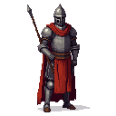
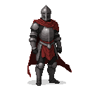

**The Hanseatic League** 🇪🇺
-   **Core Value:** Prosperity
-   **Ideal:** To build a world of opportunity and wealth through trade, connecting cultures and funding innovation.
-   **Shadow:** Their pursuit of profit becomes all-consuming greed, where human lives and traditions are exploited for coin.
-   **Core NPC:** **Jürgen von League**, a wealthy and ruthless amber merchant who unofficially speaks for the League. He is a master of economic warfare, offering you advanced technology, access to smuggling rings, and vast sums of gold in exchange for services that secure the League's dominance.
-   **Presence:** St. Olaf's Guild Hall (Reval), The Sunken Harbor District (Reval).

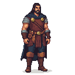

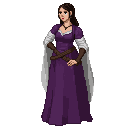

**The Livonian Order** ✠ 
-   **Core Value:** Order
-   **Ideal:** To create a stable, pious society under a single faith and a strong rule of law.
-   **Shadow:** Their pursuit of order becomes brutal fanaticism, justifying massacres and cultural destruction in the name of God.
-   **Core NPCs:** **Brother Burchard von Dreileben**, a zealous and battle-hardened knight of the Order. He is a formidable warrior and a charismatic leader, offering you access to elite combat training, blessed weaponry, and the chance to fight for what he believes is a righteous cause. He is unyielding in his faith and merciless to his enemies.
- Brother Goswin von Herike - commander in Viljandi
- Arnd von Herke
-   **Presence:** Toompea Castle (Reval), The Cathedral of Saint Mary (Reval), Wesenberg (Rakvere), Viljandi Castle, Padise Monastery.

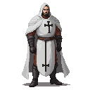
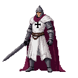

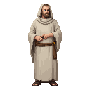
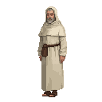
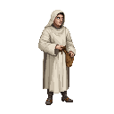

### The Rebel Factions
-   **Core Value:** Freedom
-   **Ideal:** To rule their own lands, free from foreign masters.
-   **Shadow:** Their fight for freedom can become violent xenophobia, leading to the slaughter of any and all outsiders.

These factions represent the native Estonian resistance. 
They represent rebellion, decentralization, grassroot nature powers, flexibility.
They are outgunned and outmaneuvered, but they have the support of the people and a deep connection to the land itself.

**The Harju Kings** ✊🏻
-   **Motivation:** Freedom. The main, rural-based military force of the uprising, born in the fields of Harju County. They are farmers and villagers who have taken up arms against their oppressors. They are the heart of the rebellion's military power, fighting in open battles.
-   **Core NPCs:** 
    - **Lembit Helme**, A stern village elder from Harjumaa with a gift for oratory and negotiation. Known for rallying disparate clans with his "fire-sermons" in the forests near Padise.
    - **Kaja Lahekivi**, A cunning nobleman's daughter who turned against the Danish overlords. Led a covert network of messengers between Saaremaa and mainland rebels.
    - **Jüri Ratnik** A former manor blacksmith from Läänemaa who forged weapons and alliances alike. Called "Iron Hand" by his followers, feared by knights for his brutal efficiency.
    - **Urmas Laar** A zealot and mystic from the eastern marshlands, blending ancient Finno-Ugric rites with anti-crusader rhetoric. Claimed visions from Taara led him to battle.
-   **Presence:** A Peasant Village (Harju County), The Hill of the First Flame (Harju County), The Rebel Kings' Camp, Pärnu.

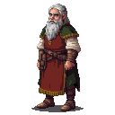

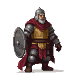

**The Black Cloaks** 🌃
-   **Motivation:** Liberation from the inside. Radicals. The urban guerilla arm of the rebellion within Reval's walls. Composed of smiths, artisans, and the city's underclass, they specialize in stealth, sabotage, intelligence, and street-level warfare.
-   **Core NPC:** **Lembit Helme**, a charismatic and impulsive blacksmith who has become the reluctant leader of the Reval uprising. He is a man of action, not words, and he offers you a place at the heart of the rebellion, fighting for the freedom of your people.
-   **Presence:** The Smith's Forge (Reval), The Whispering Market (Reval), The Sunken Harbor District (Reval).

**The Cult of Metsik** 🍀
-   **Motivation:** The Old Ways. A secretive cult of forest-dwellers who worship the ancient Estonian gods. They see the Christian invaders as a plague upon the land and believe that the uprising is a chance to restore the old ways. Their magic is powerful and chaotic, drawn from the sacred groves and the spirits of the earth.
-   **Core NPC:** **Ellen Luik**, the enigmatic high priestess of the cult. She is a powerful seer and a master of spirit magic, offering you access to ancient rituals, animal allies, and the raw, untamed power of the land itself. Her motives are cryptic, and her loyalty is to the spirits, not to any mortal cause. She seems to tell stories to children that surround her 
-   **Presence:** The Sacred Grove of Taara, The Sacred Lake of Saaremaa.

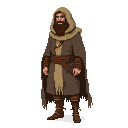

### The Neutral Factions

These factions are not directly involved in the conflict between the Rulers and the Rebels, but they have their own agendas and can be powerful allies or dangerous enemies.

**The Republic of Novgorod & Pskov** 🌞
-   **Core Value:** Opportunity
-   **Ideal:** To expand their influence and trade through shrewd alliances and military might, seizing the chances that chaos provides.
-   **Shadow:** Their pragmatism is a mask for ruthless opportunism; they are mercenaries who will betray any ally for a better deal.
-   **Core NPCs:** 
    - **Михаил Коловрат**, a cunning Pskovian agent operating as a fur trapper. He offers access to spies and saboteurs, but his true allegiance is a mystery.
    - **Яна Подаяльная**, the head of the Novgorodian trade delegation. A shrewd diplomat who can offer vast resources, but her support always comes at a steep price.
-   **Presence:** The Whispering Market (Reval), St. Olaf's Guild Hall (Reval).

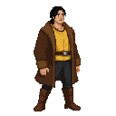

**The Veiled Council** 🕷️
-   **Motivation:** The long game. A secret society of Reval's oldest and wealthiest German families who believe that both the Danes and the Livonian Order are temporary. They manipulate events from the shadows, seeking to create a new, independent state under their own control. They are masters of espionage, assassination, and political intrigue.
-   **Core NPC:** **"Mart the Weaver"** a mysterious figure who communicates only through coded messages and intermediaries. They offer you access to a network of spies, saboteurs, and assassins, but their true motives are always hidden, and their loyalty is only to the Council's ultimate ambition.
-   **Presence:** Operates secretly throughout Reval, with influence in high-society locations like St. Olaf's Guild Hall.

**The Vitalienbrüder** 🏴‍☠️
-   **Motivation:** Plunder and chaos. The remnants of a once-powerful pirate brotherhood, now reduced to a scattered band of raiders and mercenaries. They have no loyalty to any flag and are interested only in profiting from the chaos of the uprising. They are masters of naval combat and can be hired to attack shipping, smuggle goods, or create diversions.
-   **Core NPC:** **"Ironhand" Störtebeker**, a grizzled and pragmatic pirate captain who leads the largest band of Vitalienbrüder in the Baltic. He is a man of his word, but his word is always backed by a sharp axe and a lust for gold.
-   **Presence:** Paldiski (Rågervik), The Sunken Harbor District (Reval).

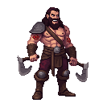
