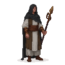

## ⚔️ Factions
You can ally, betray, or infiltrate these political forces. Your actions will determine the fate of Reval and the future of Estonia. Each faction offers unique quests, abilities, and endings.

**USER MUST CHOOSE TO JOIN EITHER RULERS OR REBELS**

### Ruling Factions

These factions represent the established, foreign powers ruling over Reval. 
They represent civilization, Christianity, stability, power, hierarchy, and advanced resources, but at the cost of natives freedom.

**The Danish Crown** 🇩🇰 
-   **Motivation:** To maintain their tenuous hold on the Duchy of Estonia, extract as much tax revenue as possible, and prevent the Livonian Order from seizing full control. They are a fading power, ruling in name only.
-   **Core NPC:** **Viceroy Konrad Preen**, the Danish governor (capitaneus Revalie). A weary, aging diplomat who is more interested in securing a comfortable retirement than in governing effectively. He is pragmatic and can be bribed or persuaded, but his loyalty is ultimately to a distant king who has all but forgotten this northern outpost.

-   **Presence:** Toompea Castle (Reval).

**The Hanseatic League** 🇪🇺
-   **Motivation:** Profit and control. The League's merchants, led by the powerful guilds of Reval, see the uprising as a threat to their trade monopolies. They are not warriors, but their wealth gives them immense influence. They fund the Livonian Order, bribe city officials, and use their extensive network of spies to protect their interests.
-   **Core NPC:** **Jürgen von League**, a wealthy and ruthless amber merchant who unofficially speaks for the League. He is a master of economic warfare, offering you advanced technology, access to smuggling rings, and vast sums of gold in exchange for services that secure the League's dominance.
-   **Presence:** St. Olaf's Guild Hall (Reval), The Sunken Harbor District (Reval).

**The Livonian Order** ✠
-   **Motivation:** Faith and purity. The Order sees itself as the sword of Christendom, tasked with rooting out paganism and imposing divine order on a savage land. They are the true military power in the region, and they view the Danish Crown with contempt and the Estonians as little more than heathens to be converted or crushed.
-   **Core NPCs:** **Brother Burchard von Dreileben**, a zealous and battle-hardened knight of the Order. He is a formidable warrior and a charismatic leader, offering you access to elite combat training, blessed weaponry, and the chance to fight for what he believes is a righteous cause. He is unyielding in his faith and merciless to his enemies.

- Brother Goswin von Herike - commander in Viljandi
- Arnd von Herke
-   **Presence:** Toompea Castle (Reval), The Cathedral of Saint Mary (Reval), Wesenberg (Rakvere), Viljandi Castle, Padise Monastery.

### The Rebel Factions

These factions represent the native Estonian resistance. 
They represent rebellion, decentralization, grassroot nature powers, flexibility.
They are outgunned and outmaneuvered, but they have the support of the people and a deep connection to the land itself.

**The Harju Kings** ✊🏻
-   **Motivation:** Freedom. The main, rural-based military force of the uprising, born in the fields of Harju County. They are farmers and villagers who have taken up arms against their oppressors. They are the heart of the rebellion's military power, fighting in open battles.
-   **Core NPCs:** 
    - **Lembit Helme**, A stern village elder from Harjumaa with a gift for oratory and negotiation. Known for rallying disparate clans with his "fire-sermons" in the forests near Padise.
    - **Kaja Lahekivi**, A cunning nobleman's daughter who turned against the Danish overlords. Led a covert network of messengers between Saaremaa and mainland rebels.
    - **Jüri Ratnik** A former manor blacksmith from Läänemaa who forged weapons and alliances alike. Called "Iron Hand" by his followers, feared by knights for his brutal efficiency.
    - **Urmas Laar** A zealot and mystic from the eastern marshlands, blending ancient Finno-Ugric rites with anti-crusader rhetoric. Claimed visions from Taara led him to battle.
-   **Presence:** A Peasant Village (Harju County), The Hill of the First Flame (Harju County), The Rebel Kings' Camp, Pärnu.

**The Black Cloaks** 🌃
-   **Motivation:** Liberation from the inside. Radicals. The urban guerilla arm of the rebellion within Reval's walls. Composed of smiths, artisans, and the city's underclass, they specialize in stealth, sabotage, intelligence, and street-level warfare.
-   **Core NPC:** **Lembit Helme**, a charismatic and impulsive blacksmith who has become the reluctant leader of the Reval uprising. He is a man of action, not words, and he offers you a place at the heart of the rebellion, fighting for the freedom of your people.
-   **Presence:** The Smith's Forge (Reval), The Whispering Market (Reval), The Sunken Harbor District (Reval).

**The Cult of Metsik** 🍀
-   **Motivation:** The Old Ways. A secretive cult of forest-dwellers who worship the ancient Estonian gods. They see the Christian invaders as a plague upon the land and believe that the uprising is a chance to restore the old ways. Their magic is powerful and chaotic, drawn from the sacred groves and the spirits of the earth.
-   **Core NPC:** **Ellen Luik**, the enigmatic high priestess of the cult. She is a powerful seer and a master of spirit magic, offering you access to ancient rituals, animal allies, and the raw, untamed power of the land itself. Her motives are cryptic, and her loyalty is to the spirits, not to any mortal cause. She seems to tell stories to children that surround her 
-   **Presence:** The Sacred Grove of Taara, The Sacred Lake of Saaremaa.

### The Neutral Factions

These factions are not directly involved in the conflict between the Rulers and the Rebels, but they have their own agendas and can be powerful allies or dangerous enemies.

**The Veiled Council** 🕷️
-   **Motivation:** The long game. A secret society of Reval's oldest and wealthiest German families who believe that both the Danes and the Livonian Order are temporary. They manipulate events from the shadows, seeking to create a new, independent state under their own control. They are masters of espionage, assassination, and political intrigue.
-   **Core NPC:** **"Mart the Weaver"** a mysterious figure who communicates only through coded messages and intermediaries. They offer you access to a network of spies, saboteurs, and assassins, but their true motives are always hidden, and their loyalty is only to the Council's ultimate ambition.
-   **Presence:** Operates secretly throughout Reval, with influence in high-society locations like St. Olaf's Guild Hall.

**The Vitalienbrüder** 🏴‍☠️
-   **Motivation:** Plunder and chaos. The remnants of a once-powerful pirate brotherhood, now reduced to a scattered band of raiders and mercenaries. They have no loyalty to any flag and are interested only in profiting from the chaos of the uprising. They are masters of naval combat and can be hired to attack shipping, smuggle goods, or create diversions.
-   **Core NPC:** **"Ironhand" Störtebeker**, a grizzled and pragmatic pirate captain who leads the largest band of Vitalienbrüder in the Baltic. He is a man of his word, but his word is always backed by a sharp axe and a lust for gold.
-   **Presence:** Paldiski (Rågervik), The Sunken Harbor District (Reval).

**The Pskov Agents** 🐆
-   **Motivation:** Opportunity and Destabilization. The Republic of Pskov, a powerful Russian principality, watches the chaos in Estonia with keen interest. Historically, the Estonian rebels sent envoys to Pskov, seeking an alliance. In the game, Pskov's motives are ambiguous. Are they genuine allies, or are they simply exploiting the uprising to weaken their Teutonic and Danish rivals?
-   **Core NPC:** **Михаил Коловрат**, a cunning and resourceful Pskovian agent operating under the cover of a fur trapper. He knows Reval's streets intimately and offers access to a network of spies, saboteurs, and assassins. He can provide intelligence on the Livonian Order, but his true allegiance remains shrouded in mystery.
-   **Presence:** The Whispering Market (Reval), operating undercover.

 **The Novgorod Republic Trade Delegation** 🌞
-   **Motivation:** Profit and Plausible Deniability. While historical records show no direct involvement from Novgorod in the uprising, this faction represents a "what if" scenario. The powerful Republic of Novgorod is officially neutral, concerned only with protecting its lucrative trade routes. However, they are not above profiting from chaos. They might secretly fund the rebels, the Order, or both, depending on which outcome best serves their economic interests.
-   **Core NPC:** **Яна Подаяльная**, the head of the Novgorodian trade delegation in Reval. A shrewd and calculating diplomat, she is a master of economic statecraft. She can be a powerful ally, offering vast resources, political influence, and a safe escape route—but her support always comes at a steep price, and her loyalty is ultimately to the bottom line.
-   **Presence:** St. Olaf's Guild Hall (Reval).

## 🏰 Setting & Exploration (scenes/levels) 🌍
The game world is a condensed, semi-fictionalized representation of 14th-century Estonia. Locations are divided into two types: Core Locations, which are always accessible, and Dynamic Locations, whose state or availability changes dramatically with the start of the uprising (Phase 2).
