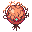
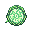
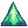

See [PSYCHE](./PSYCHE.md) to better understand background of the character build system.

### NATURAL character build system

-  - Nature
-  - Affection
-  - Tenacity
-  - Unity
-  - Resonance
-  - Awareness
-  - Light

