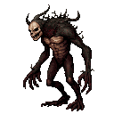

# 🌳 The Inner World: The Hingepuu

Beyond the physical conflict for Reval, there is a battle within Kalev's soul. This is represented by the **Hingepuu** (Soul Tree), a personal world tree that serves as the landscape of Kalev's psyche. The player can visit the Hingepuu during sleep or meditation to take stock of their inner state, commune with the facets of their personality, and grow their spiritual power.

The health and appearance of the Hingepuu are a direct reflection of Kalev's inner balance. A soul in harmony will have a mighty, vibrant oak, while a soul in turmoil will see the tree become withered, scorched, or overgrown with parasites.

## The Seven Aspects of the Soul

The Hingepuu is the source of Kalev's inner power, which is channeled through seven spiritual centers called **Aspects**. These are tangible locations on the tree that can be visited. By nurturing these Aspects through experience, completing quests, or performing rituals, Kalev can grow his core attributes. Each Aspect's state directly impacts his abilities in combat, spellforging, and social interactions.

*   **Nature** (Root System)

*   **Affection** (Base of Trunk)

*   **Tenacity** (Main Trunk)

*   **Unity** (Large Branch)

*   **Resonance** (High Windy Branch)

*   **Awareness** (Treetop Perch)

*   **Light** (Sky Above Tree)

## The Inner Council: The Four Faces of the Soul

The Hingepuu is inhabited by four archetypal figures from Jungian psychology, representing the core facets of Kalev's psyche. Interacting with them is the key to inner growth and resolving the consequences of your actions. The ultimate goal is **Individuation**: the integration of these faces into a balanced, whole Self.

*   **The Persona**
    *   **Represents:** The Mask / The Smith
    *   **In-Game Role:** The version of Kalev the world sees. His counsel is pragmatic, focused on reputation and fulfilling one's role. He represents **Volition** and **Logic**.
    *   **Associated Hearths:** Resonance & Tenacity
    *   **Gameplay Impact:** Integrating the Persona improves persuasion and deception, strengthening `Dominion` and `Deception` Elements.

*   **The Shadow**
    *   **Represents:** The Unconscious / The Beast
    *   **In-Game Role:** Represents Kalev's repressed anger, fears, and raw power. He is not evil, but primal and untamed. He represents raw **Emotions**.
    *   **Associated Hearths:** Nature & Affection
    *   **Gameplay Impact:** Integrating the Shadow unlocks immense power, boosting "chaotic" Elements like `Fire`, `Beast`, and `Chaos`.

*   **The Anima**
    *   **Represents:** The Inner Feminine / The Muse
    *   **In-Game Role:** Represents Kalev's capacity for empathy, creativity, and intuition. She is the guide to the unconscious and represents **Empathy**.
    *   **Associated Hearths:** Unity & Awareness
    *   **Gameplay Impact:** Integrating the Anima unlocks unique dialogue options and strengthening "connecting" Elements like `Life`, `Hope`, `Spirit`, and `Mind`.

*   **The Self**
    *   **Represents:** The Integrated Whole / The Sage
    *   **In-Game Role:** The **goal** of the inner journey. The Self emerges when the other three archetypes are in balance, representing true **Conscience** and enlightenment.
    *   **Associated Hearths:** Light
    *   **Gameplay Impact:** Achieving moments of integration grants significant, permanent bonuses to all Hearths. Full integration is the key to Kalev's ultimate potential.

### Inner Demons: The Soul's Afflictions

Actions, choices, and traumatic events do not just leave mental scars; they give birth to entities within the Hingepuu. These **Inner Demons** are living manifestations of Kalev's psychological state—symbolic creatures that embody his afflictions (and sometimes, his boons). They are not literal demons from hell, but personifications of his inner turmoil, like parasites feeding on the Soul Tree. Confronting and overcoming them is key to restoring balance. Each demon corresponds to a **Psyche State** with tangible gameplay effects.

| icon | Psyche State (Inspiration) | Type | Visual Prompt / Description | Gameplay Effects | Potential Triggers |
|--| :--- | :--- | :--- | :--- | :--- |
| | **Ruthless** (Sadist) | Volatile | A gaunt, hunched creature with thorny vines growing from its back and fingers sharpened into claws. It whispers cruelties. | **[+]** Increased Intimidation & critical damage. **[-]** Blocks Empathy-based dialogue options; lowers Charisma. | Executing helpless or fleeing enemies; choosing exceptionally cruel dialogue options. |
| | **Exalted** (Maniac) | Volatile | A being of pure, frantic energy, flickering like a flame. It has too many limbs and its head is a vortex of light. | **[+]** Reduced spell cooldowns & increased movement speed. **[-]** Increased damage taken; erratic aim with ranged weapons. | Surviving a major boss fight with critical health; a monumental quest victory. |
| | **Melancholy** (Depressive) | Affliction | A heavy, slow-moving creature made of wet clay and tangled roots, weeping a black sap that poisons the ground. | **[-]** Slower XP gain; reduced stamina regeneration. **[+]** Increased resistance to Intimidation (apathy). | Witnessing a companion's death; failing to save an innocent; returning to a destroyed friendly location. |
| | **Pride** (Hubris) | Volatile | A beautiful, statuesque figure with golden, cracked skin. It admires its own reflection in a pool of stagnant water. | **[+]** Increased damage when at full health. **[-]** Reduced defense when damaged; blocks options to ask for help. | Winning many battles without taking damage; acquiring powerful unique gear; succeeding on multiple Intimidation checks. |
|| **Apathy** (Burnout) | Affliction | A grey, featureless humanoid figure that slowly crumbles at the edges like ash. It sits listlessly on a branch. | **[-]** All XP gain is halved; companion effectiveness reduced. **[+]** High resistance to all psychological debuffs. | Ignoring multiple pleas for help; consistently choosing neutral/indifferent dialogue; letting companions die. |
|  | **Paranoid** (Fear) | Affliction | A creature made of dozens of scurrying, insect-like shadows with countless glowing red eyes that dart around constantly. | **[+]** Increased Perception for spotting traps/ambushes. **[-]** Lowers Charisma; may cause neutral NPCs to react negatively. | Being ambushed multiple times; being betrayed by a quest giver; reading conspiratorial texts. |
|  | **Obsession** (Fixation) | Affliction | A magpie-like creature covered in glittering, stolen trinkets, constantly chattering about its collection. | **[+]** Bonus to tasks related to the obsession. **[-]** Penalties to all non-related tasks; dialogue becomes fixated. | Repeatedly pursuing a single optional goal; collecting all items of a specific type; ignoring main quests. |

### The Gameplay Loop of the Psyche

1.  **Action & Consequence:** An action in the real world (e.g., a moral choice, a brutal combat finisher) creates ripples in the inner world.
2.  **A Demon is Born:** The archetypes come into conflict, causing an imbalance. This spiritual energy coalesces and manifests as an **Inner Demon** latching onto the Hingepuu, inflicting a corresponding **Psyche State** (e.g., a violent act empowers The Shadow, giving birth to the Demon of Ruthlessness).
3.  **Confrontation:** The player must visit the Hingepuu to confront the demon. This may involve dialogue, a symbolic inner challenge, or seeking the aid of one of the Four Faces to understand and weaken the entity. The appearance of the tree and the demon itself are clues to its nature.
4.  **Integration or Subjugation:** Successfully confronting the demon banishes it, resolving the negative Psyche State and leading to **Integration**, providing permanent bonuses. Ignoring it allows the demon to fester and strengthen its hold, prolonging the **Imbalance** until it is dealt with.
