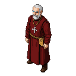

# Prince-Bishop Johann I von Vifhusen

A stern and pragmatic ruler, more of a general than a priest, forced to navigate the treacherous politics of the Livonian frontier. He is deeply concerned with the defense of his territory against Pskov and sees the St. George's Night Uprising not as a righteous struggle for freedom, but as a foolish rebellion that dangerously weakens Christendom's eastern shield.

## Visual Description

Johann von Vifhusen is a man in his late fifties, with a commanding presence that speaks more of the battlefield than the chancel. His figure is sturdy and broad-shouldered, a testament to a life spent as much in the saddle as at the altar. His hair is short, steel-grey, and receding at the temples, framing a face lined with the cares of his office. Indoors, he often wears a simple crimson zucchetto (skullcap) on his head. His eyes are a pale, watchful blue, missing little. He typically wears the practical robes of a bishop in a deep, sober crimson, but they are often worn over a fine shirt of chainmail, the steel links glinting at his neck and wrists. On his chest, over his robes, hangs a pectoral cross of solid, unadorned silver—a symbol of his office, but also a weighty, functional piece that lacks the delicate ornamentation favored by his southern counterparts. His robes are of high-quality wool, functional rather than ornate, befitting a man who must be ready to ride to a besieged castle at a moment's notice.

## Motivations

*   **Survival of the Bishopric:** His overriding goal is the preservation of Dorpat as a bastion of Catholic Christendom on a hostile frontier. Every decision is weighed against this single imperative.
*   **Order Above All:** He believes that stability, hierarchy, and order are the only things that keep the savage forces of the world at bay. The uprising, in his eyes, is a descent into chaos that threatens everything.
*   **Preserve Autonomy:** While he must rely on the Livonian Order, he deeply resents their ambition and is determined to prevent them from using the current crisis to usurp his authority and seize his lands.

## Ties & Relationships

*   **Allies:** His primary allies are his own vassal knights and the wealthy Hanseatic merchants of Dorpat, whose interests align with his own in maintaining stability and secure trade. He has a cautious, informal alliance with the Danish Duchy of Estonia, seeing them as a necessary counterbalance to the Livonian Order.
*   **Enemies:** His sworn enemy is the Principality of Pskov, whom he views as schismatic aggressors. He also considers the Estonian rebel leaders to be dangerous fanatics who are unwittingly playing into Pskov's hands.
*   **Initial View of Main Player:** He will view the player with suspicion, as an unknown quantity in a dangerous time. He will be looking to see if the player can be a useful tool—a skilled warrior, a cunning diplomat, or a disposable pawn. Loyalty and competence are the only things that will earn his respect.

## History (Biography)

Born into a minor noble family in Westphalia, Johann was a second son destined for the Church. He showed an early aptitude not for theology, but for administration and military strategy. He served as a canon in several cathedral chapters in the Holy Roman Empire before being appointed to the frontier bishopric of Dorpat in 1343, a position many would have seen as a death sentence. He arrived just as the St. George's Night Uprising was beginning, plunging him immediately into a trial by fire. His entire tenure has been defined by this crisis, forcing him to become the military commander his bishopric desperately needs.

## Daily Routines

His days are a grueling mix of spiritual and temporal duties. He rises before dawn for private prayer, followed by Mass in the cathedral. The rest of his morning is spent in his solar, reviewing military dispatches from the eastern border, meeting with his council of canons to manage the bishopric's finances, and dictating letters to the Archbishop of Riga and the Master of the Livonian Order. In the afternoon, he often inspects the city's fortifications or observes the training of the garrison. His evenings are spent in quiet contemplation or studying maps of his volatile domain.

## Possible Quest Lines

*   **The Eastern Shield:** The player is tasked with reinforcing a series of border castles and repelling Pskovian raiding parties, earning the Bishop's trust through military prowess.
*   **A Web of Spies:** The Bishop suspects a spy within his own court is feeding information to the rebels or even to Pskov. The player must navigate the treacherous social landscape of Dorpat to uncover the traitor.
*   **The Reluctant Ally:** The player is sent as an envoy to the local commander of the Livonian Order to request military aid, but must negotiate a steep price and may have to perform a difficult task to prove their worth to the cynical knight-brother.
