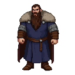

# Voivode Grigori of Pskov

A cunning and ambitious military commander from the neighboring Principality of Pskov. He sees the chaos of the uprising as a golden opportunity to seize the wealthy city of Dorpat and its surrounding lands. He is not just a brute; he is a capable strategist who may even attempt to forge temporary alliances with Estonian rebel leaders to achieve his goals.

## Visual Description

Voivode Grigori is a man in his early forties, built like the bears of his native forests—broad, powerful, and radiating a palpable sense of menace. His beard is thick, dark, and streaked with grey, often braided with silver rings. His hair is a similar dark brown, cut practically just above his shoulders. His eyes are a sharp, intelligent black, constantly assessing his surroundings for weakness. He wears a high-collared kaftan of deep blue silk over a shirt of fine chainmail. His boots are of sturdy, dark leather, and a fur-lined cloak is often thrown over his shoulders, even indoors. He is a man accustomed to the harshness of the northern climate and the brutalities of war.

## Motivations

*   **Glory for Pskov:** Grigori is a patriot, fiercely loyal to his home city of Pskov. His primary goal is to expand its power and influence, and humbling the wealthy Bishopric of Dorpat would be a major victory.
*   **Personal Ambition:** He craves the glory and riches that come with successful conquest. Capturing Dorpat would make him a hero in Pskov and secure his family's status for generations.
*   **Religious Rivalry:** He views the Catholic Germans and Danes as schismatic heretics and their presence on the borders of Rus' as an affront. While not a fanatic, he uses this religious difference to justify his aggression.

## Ties & Relationships

*   **Allies:** His main allies are the boyars and merchants of Pskov who stand to profit from his campaigns. He may form temporary, pragmatic alliances with Estonian rebel leaders like Meelis of Otepää, but he sees them as disposable tools and has no intention of honoring any promises of true freedom.
*   **Enemies:** His primary enemies are the Prince-Bishop of Dorpat and the Livonian Order, whom he sees as the main obstacles to Pskov's ambitions. He views them as bitter rivals in a long and bloody struggle for control of the borderlands.
*   **Initial View of Main Player:** If the player is not openly hostile, Grigori will see them as a potential asset. He is a pragmatist who is willing to use anyone—mercenary, spy, or diplomat—to gain an advantage. He will be charming and persuasive, but utterly ruthless and untrustworthy.

## History (Biography)

Grigori is a son of a prominent Pskovian boyar family, raised on stories of the heroic deeds of Alexander Nevsky. He has spent his entire adult life fighting in the brutal border wars against the Livonian states. He learned strategy and tactics not in a classroom, but in the crucible of countless raids, skirmishes, and sieges. He earned his title of Voivode (military governor) through a combination of tactical brilliance, personal bravery, and a reputation for absolute ruthlessness towards his enemies. He knows the forests and bogs of the borderlands better than any of his foes.

## Daily Routines

As a commander on an active campaign, Grigori's life is dictated by the needs of his army. He wakes with his soldiers, sharing their simple breakfast. His days are spent drilling his troops, reviewing reports from his scouts, interrogating prisoners, and planning his next move on a large map laid out in his command tent. He is a hands-on commander, frequently seen walking the camp, speaking with his men to gauge their morale. His evenings are for strategy councils with his captains and, occasionally, clandestine meetings with potential allies.

## Possible Quest Lines

*   **A Feigned Retreat:** Grigori hires the player to spread disinformation within the Bishop's ranks, suggesting his army is retreating, in order to lure a garrison out of a fortified position and into an ambush.
*   **The Price of Betrayal:** The player discovers that Grigori is planning to betray his Estonian rebel allies. They must choose whether to warn the rebels, try to profit from the situation, or use the information to sow chaos among their enemies.
*   **Sabotage:** The player is tasked by the Bishopric to infiltrate Grigori's camp and sabotage his siege engines or poison his army's water supply before he can launch his assault on Dorpat.
