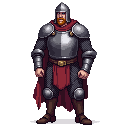

> **Legacy status:** `archive`  
> **Reason:** NPC roster entry outside the seven-character vertical-slice scope.  
> **Current source of truth:** [`README.md`](../../../README.md) - Main cast; approved character briefs in [`docs/CHARACTERS/`](../../../docs/CHARACTERS/).

## Town Guard Captain

A stern, well-built man in his late 30s, wearing a polished helmet and a chainmail shirt. He has a neatly trimmed beard and a suspicious gaze.
