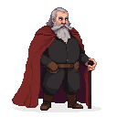

# Viceroy Konrad Preen

**Visual Description:** Viceroy Konrad Preen is a man in his late 50s, his tall, once-strong frame now slightly stooped with the weight of his responsibilities. His thinning, silver-grey hair is cut short and combed back from a high forehead. His face is a roadmap of his life's worries, with deep-set, weary blue eyes and lines etched around his mouth and brow. He wears a high-collared, dark blue woolen tunic, its texture rich but showing subtle signs of wear at the cuffs. The tunic is cinched at the waist with a simple leather belt, from which no weapon hangs. Over this, he wears a heavier, fur-lined tabard of deep crimson, the fabric a thick, durable wool suitable for the damp chill of Toompea Castle. The colours, though noble, are muted, reflecting the fading power of the Danish crown in this far-flung duchy.

