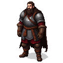

# Algirdas

**Visual Description:**
Algirdas is a formidable figure in his late 40s, a hardened pagan warrior-king. He is tall and powerfully built, with long, dark hair and a thick beard, possibly braided in the Lithuanian fashion. His eyes are sharp and cunning, the eyes of a skilled hunter and a brilliant military strategist. He wears practical but high-quality armor, likely lamellar or chainmail, covered by a heavy cloak of wolf or bear fur. He carries an air of raw, untamed power, very different from the feudal lords of Christendom.

**Motivations:**
Algirdas is driven by the defense and expansion of the Grand Duchy of Lithuania, the last great pagan state in Europe. He is a brilliant military commander, constantly at war with the Teutonic and Livonian Orders to the west and the Tartars and Muscovites to the east. His interest in the Estonian rebellion is purely strategic. A weakened Livonian Order is a victory for Lithuania. He is a pragmatist who would gladly aid the Estonian rebels if it served his purpose, but he would not risk his own armies for a lost cause.

**Ties & Relationships:**
*   **Allies:** His brother and co-ruler, Kęstutis, is his most important ally. He commands the loyalty of the powerful Lithuanian nobility.
*   **Enemies:** The Teutonic and Livonian Orders are his mortal enemies, locked in a state of perpetual holy war. He is also a rival of the Kingdom of Poland and the Grand Duchy of Moscow for control of the lands of Rus'.
*   **Initial view of the main player (Kalev):** He would see Kalev as a potential pawn in his war against the German knights. He would be interested in Kalev's strength and leadership abilities, and might see in him a reflection of the pagan spirit that Lithuania itself championed. He would be a dangerous and unpredictable patron.

**History (Biography):**
Algirdas was the Grand Duke of Lithuania from 1345 to 1377, but he was already the de facto ruler of the eastern part of the Grand Duchy in 1343. A bold and brilliant strategist, Algirdas believes in assessing his enemies personally. Seeing the uprising as a unique opportunity to weaken the Livonian Order, he has taken an enormous risk: traveling incognito into Estonia. Disguised as a Lithuanian trader with a small retinue of elite bodyguards, he is secretly meeting with the elders of the Cult of Metsik to forge a pagan alliance and personally gauge the strength of the rebellion and the Order.

**Daily Routines:**
While in Estonia, Algirdas lives the life of a fugitive and a spy. By day, he may travel the forest paths, disguised and observing. By night, he meets in secret with pagan leaders in hidden groves, sharing rituals and planning strategy. His routine is one of constant vigilance, relying on his bodyguards and his own formidable skills as a warrior and hunter to survive deep within enemy territory.

**Possible Quest Lines:**
*   **The Pagan Alliance:** The player could be sent on a perilous diplomatic mission to the court of Algirdas in Vilnius, seeking a military alliance. This would involve navigating the complex and dangerous world of Lithuanian pagan politics.
*   **A Feint from the South:** The player might be asked to help a small Lithuanian raiding party create a diversion on the Livonian border, drawing the Order's forces away from the main rebellion in the north.
*   **The Old Gods:** Algirdas might take an interest in the player's connection to the old pagan ways of Estonia, leading to a quest that delves into the shared pre-Christian heritage of the Baltic peoples.
