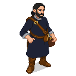

# Ambrogio Lorenzetti (c. 1290–1348)

**Visual Description:**
Ambrogio is a man in his early 50s, with a thoughtful and composed demeanor that reflects his artistic sensibilities. His hair, once dark, is now streaked with grey at the temples, and his beard is neatly trimmed. He has the keen, observant eyes of a painter, constantly studying the world around him. He is of average height and build, with hands that are surprisingly strong and calloused from years of grinding pigments and preparing frescoes. He dresses in the practical but well-made clothes of a successful Sienese master craftsman: a tunic of dark blue wool, simple leather shoes, and a belt holding a few pouches for charcoal and a small sketchbook. His movements are deliberate and economical, the gestures of a man who understands form and function.

**Motivations:**
- To capture the essence of a just and well-ordered society in his art, believing that beauty and virtue are intertwined.
- To find new patrons and inspiration beyond the confines of Siena, curious about how different cultures express their ideals.
- To survive the current turmoil and return to his workshop in Siena to complete his masterpieces.

**Ties & Relationships:**
- **Allies:** He would find kinship with other artisans, architects, and thinkers who appreciate order, beauty, and philosophy. He might be intrigued by the theologians at the Dome School.
- **Enemies:** He would be wary of chaotic and destructive forces, viewing the rebels and the more brutal knights of the Order with equal apprehension, seeing them as threats to the civilized society he values.
- **Initial view of the main player:** He would see the player as a subject of intense interest—a figure of action in a world he prefers to observe. He would be curious about the player's motivations, judging them by their deeds and their impact on the city's stability.

**History (Biography):**
Ambrogio Lorenzetti is a celebrated painter from the city-state of Siena, renowned for his innovative work in the Sienese school. Along with his brother Pietro, he is one of the masters of his generation. His most famous work is the series of frescoes in the Palazzo Pubblico of Siena, *The Allegory of Good and Bad Government*, which serves as a powerful visual sermon on the virtues of justice and the dangers of tyranny. He traveled to Reval as part of a cultural exchange arranged by a wealthy Sienese merchant with ties to the Hanseatic League, hoping to study the different light and aesthetics of the North. The sudden uprising has trapped him in the city, turning his artistic sojourn into a struggle for survival.

**Daily Routines:**
- Spends his mornings sketching the city's architecture and its people, filling his notebooks with observations.
- Seeks out conversations with scholars, merchants, and clergy, trying to understand the complex power dynamics of Reval.
- When possible, he finds quiet places to mix pigments and practice his craft on small wooden panels, desperate to keep his skills sharp.

**Possible Quest Lines:**
- **The Colors of Justice:** Ambrogio has run out of a specific pigment (like lapis lazuli for blue) needed for a private commission. He asks the player to procure it for him, a task that might involve trading with a secretive merchant, finding it in a looted manor, or even grinding it from raw materials.
- **The Face of the City:** He wishes to create a portrait that captures the "soul" of Reval during the uprising. He might ask the player to protect him while he sketches in a dangerous part of the city or to persuade a reluctant but significant individual (a rebel leader, a stoic knight, a fearful merchant) to sit for a portrait.
- **Lessons in Government:** Inspired by his famous frescoes, he might ask the player to perform a series of tasks that demonstrate the principles of "Good Government" (like resolving a dispute fairly, distributing food to the needy, or securing a trade route), using the player's actions as inspiration for a new masterpiece.

**Worldview and Philosophy:**
Ambrogio's worldview is a sophisticated blend of Aristotelian-Thomistic philosophy and a belief in cosmic harmony. He holds that a just society is achieved when individual interests are subordinated to the common good, a principle deeply influenced by the teachings of St. Thomas Aquinas. He sees a direct link between the governance of a city and the natural, cosmic order, believing that peace and prosperity flow from citizens acting in alignment with temporal and astral forces. His art is not merely decorative but serves as a moral and political treatise, aiming to educate and inspire rulers and citizens alike towards a virtuous and well-ordered life. He is a humanist in spirit, focusing on the tangible, observable world to convey transcendent truths.

**Major Creative Works:**
His most significant work is **"The Allegory of Good and Bad Government,"** a series of three large frescoes painted between 1338 and 1339 in the Palazzo Pubblico of Siena. This masterpiece is a cornerstone of early Renaissance secular art and political thought.
-   ***The Allegory of Good Government***: This central panel depicts the personification of Justice, guided by Wisdom, who in turn inspires the virtuous ruler. The ruler is surrounded by allegorical figures representing the virtues essential for good governance: Peace, Fortitude, Prudence, Magnanimity, Temperance, and Justice.
-   ***Effects of Good Government in the City and Countryside***: This panel offers a panoramic, detailed depiction of a thriving Sienese city and its surrounding countryside. Citizens are shown engaging in commerce, construction, and joyful activities like dancing. The countryside is peaceful and productive, with farmers tending their crops and travelers moving safely. It is a visual representation of a society living in harmony and prosperity under just rule.
-   ***Allegory and Effects of Bad Government***: In stark contrast, this panel portrays a city in decay under the rule of a tyrannical figure. The city is filled with crime, buildings are crumbling, and the countryside is ravaged by war and famine. It serves as a powerful warning against corruption and the failure of civic virtue.

These frescoes are revolutionary for their time, combining complex allegorical symbolism with a high degree of naturalism and detailed observation of daily life. They function as both a celebration of Sienese republican ideals and a timeless meditation on the nature of justice and power.

**Scenes:**
- Can be found sketching near the Toompea Castle or engaging in debate with the scholars of the Dome School in `revel_toompea`.
