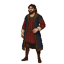

# Giovanni Boccaccio

**Visual Description:**
A man of 30, Giovanni Boccaccio is more worldly and affable than his friend Petrarch. He has a fuller build, with a round, expressive face, a neatly trimmed dark beard, and eyes that sparkle with humor and a keen interest in the people around him. He dresses in the comfortable, fashionable attire of a wealthy Florentine merchant's son, his clothes made of fine, colorful fabrics. He appears approachable and enjoys the pleasures of life, even in a rustic setting like Reval.

**Motivations:**
Boccaccio is motivated by a deep fascination with the human condition. He is a storyteller, and he has accompanied his friend Petrarch on this arduous journey not for the love of dusty manuscripts, but for the love of the stories that surround them. He is drawn to the drama of the uprising, seeing in it the raw material for a great tale of tragedy, comedy, love, and betrayal. He is in Reval to observe and to collect stories of real people in extraordinary circumstances.

**Ties & Relationships:**
*   **Allies:** His primary loyalty is to his friend and mentor, Petrarch. His charming and non-threatening demeanor allows him to make friends easily in taverns and marketplaces.
*   **Enemies:** He has no enemies, but his tendency to ask probing questions and involve himself in the lives of others could easily get him into trouble with any of the factions.
*   **Initial view of the main player (Kalev):** Fascination. He would see Kalev not as a barbarian, but as a tragic hero, a man of the people caught in the gears of history. He would be eager to hear Kalev's story, to understand his hopes and fears, and perhaps to secretly chronicle his deeds.

**History (Biography):**
Giovanni Boccaccio (1313–1375) was an Italian writer, poet, and humanist, most famous for *The Decameron*, a collection of tales set against the backdrop of the Black Death. He was a great friend and admirer of Petrarch. While their joint travel to Estonia is fictional, it is plausible within the game's narrative that the younger Boccaccio would accompany his esteemed friend on a perilous journey, seeing it as an opportunity for adventure and literary inspiration.

**Daily Routines:**
While Petrarch is in the library, Boccaccio is in the tavern. His days are spent in the public spaces of Reval—the market, the harbor, the inns—listening to the stories of soldiers, merchants, rebels, and common folk. He is a collector of human drama, and he spends his evenings turning the day's gossip and observations into notes for his future work.

**Possible Quest Lines:**
*   **The Storyteller's Muse:** Boccaccio asks the player to introduce him to a colorful character—a grizzled mercenary, a rebel leader, a cynical merchant—so he can hear their story. This could lead to unexpected complications.
*   **A Dangerous Romance:** Boccaccio becomes infatuated with a local woman, perhaps someone connected to the rebellion, and the player must help him navigate the dangerous social and political consequences of their forbidden affair.
*   **The Decameron of Reval:** Boccaccio decides to write a collection of tales based on the uprising and asks the player to help him gather the most dramatic stories, leading them into the heart of several different personal conflicts within the larger rebellion.
