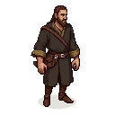

# Goytan

**Visual Description:**
Goytan is a man in his 40s, with a quiet and observant demeanor. He has a long, thin face, a neatly trimmed brown beard, and deep-set, thoughtful eyes. His hands are calloused and stained with pigments from his work. He wears the simple, practical robes of a traveling artisan from Novgorod, perhaps of dark, undyed wool. He carries a satchel with his precious brushes, pigments, and wooden panels. He moves with a deliberate slowness, as if constantly studying the play of light and shadow on the world around him.

**Motivations:**
Goytan is motivated by his faith and his art. He is a devout Orthodox Christian who believes his talent for painting icons is a gift from God. He is driven to create images that will inspire piety and devotion. He might have traveled to Reval for a specific commission, perhaps from a wealthy Novgorodian merchant living in the city, or to study the strange Catholic art of the Germans. He is a man of peace, caught in a city on the brink of war, and his primary goal is to complete his work and return home safely.

**Ties & Relationships:**
*   **Allies:** His patron, likely a Novgorodian merchant in Reval. He would find some kinship with the local clergy, despite the schism between the Catholic and Orthodox churches, through their shared faith.
*   **Enemies:** He has no personal enemies, but the rising tide of anti-foreign sentiment and the violence of the rebellion would pose a grave danger to him. To the more zealous knights of the Livonian Order, his Orthodox faith might be seen as heretical.
*   **Initial view of the main player (Kalev):** He would see Kalev with a mixture of fear and artistic curiosity. He would be frightened by the violence Kalev represents, but also fascinated by his face, seeing in it the raw, earthy strength of the Estonian people—a face worthy of being painted, perhaps as a martyr or a saint.

**History (Biography):**
Goytan is a well-regarded icon painter from the vibrant city of Novgorod, representing the local school of art. He has traveled to Reval for a commission from the Novgorodian merchant community, a common practice for skilled artisans. In the unique environment of this Catholic Hanseatic city, he finds himself working alongside two other prodigious young Orthodox painters: the sophisticated Byzantine, [**Theophanes the Greek**](theophanes_the_greek.md), and the talented [**Prokhor of Gorodets**](prokhor_of_gorodets.md) from the Volga. This meeting of three distinct artistic traditions in a foreign land creates a fertile ground for innovation, as they are all exposed to the local Gothic art and stained glass, which subtly influences their work.

**Scene Presence:**
*   **A Novgorodian Merchant's House:** His primary location would be a private workshop set up in the house of a wealthy Novgorodian merchant, likely located near the eastern quarters of the Lower Town where Russian traders congregated.
*   **[Reval Market](../../scenes/revel_central_quarter/market_civic_quarter/market.md):** He might be found quietly sketching the faces in the crowd, or purchasing supplies like eggs, linseed oil, and wooden panels for his work.
*   **[Church of the Holy Spirit (Püha Vaimu kirik)](../../scenes/revel_central_quarter/market_civic_quarter/church_of_the_holy_spirit.md):** While a Catholic church, he might visit to study the religious art of the "Latins," comparing it to his own Orthodox traditions.

**Daily Routines:**
Goytan's days are spent in quiet contemplation and meticulous work. He would have a small workshop, perhaps in the home of his patron, where he would grind his own pigments, prepare his wooden panels with gesso, and painstakingly apply layer after layer of egg tempera. His life is one of prayer, fasting, and the slow, meditative process of creating a sacred image.

**Possible Quest Lines:**
*   **The Sacred Pigments:** A quest could involve the player helping Goytan acquire rare and valuable pigments for his work, some of which might only be found in dangerous or forbidden places.
*   **An Icon of Peace:** Goytan might ask the player to help him create an icon that he believes could bring peace to the city, requiring the player to protect him and his work from the escalating violence.
*   **The Heretic Painter:** The player might have to protect Goytan from the suspicion of the Livonian Order, who may see his Orthodox icons as a form of blasphemy or a symbol of Russian influence.

**Worldview and Philosophy:**
Goytan's worldview is that of a master icon painter from the Novgorod Republic, grounded in the earthy, pragmatic spirituality of his city. He is a firm believer in the power of tradition and the strict iconographic canons. However, his time in Reval has opened his eyes. He is intrigued by the narrative clarity of the Catholic frescoes and the brilliant colors of their stained glass. He engages in spirited debates with Theophanes and Prokhor, arguing for the strength of the Novgorodian style while also absorbing the influences of his contemporaries and the foreign art around him. He is focused on how to incorporate new techniques to make the powerful protector saints of Novgorod even more immediate and accessible to the faithful.

**Major Creative Works (as a representative of the Novgorod School):**
While Goytan himself is a lesser-known figure, his work would be a prime example of the vibrant and distinctive Novgorod School of icon painting of the 14th century.
-   **Style:** His icons would be characterized by their bold, clear compositions, strong linear rhythms, and a brilliant, jewel-like color palette. The Novgorod style is known for its use of fiery vermilion, bright yellows, and emerald greens, creating a sense of energy and immediacy. The figures are often monumental and powerful, with a simple, laconic grace that is both direct and deeply expressive.
-   **Subject Matter:** As a Novgorodian painter, he would specialize in icons of the most venerated local saints, figures who were seen as the protectors of the city and its people. He would be a master of depicting saints like St. George the Dragon-Slayer, St. Nicholas the Miracle-Worker, and the Prophet Elijah—all powerful intercessors who resonated with the martial and mercantile spirit of the Novgorod Republic.
-   **The Iconostasis:** Goytan would be an expert in the creation of icons for the iconostasis, the great screen of icons that separates the sanctuary from the nave in an Orthodox church. This was a major artistic innovation of the 14th century, and his work would involve creating sets of icons (the Deesis tier, the festival tier, etc.) that formed a coherent and powerful theological statement, guiding the faithful in their worship.
