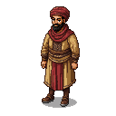

# Ibn Battuta

**Visual Description:**
A man in his late thirties, Ibn Battuta has the appearance of a seasoned traveler. He has dark, intelligent eyes that have seen countless wonders and horrors. His skin is tanned and weathered from years of travel across deserts and seas. He has a neatly trimmed black beard, perhaps with a few specks of grey. He would be dressed in the practical but dignified robes of a Moroccan scholar, likely of fine cotton or wool, in earthy tones. He might wear a turban, and his entire demeanor would be one of calm, observant curiosity.

**Motivations:**
Ibn Battuta is driven by an insatiable curiosity about the world and its diverse peoples and cultures. His primary motivation is to travel, to observe, and to document everything he sees in accordance with the Islamic injunction to "seek knowledge, even unto China." He is a scholar and a jurist, but above all, he is an explorer. His presence in the Baltic would be driven by a desire to see the "Land of Darkness," as the far north was sometimes known, and to understand the strange politics and customs of the Christian and pagan peoples on the fringes of the Islamic world.

**Ties & Relationships:**
*   **Allies:** As a respected Islamic scholar (qadi), he can often find hospitality with Muslim merchants or in the courts of rulers who respect his learning, such as Öz Beg Khan of the Golden Horde. In Estonia, he would have no natural allies and would have to rely on his wits and perhaps the protection of merchants from the East.
*   **Enemies:** He has no personal enemies in the region, but his status as a Muslim from a far-off land would make him an object of suspicion and potential hostility from the Livonian Order and the more zealous elements of the Catholic church.
*   **Initial view of the main player (Kalev):** He would be fascinated by Kalev. As a man of the people, a smith, and a reluctant rebel, Kalev would represent the authentic culture of the land, something Ibn Battuta would be keen to understand and document. He would approach Kalev with a barrage of questions about his beliefs, his craft, and his motivations.

**History (Biography):**
Born in Tangier, Morocco, in 1304, Ibn Battuta was one of the greatest travelers in history. Over a period of thirty years, he journeyed over 75,000 miles, visiting most of the known Islamic world and beyond. While there is no historical record of him visiting Estonia, he did travel extensively through the lands of the Golden Horde in the 1330s, visiting the court of Öz Beg Khan. It is plausible, though entirely fictional, that a man with his boundless curiosity might have attached himself to a trade caravan heading towards the Baltic to observe the exotic lands of the far north.

**Daily Routines:**
Ibn Battuta's routine is one of constant observation and documentation. He would spend his days exploring the city, talking to people from all walks of life (likely through a translator), and taking meticulous notes for his travelogue, the *Rihla*. He would be a fixture in the marketplaces and caravanserais, a strange and fascinating foreigner asking endless questions.

**Possible Quest Lines:**
*   **The Stranger's Guide:** The player could be hired or tasked with acting as a guide and protector for this strange foreigner, leading to quests that involve showing him the customs, sacred sites, and hidden corners of the land.
*   **A Scholar's Curiosity:** Ibn Battuta might ask the player to retrieve a rare pagan artifact, interview a reclusive wise woman, or witness a secret ritual, all for the sake of his research. This could put the player in considerable danger.
*   **The Unbeliever:** A quest could revolve around protecting Ibn Battuta from the suspicion of the Livonian Order, who might see him as a spy, a heretic, or a sorcerer.
