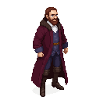

# Jean Buridan

**Visual Description:**
A man in his early 40s, Jean Buridan is a figure of immense intellectual authority. He has a sharp, questioning face, with a high forehead and piercing eyes that seem to analyze every proposition for logical flaws. He has a neatly trimmed beard and wears the distinguished robes of a senior master of the University of Paris. He carries himself with the calm, unshakable confidence of a man who has won a thousand debates and whose ideas are shaping the intellectual landscape of Europe.

**Motivations:**
Buridan is motivated by the power of reason and the desire to expand the boundaries of human knowledge. As a leading philosopher of his time, he is famous for his development of the theory of impetus, a critical step towards modern physics. He has traveled to Reval with his brilliant student, Albert of Saxony, to observe the application of physical principles in the real world—from the flight of an arrow to the mechanics of a siege engine—and to engage in rigorous debate with the scholars of the Dome School.

**Ties & Relationships:**
*   **Allies:** His student, Albert of Saxony. He would be a highly respected, if controversial, guest of the Dome School and the Bishopric of Dorpat.
*   **Enemies:** His ideas, which separated the domains of faith and reason, were controversial and could easily make him enemies among conservative theologians who saw his work as undermining the authority of scripture.
*   **Initial view of the main player (Kalev):** He would be intellectually fascinated by Kalev. As a smith, Kalev has a deep, practical understanding of concepts like momentum, heat, and force. Buridan would see Kalev not as a person, but as a living laboratory, a source of empirical data for his theories of impetus. He would pepper Kalev with questions about the act of hammering, the quenching of steel, and the force of a blow.

**History (Biography):**
Jean Buridan (c. 1300–c. 1358) was a French priest and one of the most influential philosophers and logicians of the late Middle Ages. He taught at the University of Paris and made significant contributions to logic and the philosophy of science, most notably with his theory of impetus. His presence in Reval is fictional, but it creates a compelling scenario where one of the greatest scientific minds of the 14th century is present to witness and analyze the brutal physics of a medieval uprising.

**Scene Presence:**
*   **[Dome School (Toompea Kool)](../../scenes/revel_toompea/dome_school/dome_school.md):** His primary base of operations, where he engages in debates with local scholars and guides the studies of his student, Albert of Saxony.
*   **[City Walls](../../scenes/revel_walls_towers/):** He could be found on the city walls, not as a soldier, but as a physicist, observing the trajectory of arrows and siege projectiles to gather data for his theories of impetus.
*   **[The Smith's Forge](../../scenes/revel_east/forge/forge.md):** He would be drawn to the forge to observe the practical application of force and momentum, seeing the smith's hammer as a perfect real-world example of his abstract theories.

**Daily Routines:**
Buridan's days are a disciplined mix of observation, teaching, and debate. He would spend his time observing the world with a scientific eye, whether it's the arc of a stone thrown from a wall or the workings of a crane at the harbor. He would engage in long, challenging debates with his student Albert and the other masters, pushing the boundaries of their understanding.

**Possible Quest Lines:**
*   **The Impetus of Rebellion:** Buridan becomes obsessed with creating a formal model to explain the social "impetus" of the rebellion. He sends the player on a series of dangerous observational missions to gather "data" for his theory—counting rebel numbers, assessing their weaponry, and gauging their morale.
*   **A Debate with the Devil:** Buridan's rationalist approach to the world leads a powerful inquisitor to accuse him of being a materialist and an atheist. The player must help Buridan win a formal theological debate or be forced to flee the city.
*   **The Perfect Weapon:** Buridan believes he can use his understanding of impetus to design a far more powerful and accurate trebuchet. He hires the player to help him build and test this new weapon, which could turn the tide of the siege.

**Worldview and Philosophy:**
Jean Buridan is a leading figure of 14th-century scholasticism and a champion of Nominalism. His worldview is one of rigorous rationalism and empiricism; he believes that all knowledge originates from experience and that the world can be understood through logical inquiry. He is a firm advocate for the separation of faith and reason, arguing that natural philosophy (what we would call science) should be an autonomous field of study, independent of dogmatic theology. He rejects abstract universals, focusing instead on the study of individual, concrete things. His philosophy of mind posits a universal "mental language" common to all humans, allowing for objective logical analysis. In ethics, he is an intellectual determinist, holding that the will is subordinate to the intellect; a person chooses a course of action because their intellect has judged it to be the best, and freedom lies in the ability of the intellect to suspend judgment and consider all options.

**Major Creative Works:**
Buridan was not a writer of standalone books in the modern sense, but a university master whose "works" are his extensive and highly influential commentaries and questions on the writings of Aristotle. He was a systematic thinker who made groundbreaking contributions in several fields.
-   **Impetus Theory:** This is his most famous and important contribution to science. In his *Questions on Aristotle's Physics* and *Metaphysics*, he rejected the traditional Aristotelian explanation of motion (that an object is kept in motion by the air rushing around it). Instead, he proposed that a mover impresses a force, or "impetus," into the moving body, which then keeps it in motion until overcome by resistance. This was a revolutionary idea that explained projectile motion and the acceleration of falling bodies, and it is a direct and crucial forerunner of Galileo's and Newton's concept of inertia.
-   **Logic and Paradoxes:** His *Summulae de Dialectica* was a hugely influential logic textbook. He made significant advances in the theory of consequence and syllogism. He is also famous for the logical paradox known as "Buridan's Ass," in which a perfectly rational donkey, placed exactly between two identical bales of hay, would starve to death because it has no rational basis for choosing one over the other. (Ironically, this specific paradox does not appear in his surviving works but was likely used by his critics to caricature his ideas on free will).
-   **Commentaries on Aristotle:** His primary literary output was a vast collection of *Quaestiones* (Questions) on nearly all of Aristotle's major works, from the *Nicomachean Ethics* to *On the Soul*. These were not mere summaries but deep, critical analyses that used Aristotle as a starting point for his own innovative philosophical arguments.
