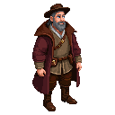

# John Mandeville (Author) (fl. 14th Century)

**Visual Description:**
The man calling himself "John Mandeville" is an enigma. He appears to be a man in his late 40s or early 50s, of indeterminate origin. He has a weathered face, suggesting a life of travel, and his eyes hold a perpetual twinkle, as if he's always withholding a fantastic secret. His hair and beard are a nondescript brown, with flecks of grey. He dresses in the durable, multi-layered garb of a seasoned traveler, his clothes a patchwork of different styles and fabrics—a woolen tunic that could be English, a fur-lined hat that looks vaguely Russian, and boots of a supple leather he claims comes from the Orient. He is never without a leather-bound journal and a pouch of exotic-smelling herbs. His accent is a curious mix, shifting depending on his audience.

**Motivations:**
- To collect stories, true or not, to add to his ever-growing travelogue.
- To experience the world in all its wonder and absurdity, believing that a good story is more important than the literal truth.
- To remain anonymous and unburdened by a single identity, allowing him the freedom to move through all levels of society.

**Ties & Relationships:**
- **Allies:** He is a natural ally to anyone with a good story to tell: tavern keepers, sailors, mercenaries, and even spies. He is a master of conversation and can find common ground with almost anyone.
- **Enemies:** His enemies are those who cannot abide falsehood or ambiguity. Dogmatic priests, literal-minded scholars, and humorless military commanders would find him infuriating and possibly dangerous.
- **Initial view of the main player:** He would see the player as a living story, a protagonist in an epic tale unfolding before his very eyes. He would shadow the player, documenting their deeds (perhaps with some embellishment) and offering cryptic advice gleaned from his supposed travels.

**History (Biography):**
"John Mandeville" is the pseudonym of the author of one of the most popular and wildly imaginative travel narratives of the Middle Ages, *The Travels of Sir John Mandeville*. The book purports to be an account of his journeys to the Holy Land, Egypt, India, and even the mythical kingdom of Prester John. While likely a compilation of other travel accounts mixed with fantastic fiction, the book is a sensation across Europe. The man himself is a mystery. He arrived in Reval on a merchant ship from Lübeck, claiming to be an English knight on a pilgrimage to the holy sites of the North. In reality, he is here to gather tales of the strange pagan customs of the Estonians and the grim crusades of the Livonian Order for a new chapter in his book. The uprising has provided him with more material than he could ever have hoped for.

**Daily Routines:**
- Spends his days in taverns, markets, and other public places, listening to gossip, rumors, and soldiers' tales.
- Can be found sketching maps (often with fantastical creatures in the margins) and writing furiously in his journal.
- Practices a form of detached observation, blending into crowds and watching events unfold from the periphery.

**Possible Quest Lines:**
- **A Story Worth Telling:** Mandeville has heard a rumor of a strange pagan idol hidden in a rebel-held village. He doesn't care if the idol is real; he just wants a good story. He'll pay the player to escort him to the village so he can "witness" it, asking them to embellish the details of any dangers they encounter.
- **The Traveller's Tall Tale:** To gain the trust of a suspicious Order knight, Mandeville needs to prove his identity as a well-traveled nobleman. He asks the player to acquire a series of exotic items from around the city (a piece of "dragon's scale" from an apothecary, a "griffin's feather" from a merchant's collection) to corroborate his fantastic stories.
- **Fact from Fiction:** A skeptical scholar accuses Mandeville of being a fraud and a spy. To protect his anonymity, Mandeville asks the player to discreetly discredit the scholar, perhaps by planting a forged letter or leading the scholar on a wild goose chase for a mythical beast that Mandeville claims to have seen nearby.

**Worldview and Philosophy:**
The man known as "John Mandeville" possesses a worldview that is both deeply medieval and startlingly modern. He is a master of cultural relativism, presenting the strange customs and beliefs of far-off lands not as monstrous heresies, but as different, often equally valid, ways of being human. His philosophy is that a good story holds a deeper truth than a dry fact. He is a critic of his own culture, using his tales of idealized Eastern societies to subtly critique the greed, hypocrisy, and intolerance he sees in Christian Europe. He believes in a universal human experience that transcends religious and cultural divides, suggesting that all peoples, in their own way, worship the same divine principles. He is a purveyor of wonders, a collector of marvels, and a firm believer that the world is far larger, stranger, and more magnificent than the limited philosophies of scholastic scholars or theologians can possibly contain.

**Major Creative Works:**
The life's work of "John Mandeville" is the creation of a single, sensational, and enormously influential book.
-   ***The Travels of Sir John Mandeville***: This is his masterpiece, a book that purports to be the true account of his journeys as an English knight through the Middle East, Africa, and Asia between 1322 and 1356.
    -   **Content:** The book is a captivating blend of relatively accurate geography (often borrowed from other travelers' accounts), mixed with fantastical stories of monstrous races, mythical beasts, and wondrous kingdoms. It describes lands of dog-headed men, giants, and pygmies; the mythical kingdom of Prester John; and the earthly paradise.
    -   **Authorship and Truth:** The true identity of the author is one of the great literary mysteries. Scholars now believe the author was likely not an English knight and probably never traveled to most of the places he describes. The book is a masterful compilation, a work of creative fiction presented as fact, that brilliantly captured the medieval imagination.
    -   **Influence:** Despite (or because of) its fictional nature, *The Travels* was a medieval bestseller, translated into numerous languages and circulated in hundreds of manuscript copies. It profoundly shaped the European view of the world for centuries. It was a primary source for Christopher Columbus and other explorers, who sailed in search of the wonders Mandeville had described. It is a testament to the power of a good story to shape reality itself.

**Scenes:**
- Can be found holding court in a smoky tavern or observing the flow of goods and people in the marketplace of the `revel_north_west_quarter_merchants`.
