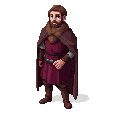

# Magnus IV Eriksson

**Visual Description:**
At 27, Magnus IV has a thoughtful, almost troubled expression. He has light brown hair, cut neatly, and a trimmed beard. His eyes are a soft grey, often distant, reflecting the immense pressures of ruling three kingdoms. He is of average height and build. He would be dressed in the fine, but not overly ostentatious, attire of a Scandinavian king: a deep red or blue tunic of fine wool, perhaps with simple embroidery at the collar and cuffs, worn over a linen shirt. A heavy, fur-lined cloak would be common for travel.

**Motivations:**
Magnus is motivated by a desire to hold his vast and unwieldy triple kingdom (Sweden, Norway, and Scania) together. He is a ruler beset by internal problems, including a powerful and restless nobility. His interest in Estonia is opportunistic; he sees the rebellion as a chance to weaken his rival, the King of Denmark, and potentially expand Swedish influence in the Baltic. However, his primary focus is on consolidating his power at home, making him a cautious and ultimately unreliable ally for the Estonian rebels.

**Ties & Relationships:**
*   **Allies:** His primary allies are those who support his rule within Sweden and Norway. He has a complex relationship with the Swedish nobility, who are both his supporters and his rivals.
*   **Enemies:** Valdemar IV of Denmark is a major political rival. The Livonian Order is a powerful force in the region that he would be wary of confronting directly.
*   **Initial view of the main player (Kalev):** He would see Kalev, and the rebellion as a whole, as a tool. A means to an end. He might feel some sympathy for their cause, but it would be secondary to his own strategic interests. He would not know Kalev personally.

**History (Biography):**
Born in 1316, Magnus Eriksson became King of Sweden and Norway at a young age. His reign was marked by significant legal reforms, including the abolition of slavery. However, he faced constant challenges from a powerful nobility and the logistical difficulties of ruling a sprawling kingdom. By 1343, he was dealing with significant political tensions, particularly in Norway, which led him to appoint his son Haakon as its king. While he did promise aid to the Estonian rebels and a Swedish fleet did arrive off Tallinn, the rebellion on the mainland had already been crushed. Unwilling to risk a direct war with the victorious Livonian Order, he withdrew.

**Daily Routines:**
Magnus's days would be consumed by the administration of his kingdoms. This would involve holding court, settling disputes, meeting with his council of nobles, and dealing with endless correspondence. His life is one of politics and diplomacy, a constant balancing act to maintain his authority.

**Possible Quest Lines:**
*   **The Swedish Promise:** The player could be sent as an envoy to the Swedish bailiff in Turku or Vyborg, trying to secure the promised military aid. This could involve navigating the complexities of Swedish court politics.
*   **A King's Indecision:** The player might interact with Swedish agents in Reval, who are gathering information for King Magnus. The player could try to influence their reports to either encourage or discourage a Swedish intervention.
*   **Betrayal from the North:** A quest could revolve around the aftermath of the Swedish withdrawal, dealing with the dashed hopes of the rebels and perhaps seeking retribution against those who made false promises.
