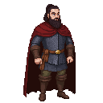

# (Prince) Ivan of Pskov

**Visual Description:**
Prince Ivan is a seasoned warrior, likely in his 30s or 40s. He has a strong, weathered face, with a thick beard and long, dark hair tied back. His eyes are sharp and alert, accustomed to scanning battlefields and courtrooms alike. He is more a soldier than a courtier, and his attire reflects this. He would wear practical chainmail or lamellar armor, covered by a heavy cloak. Even in more formal settings, he would favor function over finery.

**Motivations:**
Ivan is motivated by the security and prosperity of the Pskov Republic. As a frequent adversary of the Livonian Order, he sees the Estonian uprising as a golden opportunity to strike a blow against his long-standing enemy. His decision to lead an army into the Bishopric of Dorpat was a calculated strategic move, not an act of altruism. He is a pragmatist, willing to aid the rebels as long as it serves Pskov's interests, but also willing to withdraw the moment the situation becomes unfavorable.

**Ties & Relationships:**
*   **Allies:** The boyars and merchants of Pskov. He has a complex and often tense relationship with the larger Novgorod Republic, which still viewed Pskov as within its sphere of influence.
*   **Enemies:** The Livonian Order and the Bishopric of Dorpat are his primary, long-term enemies.
*   **Initial view of the main player (Kalev):** He would see Kalev as representative of the rebellion's potential. If the rebels are strong and organized, they are useful allies. If they are weak and fractured, they are a lost cause. He would judge Kalev on his strength and his ability to fight, not on his personal story.

**History (Biography):**
Born and raised in the fortified city of Pskov, Prince Ivan's life was shaped by the constant threat of the Livonian Order. He represents the leadership of the Pskov Republic, a state that was fiercely independent and frequently at odds with its western neighbors. In 1343, in response to a plea from the Estonian rebels, he led a Pskovian army of 5,000 men across the border, invading the territory of the Bishopric of Dorpat. His campaign was a direct, military intervention. They reached Otepää but retreated after learning that the main rebellion in Harju had been crushed, highlighting the pragmatic and self-interested nature of Pskov's involvement.

**Faction Views:**
*   **The Livonian Order & Bishopric of Dorpat:** His hereditary enemies. He views them as aggressive, expansionist powers that pose a direct threat to Pskov's independence and its control over regional trade. He is always looking for an opportunity to weaken them.
*   **Novgorod:** A powerful, and sometimes overbearing, older brother. He values the alliance with Novgorod against the Livonians, but is also fiercely protective of Pskov's de facto independence. He is wary of being drawn into Novgorod's larger political games.
*   **The Estonian Rebels:** A temporary and convenient ally. He sees their uprising as a perfect opportunity to strike at the Order with minimal risk to himself. He is willing to support them as long as they are a credible fighting force, but he will not waste Pskovian lives on a lost cause.
*   **The Grand Duchy of Lithuania:** A distant but potential ally. He shares a common enemy with them in the Livonian Order, but their paganism and expansionist ambitions make them an unpredictable and potentially dangerous partner.
*   **The Hanseatic League:** Competitors. He sees the German merchants of Reval and Dorpat as economic rivals to the traders of Pskov and Novgorod.

**Scene Presence:**
Prince Ivan's presence in the game is brief, military, and impactful.
*   **[Pskov Arrival Battle](../../scenes/events/pskov_arrival_battle.md):** He is the central figure in this event, leading his army into Livonian territory. The player will interact with him here, witnessing his military command and his pragmatic decision to retreat.

**Daily Routines:**
As a prince of a frontier republic, Ivan's days would be a mix of military and civic duties. He would be involved in training the militia, inspecting fortifications, and planning defenses against the Livonians. He would also preside over the *veche* (the city's assembly), settling disputes and managing the affairs of the republic.

**Possible Quest Lines:**
*   **The Pskovian Army:** The player could be tasked with guiding the Pskovian army through the territory of the Bishopric of Dorpat, acting as a scout or a guide.
*   **A Faltering Alliance:** A quest could focus on the moment the Pskovians decide to retreat. The player might have to try and persuade Prince Ivan to stay and fight, or deal with the consequences of his withdrawal.
*   **Cross-Border Raid:** The player could join a Pskovian raiding party, striking at Livonian outposts and supply lines, and getting a taste of the brutal border warfare of the era.
