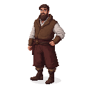

# Prokhor of Gorodets

**Visual Description:**
Prokhor is a young master in his early 20s, carrying the quiet confidence of a prodigy. He has a focused gaze, a neatly trimmed beard, and the strong, steady hands of a painter. He is dressed in the practical, yet well-made, traveling clothes of a successful artisan from the Volga region, his garments showing subtle hints of Eastern ornamental style. He observes the foreign city of Reval with a keen, analytical eye, absorbing the unfamiliar architecture and art.

**Motivations:**
- To fulfill his commissions and create icons that will inspire faith and devotion in the people of Moscow and beyond.
- To pass on his knowledge and the traditions of the Gorodets school of painting to a new generation of artists.
- To absorb new techniques and ideas from the Catholic art of Reval, while staying true to his Orthodox roots.
- To prove his skill and make a name for himself far from his home on the Volga.

**Ties & Relationships:**
- **Allies:** As he is in Reval on a commission from Novgorodian merchants, they are his primary patrons and protectors. He would naturally find community within the Russian quarter.
- **Contemporaries & Rivals:** In Reval, he has met two other brilliant young Orthodox painters: the Byzantine [**Theophanes the Greek**](theophanes_the_greek.md) and the Novgorodian [**Goytan**](goytan.md). They share a bond as Orthodox artists in a Catholic city, but a professional rivalry and a vibrant exchange of ideas exists between them.
- **Protégé:** While still a young master himself, he has the potential to one day become the teacher of the great Andrei Rublev.

**History (Biography):**
Prokhor is a gifted young icon painter from Gorodets, a town on the Volga River known for its distinctive artistic style, rich with Eastern and ornamental influences. Having already established a reputation as a prodigy, he has traveled to Reval on a prestigious commission from the city's community of Novgorodian merchants. Here, in this bustling Hanseatic port, his path crosses with two other future legends of Orthodox art: Theophanes the Greek and Goytan of Novgorod. Together, they find themselves at a unique crossroads of culture, studying the local Gothic art and stained glass, experiences that will profoundly influence their own work and contribute to a unique "northern style" in their future masterpieces.

**Daily Routines:**
- His days are structured around prayer and the meticulous, ritualistic process of icon painting.
- He would spend long hours in his workshop, preparing panels, mixing egg tempera, and applying layers of paint with meditative focus.
- He would also be a teacher, instructing apprentices in the spiritual and technical disciplines of his craft.

**Possible Quest Lines:**
- **The Master's Commission:** Prokhor has been commissioned to create a major icon for a powerful patron but lacks a rare pigment. The player must journey to a distant monastery or a foreign merchant to acquire it.
- **The Wayward Apprentice:** One of Prokhor's less-talented apprentices has stolen a valuable icon or a book of iconographic patterns. The player must track down the apprentice and recover the stolen item.
- **A Test of Styles:** A wealthy patron wishes to commission a new iconostasis and has invited both Prokhor and Theophanes the Greek to submit a trial icon. The player could become involved in helping one of the masters acquire materials or find inspiration, ultimately influencing the patron's decision.

**Worldview and Philosophy:**
Prokhor is deeply rooted in the Orthodox faith and the artistic traditions of the Volga region, known for its vibrant colors and ornamental detail. Unlike a staunch traditionalist, he is curious and open-minded, believing that all forms of beauty can reveal something of God's creation. His journey to Reval is not just a commission but a pilgrimage of sorts, to see and learn from the art of the "Latins." He is fascinated by the narrative power of Gothic painting and the ethereal light of stained-glass windows, and he contemplates how these foreign techniques can be adapted to enrich the spiritual depth of the Orthodox icon without betraying its theological core.

**Major Creative Works:**
While his documented collaboration with Theophanes the Greek and Andrei Rublev is in the future, his work from the period of the game would be representative of the late 14th-century Russian style.
- **Attributed Icons:** Russian art historians attribute several icons in the iconostasis of the Cathedral of the Annunciation to him, including the "Crucifixion," "Ascension," and "Assumption."
- **Style:** His work would be characterized by its adherence to traditional forms, its clear, balanced compositions, and its use of a rich, symbolic color palette. It would be more conservative and perhaps less dramatic than the work of Theophanes, but no less spiritually powerful.
