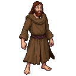

# Richard Rolle

**Visual Description:**
A man in his early 40s, Richard Rolle has the gaunt, wild-eyed appearance of a true ascetic. He is thin to the point of emaciation, with a long, unkempt beard and piercing eyes that seem to be looking at something beyond the material world. He wears the simple, rough-spun robes of a hermit, patched and weathered from years of living in the wilderness. He is a figure of intense, almost unsettling, spiritual energy.

**Motivations:**
Rolle is motivated by a profound, all-consuming love for God. He is a mystic who seeks a direct, personal union with the divine through a life of extreme asceticism, contemplation, and prayer. He has traveled to the remote, untamed wilderness of Estonia to escape the distractions of the world and to find a place where he can feel closer to God's creation. He is indifferent to the political conflict, seeing it as a foolish and worldly distraction from the true battle for the human soul.

**Ties & Relationships:**
*   **Allies:** He has no allies in the traditional sense. He might be seen as a holy man by some of the common folk, both Estonian and German, who might leave him offerings of food.
*   **Enemies:** His unconventional, personal brand of mysticism could be viewed as heretical by the more dogmatic elements of the Church. The pagan Cult of Metsik might see him as a strange and unpredictable rival for the spiritual soul of the forest.
*   **Initial view of the main player (Kalev):** He would see Kalev not as a rebel or a smith, but as a soul in turmoil. He would speak to Kalev in cryptic, poetic language, urging him to abandon his worldly struggles and seek the "fire of love" that Rolle himself experiences. He would be a source of strange, unsolicited, and perhaps profound spiritual advice.

**History (Biography):**
Richard Rolle (c. 1300–1349) was an English religious writer, mystic, and hermit. His writings were widely read in the 14th and 15th centuries. He lived a life of extreme asceticism, and his works describe his mystical experiences of union with God. His presence in Estonia is entirely fictional, but it is plausible that a man seeking the ultimate solitude to pursue his spiritual quest would be drawn to the vast, sparsely populated forests of the Baltic.

**Daily Routines:**
Rolle's days are a simple cycle of prayer, meditation, and subsistence. He would live in a crude hut or a cave deep in the forest, far from any settlement. He would spend his hours in ecstatic contemplation, writing his mystical treatises on scraps of parchment, and foraging for the bare minimum of food to survive.

**Possible Quest Lines:**
*   **The Mad Hermit:** The player is sent to investigate reports of a "mad hermit" in the woods whose strange preaching is unsettling the local peasants. This leads to an encounter with Rolle and a glimpse into his mystical world.
*   **The Mystic's Vision:** Rolle has a powerful, prophetic vision related to the uprising, but it is couched in cryptic, symbolic language. The player must try to decipher the vision's meaning before it's too late.
*   **The Heretic Hunt:** A zealous priest from the Order decides that Rolle is a heretic and sends soldiers to arrest him. The player must choose whether to protect the harmless mystic or to stand aside.
