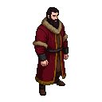

# Semyon Ivanovich (Simeon the Proud)

**Visual Description:**
Semyon is a man in his late twenties, tall and powerfully built, befitting his moniker "the Proud." He has dark hair and a thick, well-groomed beard, common for a Russian prince of the era. His eyes are dark and intense, conveying a sense of authority and shrewdness. He would be dressed in rich, layered robes of Byzantine influence, likely of silk or brocade in deep reds or golds, trimmed with fur. He carries himself with an air of command and confidence, fully aware of his status as the leader of the most powerful Russian principality.

**Motivations:**
Semyon's primary motivation is the continuation of his father's policy of "gathering the Russian lands." He seeks to establish Moscow as the undisputed political and religious center of the Russian principalities. He is ambitious and calculating, constantly maneuvering to increase his influence while carefully managing his relationship with his overlords, the Golden Horde. His interest in the Estonian rebellion would be purely strategic: a weakened Livonian Order could present opportunities for Novgorod and Pskov, and by extension, for Moscow.

**Ties & Relationships:**
*   **Allies:** His brothers, whom he rules over, and the boyars of Moscow who are loyal to him. He has a complex, subservient relationship with Jani Beg, the Khan of the Golden Horde.
*   **Enemies:** Rival Russian princes, particularly those of Tver and Ryazan, are his main enemies. The Grand Duchy of Lithuania is a major geopolitical rival. The Livonian Order is a long-standing adversary on the western frontier.
*   **Initial view of the main player (Kalev):** Utterly insignificant. Semyon operates on a grand political stage. An Estonian smith is beneath his notice. He would view the rebellion itself as a minor skirmish on a distant border, perhaps a useful distraction for his enemies, but nothing more.

**History (Biography):**
Born in 1317, Semyon became Grand Prince of Moscow in 1340. He was a skilled diplomat and a strong ruler, successfully asserting Moscow's dominance over other Russian principalities. His reign was a constant balancing act between consolidating his own power and maintaining the favor of the Golden Horde. He was involved in the politics of Novgorod, influencing its leadership. While he did not directly intervene in the St. George's Night Uprising, the event would have been of keen interest to him as it impacted the balance of power on his western border. He died of the Black Death in 1353.

**Daily Routines:**
Semyon's life would be centered in the Moscow Kremlin. His days would be filled with holding court, receiving tribute, dispatching envoys, and planning political or military moves. He would also be involved in religious ceremonies, as the church was a key pillar of his power.

**Possible Quest Lines:**
*   **Whispers from the East:** The player might encounter agents from Novgorod or Pskov in Reval, who are secretly reporting back to Moscow. The player could become entangled in this web of espionage.
*   **The Prince's Interest:** A quest could involve a valuable item or piece of information that Semyon desires, forcing the player to deal with his powerful and far-reaching influence.
*   **An Unlikely Alliance:** In a more elaborate storyline, the player might be part of a desperate attempt to secure aid from the Russian principalities, requiring a perilous journey east and an attempt to gain the attention of the formidable Grand Prince.
