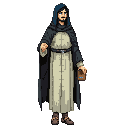

# Sergius of Radonezh (Сергий Радонежский)

**Born:** 1314 (Age in 1342: 28)

**Role:** Spiritual leader, monk, peacemaker

**Visual Description:**
A man of 28, with a slender and ascetic build, shaped by a life of fasting and prayer. His hair is dark brown and of medium length, and his beard is neatly trimmed, framing a face that exudes a profound sense of calm. He is dressed in a simple, dark brown monastic robe (ryasa) made of coarse linen, and a soft, black woolen cap (skufia). His figure is unassuming, yet he carries an aura of quiet authority and deep inner peace.

**Motivations:**
- To seek a deeper connection with God through a life of solitude, prayer, and contemplation.
- To spread a message of peace, unity, and spiritual renewal among the Russian principalities.
- To act as a peacemaker and spiritual guide for the Russian people, caught between the authority of the Golden Horde and the ambitions of their own princes.
- To establish a monastic community founded on the principles of humility, labor, and communal living.

**Ties & Relationships:**
- **Allies:** As a man of God, he would find natural allies among the Orthodox communities, such as the Novgorodian merchants in Reval. He holds a deep spiritual connection with the common people and those who seek a life of faith.
- **Contemporaries:** In Reval, he might encounter other prominent Orthodox figures like [**Theophanes the Greek**](theophanes_the_greek.md), [**Goytan of Novgorod**](goytan.md), and [**Prokhor of Gorodets**](prokhor_of_gorodets.md). While not a painter himself, he would share a common spiritual and cultural world with them, offering guidance on the theological purpose of their art.
- **Initial View of the Main Player:** He would see the player not through the lens of politics or faction, but as a soul on a journey. He would offer cryptic but profound spiritual guidance, encouraging a path of peace and reconciliation over violence and greed.
- **Faction Relations:**
    - **The Republic of Novgorod & Pskov:** He views them as his brethren in faith. He supports their merchants and community in Reval spiritually, offering prayers and guidance, but remains detached from their political and commercial ambitions.
    - **The Rebel Factions:** He feels a deep compassion for the suffering of the Estonian people but fundamentally disagrees with their violent methods. He would see their uprising as a tragic cycle of bloodshed that only perpetuates hatred.
    - **The Ruling Factions:** He is deeply wary of the Catholic powers like the Livonian Order and the Danish Crown. He views their crusade as a perversion of the Christian faith, driven by worldly ambition and greed rather than true piety. He would avoid them and pray for their enlightenment.
- **Presence:**
    - He can be found in quiet contemplation within the small Orthodox chapel in the Novgorodian quarter.
    - Occasionally, he walks through the [Reval Market](../../scenes/revel_central_quarter/market/market.md), observing the worldly affairs of the city with a detached, sorrowful gaze.

**History (Biography):**
Born as Bartholomew in the village of Varnitsa near Rostov, Sergius was the son of pious nobles. From a young age, he displayed a profound inclination towards a spiritual life. In 1337, at the age of 23, he was tonsured as a monk, taking the name Sergius. Seeking a life of solitude, he and his brother built a small cell and a chapel dedicated to the Holy Trinity in the dense forest near Moscow. After his brother left, Sergius spent several years alone in the wilderness, living a life of extreme asceticism.

By 1342, he is still a relatively unknown figure, but whispers of the holy man in the Radonezh forest are beginning to spread. He has not yet founded the great Trinity-Sergius Lavra, nor has he played his pivotal role in the politics of the Russian principalities. He is a soul on a journey, seeking God in silence and solitude. His travels have brought him to the lands of Livonia, where he observes the conflict between the Catholic crusaders and the Estonian rebels with a heavy heart, seeing it as a reflection of a world that has lost its spiritual center.

**Daily Routines:**
- His days are governed by the monastic cycle of prayer, beginning before dawn and continuing throughout the day.
- He engages in simple manual labor, such as chopping wood, tending a small garden, and baking bread, believing that work is a form of prayer.
- He spends long hours in silent contemplation and the reading of scripture and the writings of the Church Fathers.

**Worldview and Philosophy:**
Sergius is a proponent of Hesychasm, a mystical tradition of prayer in the Orthodox Church that emphasizes the quest for inner stillness and the direct experience of God's presence. He believes that true peace and unity can only be achieved through spiritual transformation, not through political or military power. He is deeply troubled by the violence and division he sees in the world, viewing it as a symptom of humanity's separation from God. His goal is not to take sides in the conflicts of the world, but to call all people back to a life of love, humility, and prayer.

**Possible Quest Lines:**
- **The Peacemaker:** Sergius asks the player to act as an intermediary between two warring factions (perhaps a group of rebels and a local lord), carrying a message of peace and a proposal for a truce. The quest would test the player's skills of diplomacy and persuasion rather than combat.
- **The Lost Icon:** A sacred icon has been stolen from the Novgorodian chapel in Reval. Sergius senses that the icon is not merely a valuable object but a source of spiritual protection for the community. He tasks the player with recovering it, not for its monetary value, but for its spiritual significance.
- **A Word of Wisdom:** Sergius offers to share a piece of spiritual wisdom with the player, but only if they can prove their worthiness by completing a task of humility and service, such as helping a poor family, tending to the sick, or resolving a dispute without violence.

**Fourth Wall Quests:**
- **The Unseen Hand:** Sergius speaks to the player about the "unseen hand" that guides their destiny, alluding to the player controlling the character. He might ask the player to perform an action that is nonsensical within the game's world but acknowledges the player's perspective, such as, "You move with a purpose that is not your own. Show me the limits of your world. Walk to the edge of the sea and take three steps more."
- **The Illusion of Choice:** Sergius might comment on the player's tendency to save their progress before making a significant decision. He could say, "You stand at a crossroads, yet you carry the memory of the path not taken. Tell me, does the choice have meaning if you can simply live it again?" This quest could involve a decision that has the same outcome regardless of the player's choice, prompting a philosophical dialogue with Sergius about fate and free will in a simulated world.
- **The Weight of a Thousand Souls:** Sergius observes the player's inventory, remarking, "You carry the weight of a thousand souls in your satchel, yet your back is not bent." He might ask the player to collect a series of seemingly mundane and unrelated items, which, when brought back to him, spell out a word or form a pattern that is only meaningful to the player (e.g., the developer's name based on operating system user running the process).
