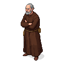

# William of Ockham

**Visual Description:**
William of Ockham is a man in his late 50s, with a sharp, ascetic face that reflects a life of intense intellectual rigor and controversy. He is thin, with a high forehead, piercing intelligent eyes, and a tonsured, greying haircut typical of a Franciscan friar. He wears the simple, coarse brown robes of his order. His demeanor is one of profound intellectual confidence and a certain weariness from his long conflict with the church authorities.

**Motivations:**
Ockham is motivated by a search for truth, both philosophical and theological. He is a radical thinker who challenged the established scholastic traditions of his time. His flight from the papal court at Avignon was motivated by his belief that the Pope had exceeded his authority and fallen into heresy. If he were in Reval, it would be as a fugitive, seeking refuge in a remote corner of Christendom where the Pope's reach was weak. He would be driven to continue his writing and philosophical work, even in hiding.

**Ties & Relationships:**
*   **Allies:** As a fugitive, he would have few allies. He might find cautious protection from elements within the Livonian Order who were loyal to the Holy Roman Emperor, Louis IV, Ockham's protector. He might also find intellectual companionship with other scholars at the Dome School, if he dared reveal himself.
*   **Enemies:** The Pope and his agents are his primary enemies. He would be a high-value target for the Inquisition. His radical ideas would also make him an enemy of the more conservative theological minds in Reval.
*   **Initial view of the main player (Kalev):** Ockham would likely see Kalev as a fascinating philosophical puzzle. He might see in the simple, direct worldview of the smith a real-world application of his principle of simplicity (Ockham's Razor). He would be interested in Kalev's motivations, trying to strip away the complex layers of politics and religion to find the simplest, most direct cause of his actions.

**History (Biography):**
William of Ockham was a highly influential English Franciscan friar and scholastic philosopher. He is famous for the principle of parsimony known as "Ockham's Razor." In the 1320s, his writings were condemned by a papal commission, and he was forced to flee the papal court at Avignon in 1328. He sought protection with the Holy Roman Emperor, Louis IV of Bavaria, and spent the rest of his life in exile, writing treatises on logic, philosophy, and politics. While historically he spent his exile in Munich, his presence in a remote location like Reval is a fictional scenario that places a major intellectual figure in the middle of the game's raw, provincial conflict.

**Scene Presence:**
*   **A Hidden Room in a Monastery:** His most likely hiding place would be a secret, forgotten room in the vast **[Dominican Monastery of St. Catherine](../../scenes/revel_east/dominican_monastery/dominican_monastery.md)** or the **[St. Michael's Cistercian Nunnery](../../scenes/revel_north_west_quarter_merchants/st_michaels_nunnery.md)**, under the protection of a sympathetic abbot who values his intellect more than papal decrees.
*   **[Dome School (Toompea Kool)](../../scenes/revel_toompea/dome_school/dome_school.md):** He might secretly meet with trusted scholars like Jean Buridan in the dead of night in the school's library to debate philosophy.
*   **The Undercity:** If truly desperate, he might find refuge in the city's hidden tunnels, a place where even the Pope's agents would be unlikely to find him.

**Daily Routines:**
Ockham's routine would be one of secrecy and intense intellectual work. He would live in hiding, perhaps in a secluded room in a monastery or under the protection of a powerful vassal. His days would be spent reading, writing, and thinking, filling parchment with his sharp, logical arguments against the philosophical and theological status quo.

**Possible Quest Lines:**
*   **The Fugitive Friar:** The player could stumble upon Ockham's hiding place and be drawn into the dangerous game of concealing him from papal agents who are hunting for him in the city.
*   **Forbidden Knowledge:** Ockham might entrust the player with smuggling his controversial manuscripts out of the city, or with acquiring rare books he needs for his work.
*   **The Razor's Edge:** The player might bring a complex moral or political problem to Ockham, who would then use his powerful intellect to cut through the confusion and reveal the simplest, and perhaps most dangerous, truth at its heart, setting the player on a new and unexpected path.

**Worldview and Philosophy:**
William of Ockham is a radical empiricist and a champion of Nominalism, a philosophical position that would fundamentally reshape Western thought. His worldview is one of profound skepticism towards abstract, metaphysical systems. He believes that reality consists only of individual, particular things, and that universal concepts (like "humanity" or "justice") are merely names or mental constructs, not real entities existing in the world. This leads to his most famous principle, the "Law of Parsimony" or "Ockham's Razor": *Entia non sunt multiplicanda praeter necessitatem* ("Entities should not be multiplied beyond necessity"). In essence, he argues that the simplest explanation is usually the best. In theology, he is a Fideist, believing that God's existence cannot be proven by reason but must be accepted on faith. He emphasizes God's absolute freedom and omnipotence, arguing that moral laws are good simply because God has willed them. This combination of radical empiricism in philosophy and fideism in theology makes him a deeply controversial figure, a man who is simultaneously clearing the ground for modern science while challenging the rationalist foundations of mainstream scholastic theology.

**Major Creative Works:**
Ockham's works are primarily academic and polemical, written in Latin for a scholarly audience. They are foundational texts of late medieval philosophy.
-   ***Summa Logicae*** **(Summa of Logic):** This is his most important philosophical work, a masterpiece of medieval logic. In it, he lays out his theory of terms and propositions and develops his Nominalist philosophy in great detail. It was a hugely influential text that challenged the dominant Realist traditions of logic that had descended from Aristotle.
-   **Commentaries on Aristotle and Peter Lombard:** Like other university masters, a significant portion of his early work consists of detailed commentaries on Aristotle's *Physics* and the *Sentences* of Peter Lombard, a standard theological textbook. It was in these commentaries that he first developed many of his controversial philosophical and theological positions.
-   **Political Writings:** After his flight from Avignon, Ockham wrote a series of powerful polemical works on politics and the Church. The most famous of these is the ***Dialogus de potestate papae et imperatoris*** **(Dialogue on the Power of the Pope and the Emperor)**. In these works, he argues for the separation of church and state, asserting that the Pope has no right to temporal power over secular rulers like the Emperor. These writings made him a key figure in the political conflicts of the 14th century and an early advocate for a more limited, spiritual role for the papacy.
-   **Ockham's Razor:** While the famous phrase is his, the "razor" is not a single book but a principle of simplicity and parsimony that he applied rigorously throughout all his works, using it to "shave away" what he saw as the unnecessary and unprovable metaphysical assumptions of his philosophical opponents.
