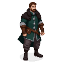

# Nikolaus von Danzig

**Title:** Spymaster of the Lizard Union

**Appearance:** A man in his late 30s, with a lean, wiry build that hints at a past of martial discipline. His face is sharp and intelligent, with piercing grey eyes that seem to miss nothing. His dark brown hair is cut to a practical, medium length, and his beard is neatly trimmed. He is dressed in the expensive but understated attire of a successful Hanseatic merchant. He wears a high-collared doublet of deep forest green wool, its texture rich and heavy, fastened with a row of polished silver buttons. Over this, he wears a sleeveless, charcoal-grey houppelande of fine Flemish cloth, lined with dark fur that shows at the collar and armholes. His trousers are of a matching grey wool, tucked into sturdy, well-oiled black leather boots that are more practical than fashionable. The calluses on his hands and the precise, economical way he moves are the only outward signs of his past as a knight.

**Personality:** Charismatic, cunning, and utterly ruthless. Nikolaus is a master of manipulation, able to read the desires and fears of others and use them to his advantage. He is a patient strategist, always thinking several moves ahead. He sees people as pieces on a board, and he is not afraid to sacrifice them to achieve his objectives.

### Background
Nikolaus was once a promising knight in the service of the Teutonic Order, but he grew disillusioned with their rigid dogma and hypocrisy. After a bitter falling out with his superiors, he left the Order and used his connections and skills to build a new life as a merchant in Reval. But the ambition that had driven him as a knight never faded, and he found a new outlet for it in the secretive circles of the Lizard Union. He is the architect of the Union's strategy in Reval, and his web of spies and informants extends into every corner of the city.

### Motivations
- To see the Livonian Order humbled and broken.
- To carve out a new, powerful state for himself and his allies.
- To prove that his intellect and ambition are superior to the blind faith and brute force of his former masters.

### Ties & Relationships
- **Allies:** The other members of the Lizard Union. He has a network of informants and agents throughout Reval.
- **Enemies:** The Livonian Order, particularly his former commander, Brother Goswin von Herike. He sees everyone else as a potential pawn or an obstacle.
- **Initial View of the Main Player:** He sees Kalev as a tool, a powerful but unrefined weapon that can be aimed at the Union's enemies. He will attempt to recruit Kalev with promises of wealth, power, and a chance to strike back at the forces that have oppressed him.

### Daily Routines
By day, Nikolaus is a respectable merchant, conducting his business in the markets and guild halls of Reval. By night, he holds clandestine meetings in hidden locations throughout the city, receiving reports from his agents and issuing new orders.

### Possible Quest Lines
- **The Serpent's Kiss:** Nikolaus tasks the player with poisoning a high-ranking member of the Livonian Order. The player must choose whether to go through with the assassination, and how to deal with the consequences.
- **A Web of Lies:** The player is asked to spread disinformation to turn the Ruling and Rebel factions against each other, creating more chaos for the Union to exploit.
- **The Price of Ambition:** As the player rises through the ranks of the Union, Nikolaus will ask them to perform increasingly ruthless acts. The player must decide how far they are willing to go in the pursuit of power.
