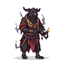

# The Metsik Pagan Cult

The Metsik Cult represents the continuation of ancient Estonian beliefs, a tradition deeply intertwined with the natural world. Their faith, known as Maausk ("Earth belief"), is not a religion of temples and scriptures, but of sacred groves, animistic spirits, and a profound respect for the land.

[ELLEN LUIK](./ellen_luik.md)

---

Wild and unpredictable, drawing power from the ancient forest.

-   **Forest Stalker (Low Threat):** A fast, lightly armored warrior who dual-wields axes. Attempts to flank the player and attacks in flurries.

## Core Beliefs

The cult's beliefs are centered around the idea that all aspects of nature possess a spirit. Forests, rivers, stones, and animals are not mere resources, but living entities deserving of respect and reverence. They do not worship a single, all-powerful deity, but rather a pantheon of nature spirits and ancestors who influence the world.

Key tenets of their faith include:

*   **Animism:** The belief that all natural objects, from the smallest pebble to the mightiest oak, have a soul or spirit.
*   **Ancestor Worship:** The spirits of the dead are believed to watch over their descendants, offering guidance and protection. Funerary rites are designed to ensure a peaceful transition to the afterlife.
*   **Sacred Groves (Hiis):** These are the cult's most holy sites, natural cathedrals where they commune with the spirits and perform their rituals. It is forbidden to harm any living thing within a sacred grove.
*   **Polytheism:** The cult acknowledges a multitude of spirits and deities, with no single entity holding absolute power. Tharapita, a sky and thunder god, is one of the more prominent figures, but is not seen as the sole creator or ruler of the universe.

## Core Belief Systems

The pre-Christian Estonian spiritual landscape was dominated by two primary belief systems that emphasized humanity's connection to the natural world. **Taaraism** centered around the worship of Tharapita, a powerful deity associated with thunder and sky, who was particularly revered by the Oeselians and worshipped in sacred forest groves[2][3]. This tradition represented a more structured form of religious practice within Estonian paganism.

**Maausk**, literally meaning "Earth belief" or "faith of the earth," encompassed a broader collection of animistic practices focused on nature worship[1][2]. Rather than being a formal religion, Maausk represented a comprehensive worldview expressed through verbal traditions, songs, and customs that honored the earth and its natural forces[1]. This belief system reflected the Estonian understanding that divinity resided within nature itself.

## Deities and Spiritual Beings

The Estonian pantheon included several important deities that governed different aspects of life and nature. **Tharapita** stood as one of the most significant gods, described in the Chronicle of Henry of Livonia as originating from a mountain and forest in Virumaa, northern Estonia[3]. This thunder god represented the powerful forces of sky and storm.

Ancient Estonians also recognized a sky and thunder god known as **Uku** or **Ukko**, who was alternatively called **Vanaisa** (Grandfather) or **Taevataat** (Sky Father)[3]. Additionally, proto-Estonian deities may have included **Jumal** or **Taevataat** ("Old man of the sky"), corresponding to similar divine figures recognized by other Finnic peoples[3].

## Sacred Practices and Rituals

Estonian spiritual practices were intimately connected to natural cycles and sacred spaces. Forest groves served as primary locations for worship, where communities gathered to honor their deities in settings that embodied the divine presence they believed resided in nature[2][4]. These sacred spaces often featured **shrines** equipped with large wooden swings and saunas, creating sanctuaries for spiritual practice[1].

**Cremation** played an important role in Estonian death rituals, as evidenced by historical accounts from 1225. Estonians believed that burning the dead would speed their journey to the afterlife and prevent them from becoming dangerous earthbound spirits[3]. This practice reflected their sophisticated understanding of the relationship between the physical and spiritual worlds.

## Seasonal Celebrations and Natural Elements

The celebration of **Midsummer** (Jaanipäev) represented one of the most enduring Estonian traditions, honoring the sun through elaborate bonfires and solar symbols[3]. This solstice festival demonstrated the deep connection between Estonian spirituality and astronomical cycles, a tradition that has survived to the present day.

**Bonfires and elemental traditions** formed central components of Estonian religious practice, reflecting their belief that natural forces possessed spiritual power[1]. Sacred trees, particularly **oak and linden**, were revered as manifestations of divine presence, demanding respect from those who encountered them[2][3].

## Mythological Worldview

Estonian mythology expressed a sophisticated understanding of the relationship between human behavior and natural consequences. Folk tales preserved ancient beliefs through stories where nature actively responded to human actions - lakes would fly away to punish greedy villagers, forests would wander off never to return, and natural features demanded proper respect through gestures like tipping one's hat to trees or feeding coins to holes in the ground[2].

These pre-Christian beliefs demonstrated remarkable resilience, surviving centuries of foreign domination and religious conversion by embedding themselves within Estonian folk culture. Even as Christianity was forcibly introduced in the 13th century, the ancient animistic worldview continued to influence Estonian identity through oral traditions, seasonal celebrations, and a persistent reverence for the natural world that remains characteristic of Estonian culture today.

## Contradictions with Christianity

The arrival of Christian missionaries and crusaders brought the Metsik Cult into direct conflict with the new faith. The core tenets of Maausk are fundamentally incompatible with Christian doctrine, leading to persecution and violence.

The primary points of contention are:

*   **Monotheism vs. Polytheism:** Christianity's insistence on a single, all-powerful God is seen as an affront to the cult's pantheon of nature spirits. The cult views the Christian God as a foreign entity, a usurper who demands exclusive worship.
*   **Sacred Spaces:** The Christians build their churches of stone and wood, while the cult's temples are the ancient forests. The destruction of sacred groves by the crusaders is seen as a sacrilegious act, a desecration of the land itself.
*   **Idolatry:** The Christians accuse the cult of idolatry for their worship of nature and their use of carved wooden idols. The cult, in turn, sees the Christian veneration of saints and relics as a form of idolatry.
*   **Afterlife:** The Christian concepts of Heaven and Hell are alien to the cult's beliefs. They believe in a more cyclical view of life and death, with the spirits of the dead remaining connected to the world of the living.

The Bishopric factions, the Teutonic Order, and the Danish rulers all view the Metsik Cult as a dangerous and heretical force that must be eradicated. For the cult, the struggle against the Christians is not just a religious conflict, but a fight for the survival of their culture, their traditions, and their very way of life.

## **Theological Worldview Conflicts**

Ancient Estonian religion was characterized by **pluralism**, with beliefs in many spirits and fairies who had no hierarchical relationships and embodied different areas of nature[3]. This animistic worldview, where spirits inhabited forests, trees, rocks, and springs without any central authority, stood in direct opposition to Christianity's strict monotheism[1]. While Estonians may have recognized a sky god called **Jumal** or **Taevataat** ("Old man of the sky"), their religious framework accommodated multiple supernatural entities coexisting as equals[5].

Christianity demanded exclusive devotion to one God and rejection of all other spiritual beings as either non-existent or demonic. The Christian concept of a transcendent, all-powerful deity fundamentally contradicted the Estonian understanding of numerous localized nature spirits with limited spheres of influence.

## **Sacred Spaces and Ritual Practices**

The most visible contradiction emerged in approaches to sacred space and worship. Ancient Estonians revered **sacred groves**, particularly oak groves that served as burial sites where deceased ancestors rested among trees[1]. These natural sanctuaries were treated with extraordinary reverence - breaking branches, trampling grass, or cutting trees was strictly prohibited[1]. The groves functioned as centers for unity with nature, where offerings were made to tree-dwelling spirits and supernatural forces.

Christianity replaced these natural sacred spaces with constructed churches and consecrated buildings, viewing the veneration of groves and trees as pagan idolatry. The Christian emphasis on indoor worship in human-built structures directly challenged the Estonian practice of outdoor nature-based spirituality.

## **Ancestral Relationships and Death Practices**

Ancient Estonian beliefs maintained active relationships between the living and the dead through ancestor veneration. People believed deceased ancestors could protect the living, making sacrificial offerings to ancestral souls a central practice[3]. Cremation was employed to speed the dead person's journey to the afterlife and prevent them from becoming dangerous earthbound spirits[5].

Christian doctrine introduced concepts of final judgment, heaven, and hell that rendered ongoing communication with the dead problematic or forbidden. The Christian emphasis on salvation through Christ alone contradicted the Estonian practice of seeking favor and protection from ancestral spirits through continued offerings and rituals.

## **Sacrificial Systems and Religious Authority**

The Estonian sacrificial system involved offerings of food, agricultural products, money, and jewelry to nature spirits and ancestors[1][3]. Particularly significant was **hõbevalge** - silver specks scraped from coins or jewelry that carried special spiritual power[3]. These practices represented direct communication between individuals and spiritual forces without institutional mediation.

Christianity replaced this decentralized system with centralized ecclesiastical authority, sacraments administered by ordained clergy, and rejection of offerings to any beings other than God. The Christian prohibition against "pagan" sacrifices eliminated the ritualistic framework that had previously connected Estonians to their natural and spiritual environment.

## **Seasonal Celebrations and Solar Worship**

Ancient Estonian religious life included solar worship through festivals like Midsummer (**Jaanipäev**), celebrating the sun with bonfires and solar symbols[5]. These celebrations honored natural cycles and cosmic forces as divine manifestations.

Christianity, while eventually accommodating some seasonal observances, fundamentally rejected the worship of natural phenomena as divine. Solar symbols and fire rituals were reinterpreted within Christian symbolism or gradually suppressed as incompatible with monotheistic worship.

Despite these contradictions, the transition was gradual, with some Christian elements present even before official Christianization in the 13th century[2]. The process of religious change involved complex negotiations between indigenous beliefs and Christian doctrine, creating syncretic practices that persisted long after formal conversion.