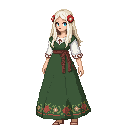

# Ellen Luik

**Visual Description:**
Ellen Luik is a woman in her late thirties, though the weight of her responsibilities makes her appear older. She has a slender, wiry frame, built for moving silently through the dense forests she calls home. Her skin is weathered and tanned from a life spent outdoors, and her face is framed by long, raven-black hair, intricately braided with feathers and small, polished animal bones. Her eyes are a startlingly pale grey, seeming to hold the wisdom of ages and the secrets of the forest.

She wears simple, practical clothing made from natural fibers like linen and wool, dyed in earthy tones of green, brown, and grey. Her tunic is cinched at the waist with a leather belt, from which hang various pouches and talismans. Over this, she wears a heavy, dark green woolen cloak, its edges embroidered with symbols of the spirits she serves. Her feet are clad in soft leather boots, allowing her to tread lightly on the forest floor. She wears no metal jewelry, only adornments of wood, bone, and stone.

**Motivations:**
Ellen's primary motivation is the preservation of the old ways and the protection of her people. She sees the encroachment of Christianity as a direct threat to the spiritual balance of the land and is determined to resist it at all costs. She is not driven by a lust for power, but by a deep sense of duty to the spirits and the ancestors who came before her. She also feels a strong responsibility for the children of her community, seeing them as the future of the cult and the inheritors of their sacred traditions.

**Ties & Relationships:**
*   **Allies:** Her main allies are the spirits of the forest and the members of her cult. She has a deep connection with the natural world and can call upon animal allies to aid her. She may also find common cause with other pagan groups or individuals who resist the authority of the Christian factions.
*   **Enemies:** Her primary enemies are the Bishopric factions, the Teutonic Order, and the Danish rulers. She sees them as invaders who seek to destroy her culture and enslave her people. She is particularly wary of the zealotry of the Teutonic Knights and the political machinations of the bishops.
*   **Initial View of the Main Player:** Ellen will be cautious and reserved when first meeting the player. She will see them as an outsider, a potential threat to her community. However, if the player shows respect for the old ways and proves themselves to be an ally, she may come to see them as a valuable asset in the fight against the Christians.

**History (Biography):**
Ellen was born and raised within the Metsik Cult, identified at a young age as having a strong connection to the spirit world. She was apprenticed to the previous high priestess, learning the ancient rituals, the secrets of herbalism, and the art of communicating with the spirits. When her mentor passed away, Ellen was chosen to take her place, a responsibility she has carried with great solemnity ever since. She has witnessed firsthand the brutality of the Christian crusaders, having lost family and friends in their raids. These experiences have hardened her resolve and fueled her determination to protect her people.

**Daily Routines:**
Ellen's days are spent in service to her community and the spirits. She rises with the sun, performing a daily ritual of thanks to the spirits of the forest. Much of her day is spent foraging for herbs and other natural resources, tending to the sick and injured, and teaching the children the stories and traditions of their people. In the evenings, she often leads the community in rituals and ceremonies, seeking guidance from the spirits and strengthening the bonds of their community.

**Possible Quest Lines:**
*   **The Sacred Grove:** The player could be tasked with helping Ellen protect a sacred grove from being destroyed by the Teutonic Knights. This could involve setting traps, ambushing patrols, or performing a ritual to call upon the spirits of the forest for aid.
*   **The Spirit Animal:** Ellen could guide the player on a vision quest to find their spirit animal, a powerful ally that will grant them new abilities.
*   **The Stolen Idol:** A sacred idol has been stolen from the cult by a rival faction. The player must track down the thieves and recover the idol before it can be desecrated.
*   **The Whispering Fen:** A dark presence has taken root in a nearby swamp, corrupting the land and sickening the local wildlife. Ellen could ask the player to investigate the source of the corruption and cleanse the fen of its evil.
