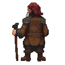

## Old Toomas

A retired blacksmith who sometimes helps out at the forge. He is a man forged by a lifetime of labor and quiet resistance, a living relic of a Reval that is slowly being forgotten.

### Visual Description
Old Toomas is a man in his late sixties, with a body that speaks of a long life spent at the anvil. He is thin and wiry, his frame stooped from years of bending over the forge. His face is a roadmap of wrinkles, etched deep around his kind, pale blue eyes. His hands, though gnarled and calloused, are surprisingly steady. He has a full head of silver-white hair, long and often tied back with a simple leather cord. He wears a simple, homespun linen tunic, its color faded to a soft grey, and dark wool trousers, both patched and worn but impeccably clean. The texture of his clothes is coarse, a testament to a life of practicality over comfort.

### Motivations
- **Preserve the Past:** Toomas is a keeper of stories and traditions. He fears that the old ways, the Estonian language, and the memories of a time before the Germans are being erased. He is motivated to pass on this knowledge to the younger generation.
- **Protect the Community:** He feels a deep sense of responsibility for the people of the lower town, especially the young and vulnerable. He will do anything to protect them from the harsh realities of life under the Livonian Order.
- **A Quiet Rebellion:** While he is too old to fight on the front lines, Toomas believes in the cause of the rebels. He supports the uprising in his own way, through quiet acts of defiance and by providing aid and counsel to those who would fight for freedom.

### Ties & Relationships
- **Allies:**
    - **Kalev (The Player):** Toomas sees a spark of the old spirit in Kalev. He acts as a mentor figure to the player, offering guidance, wisdom, and the occasional cryptic piece of advice. He views Kalev with a mixture of hope and trepidation, knowing the dangerous path that lies ahead of him.
    - **The Black Cloaks:** Toomas is a secret supporter of the urban rebels. He knows their members and provides them with information and a safe place to meet.
- **Enemies:**
    - **The Livonian Order:** He harbors a deep-seated resentment for the Order, seeing them as brutal oppressors who have brought nothing but suffering to his people.
    - **Hanseatic Merchants:** He views the wealthy merchants with suspicion, seeing their greed as another form of oppression.
- **Initial View of the Main Player:** Toomas is initially cautious of Kalev, seeing him as a young man who is yet to be tested. He will offer his help, but only after he is convinced of Kalev's commitment to the cause of the Estonian people.

### History (Biography)
Toomas was born in a small village in Harju county, in a time when the Danish rule was more distant and the old ways were still strong. He moved to Reval as a young man, apprenticed to a German blacksmith. He learned the trade quickly, but he never forgot his roots. He witnessed firsthand the growing power of the Livonian Order and the increasing oppression of his people. He was a young man during the last major uprising and saw many of his friends and family killed. This experience left him with a deep-seated hatred for the German rulers, but also a sense of caution. He has spent his life in Reval, a quiet observer of the city's politics, his forge a meeting place for those who dream of a free Estonia.

### Daily Routines
- **Morning:** Toomas can be found at the forge in the early morning, helping the younger smiths and sharing his knowledge.
- **Afternoon:** He spends his afternoons walking through the lower town, talking to the locals and gathering news. He is a familiar sight at the market, where he listens to the whispers and rumors that circulate among the common folk.
- **Evening:** In the evenings, he can be found in the tavern, nursing a small ale and telling stories of the old days to anyone who will listen.

### Possible Quest Lines
- **The Whispering Anvil:** Toomas asks Kalev to deliver a series of coded messages to members of the Black Cloaks, hidden within seemingly innocuous blacksmithing orders.
- **The Runes of the Forefathers:** Toomas sends Kalev on a quest to find a hidden grove where ancient runestones are located. He believes that the runes hold the key to unlocking a forgotten form of magic that could help the rebellion.
- **A Smith's Legacy:** Toomas asks Kalev to forge a weapon in the old Estonian style, a symbol of their people's defiance. This would be a multi-stage crafting quest, requiring Kalev to gather rare materials and learn ancient smithing techniques from Toomas.
