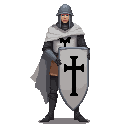
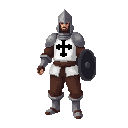
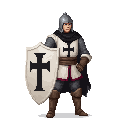
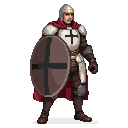
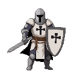
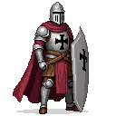

## Rulers
- [[master_burchard_von_dreileben]]
- [[brother_goswin_von_herike]]

## Mobs

### Order Footman

-   **Order Footman (Low Threat):** The backbone of the Order's forces. Wields a sword and shield. Fights defensively, relying on numbers and formation.
    - Abilities: form shields

## Sergeant

    
-   **Order Sergeant (Medium Threat):** A battle-hardened leader. Can perform a shield bash to break the player's poise and shouts commands to buff nearby footmen.
    - Abilities: form swords around them

## Knight

-   **Order Knight (High Threat):** An elite warrior clad in full plate armor. Wields a greatsword or mace, capable of devastating, uninterruptible attacks. Highly resistant to stagger.

![[download-8.png]]

![[download-14.png]]
![[download-15.png]]
![[download-16.png]]
![[download-17.png]]
![[download-18.png]]
![[download-19.png]]

![[teutonic-2.png]]