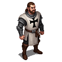

# Brother Goswin von Herike

**Visual Description:**
Brother Goswin von Herike is a man in his early 40s, with a robust and stocky build that speaks of a life of martial discipline. His face is broad and weathered, with a square jaw and a prominent brow. He has close-cropped, light brown hair and intelligent, watchful brown eyes. A thick, well-groomed mustache adorns his upper lip, a common style among the German knights of the era. His expression is typically serious and focused, that of a man accustomed to command and responsibility.

He is dressed in the practical attire of a high-ranking member of the Livonian Order. Over a simple linen shirt, he wears a chainmail hauberk, its steel rings polished and well-maintained. Over the chainmail, he wears a white surcoat, shorter than the ceremonial mantle, made of durable wool and emblazoned with the black cross of the Order. The surcoat is functional, allowing for ease of movement in combat. He wears sturdy leather breeches and tall, thick-soled leather boots. A wide leather belt with a simple iron buckle cinches his waist, from which hangs a sheathed longsword.

**Motivations:**
Goswin von Herike is a man of ambition and duty. He is deeply loyal to the Livonian Order and its mission, but he is also a pragmatist who understands the importance of power and influence. His primary motivation is to rise within the ranks of the Order and leave his mark on its history. He is a skilled administrator and a capable military commander, and he is eager to prove his worth to his superiors. The St. George's Night Uprising is, for him, both a threat and an opportunity—a chance to demonstrate his leadership and crush the enemies of the Order.

**Ties & Relationships:**
*   **Allies:** As the Commander of Viljandi, he has the loyalty of the knights and soldiers under his command. He has a respectful, if somewhat formal, relationship with [Master Burchard von Dreileben](master_burchard_von_dreileben.md) , whom he sees as a mentor and a role model. He also cultivates relationships with other influential commanders within the Order.
*   **Enemies:** His primary enemies are the Estonian rebels, whom he views with a mixture of contempt and frustration. He also sees the Danish nobility and the Hanseatic merchants as rivals, though he is more willing than Master von Dreileben to engage in diplomacy and negotiation with them if it serves his purposes.
*   **Initial View of the Main Player:** He would see the main player as a potential asset or a potential threat. If the player demonstrates skill and loyalty, he would be willing to take them under his wing and use them to further his own ambitions. However, if he suspects the player of disloyalty, he would not hesitate to eliminate them.

**History (Biography):**
Goswin von Herike comes from a noble family in Westphalia with a long tradition of service to the Teutonic Order. He joined the Order at a young age and quickly distinguished himself through his military skill and administrative talents. He served in various capacities throughout Livonia before being appointed as the Commander of Viljandi, one of the most important castles in the region. He played a key role in the administration of Estonia after its acquisition from Denmark, earning a reputation as a capable and efficient governor. He aspires to one day become the Master of the Livonian Order, and he is willing to do whatever it takes to achieve that goal.

**Possible Quest Lines:**
*   **The Commander's Gambit:** The player is tasked by Goswin von Herike with a series of missions designed to undermine his rivals within the Order and strengthen his own position. This would involve a mix of combat, espionage, and political maneuvering.
*   **The Pacification of the North:** The player is sent to a rebellious region of Estonia with a small force of knights and tasked with restoring order. The player would have to choose between using brutal force, as von Herike would prefer, or a more diplomatic approach.
*   **A Knight's Honor:** The player uncovers a conspiracy that threatens to tarnish the reputation of Goswin von Herike. The player must then choose whether to expose the conspiracy and risk the wrath of powerful enemies, or to protect their commander and become complicit in his schemes.
