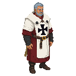

# Master Burchard von Dreileben

**Visual Description:**
Master Burchard von Dreileben is a man in his late 50s, his appearance a direct reflection of a life dedicated to military command and the austere principles of the Livonian Order. He has a tall and lean, yet powerful, figure, standing with an unyielding posture that speaks of authority. His face is long and angular, with high cheekbones and a strong, square jawline. The skin is weathered and leathery from years of exposure to the elements, with deep-set wrinkles around his sharp, piercing pale blue eyes. His hair is silver-grey, cut short and practical, receding slightly at the temples. He is clean-shaven, revealing a firm, resolute mouth that rarely smiles.

He wears the distinctive white mantle of the Teutonic Order, a heavy, coarse wool garment that falls to his ankles. The fabric is a stark, almost blinding white, symbolizing the purity of their mission, and is emblazoned over the left shoulder with a simple, bold black cross. The mantle is well-maintained but practical, showing subtle signs of wear at the hem and cuffs. Beneath the mantle, glimpses of a dark, simple tunic and leather belt can be seen. He wears no jewelry or ornamentation, save for the simple iron ring of the Order on his finger.

**Motivations:**
Master von Dreileben is driven by a deep-seated belief in the divine mission of the Livonian Order. He sees the world in stark terms of order versus chaos, civilization versus paganism. His primary motivation is to expand the influence of the Order, secure its borders, and ensure the complete subjugation of the local populace to the rule of the Church and the Order. He is not merely a religious zealot; he is a pragmatist who understands the necessity of political maneuvering and brutal force to achieve his goals. The St. George's Night Uprising is, in his eyes, a direct challenge to the divine order he represents, and he is determined to crush it decisively to make an example of the rebels.

**Ties & Relationships:**
*   **Allies:** His primary allies are the loyal knights and commanders of the Livonian Order. He commands their respect through his strategic acumen and unwavering resolve. He also maintains a pragmatic, if sometimes tense, relationship with the Bishop of Reval and other key figures in the Church, recognizing the need for a united front against the pagan threat.
*   **Enemies:** His enemies are numerous. He is the primary antagonist to the Estonian rebels, whom he views as little more than savages. He also harbors a deep-seated distrust of the secular Danish nobility and the opportunistic merchants of the Hanseatic League, whom he sees as rivals for power and influence in the region.
*   **Initial View of the Main Player:** He would view the main player with suspicion, regardless of their background. If the player is an Estonian, they are a potential rebel. If they are a foreigner, they are a potential spy or an agent of a rival power. He is not a man who trusts easily, and the player will have to prove their loyalty and usefulness to the Order to gain even a sliver of his confidence.

**History (Biography):**
Burchard von Dreileben has served the Livonian Order for his entire adult life. He rose through the ranks through a combination of military prowess, unwavering faith, and a keen understanding of the complex political landscape of Livonia. He has led numerous campaigns against the pagan tribes, solidifying the Order's control over its territories. A key moment in his career was his leadership in the reconquest of Saaremaa (Oesel) and the subsequent construction of Maasi Castle, a strategic fortress that secured the Order's dominance in the region. This achievement cemented his reputation as a capable and ruthless commander, leading to his eventual election as the Master of the Livonian Order.

**Daily Routines:**
His days are highly structured and disciplined. He begins each day with prayer, followed by meetings with his commanders to review reports from across the Order's territories. He spends a significant portion of his day overseeing the administration of the Order, dealing with matters of logistics, finance, and diplomacy. He is known to personally inspect the training of new recruits and the fortifications of the castles under his command. His evenings are often spent in quiet contemplation or studying maps and military treatises.

**Possible Quest Lines:**
*   **The Iron Fist:** The player is tasked with carrying out a series of ruthless commands from von Dreileben to suppress the rebellion, such as burning villages, executing rebel leaders, and interrogating prisoners. This quest line would force the player to confront the brutal reality of the Order's methods.
*   **A Web of Intrigue:** The player is used as an agent by von Dreileben to uncover plots against the Order from within the ranks of the Danish nobility or the Hanseatic merchants. This would involve espionage, diplomacy, and difficult moral choices.
*   **The Master's Trust:** A longer, more complex quest line where the player, through a series of difficult and dangerous tasks, can slowly earn the trust of Master von Dreileben, eventually becoming one of his key lieutenants. This would provide a unique perspective on the conflict and the inner workings of the Livonian Order.
