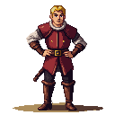

> **Legacy status:** `archive`  
> **Reason:** NPC roster entry outside the seven-character vertical-slice scope.  
> **Current source of truth:** [`README.md`](../../README.md) - Main cast; approved character briefs in [`docs/CHARACTERS/`](../../docs/CHARACTERS/).

## Livonian Order Squire

A young nobleman in training, sent to the forge to have his master's horse shod. He is arrogant and impatient.
