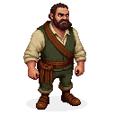

> **Legacy status:** `archive`  
> **Reason:** NPC roster entry outside the seven-character vertical-slice scope.  
> **Current source of truth:** [`README.md`](../../README.md) - Main cast; approved character briefs in [`docs/CHARACTERS/`](../../docs/CHARACTERS/).

## Disgruntled Farmer

A man in his 40s, with a weathered face and a permanent scowl. He complains about the high price of iron and the low price of grain.
