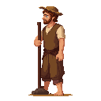

> **Legacy status:** `archive`  
> **Reason:** NPC roster entry outside the seven-character vertical-slice scope.  
> **Current source of truth:** [`README.md`](../../README.md) - Main cast; approved character briefs in [`docs/CHARACTERS/`](../../docs/CHARACTERS/).

## Farmer with a Broken Plow

A man in simple, earth-stained clothes, holding a broken plowshare. He has a worried look and a sun-beaten face.
