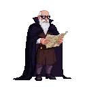

> **Legacy status:** `archive`  
> **Reason:** NPC roster entry outside the seven-character vertical-slice scope.  
> **Current source of truth:** [`README.md`](../../../README.md) - Main cast; approved character briefs in [`docs/CHARACTERS/`](../../../docs/CHARACTERS/).

## Black Cloak Strategist

An older man with a scholarly air, often seen poring over maps and diagrams. He has a long, grey beard and wears spectacles.
