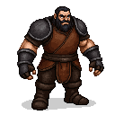

# Jüri Ratnik (Iron Hand)

## Visual Description
Jüri is a mountain of a man in his forties, his physique a testament to a life spent at the forge. He is tall and broad-shouldered, with immense, muscular arms corded from the heavy work of a blacksmith. His hair is short and black, flecked with grey at the temples, and his square-jawed face is set in a perpetually grim expression. His dark eyes are intense and watchful, accustomed to measuring the heat of steel and the intent of men. His hands are large and calloused, permanently stained with soot.

He wears practical, makeshift armor over simple wool clothing. A thick, hardened leather jerkin protects his torso, and he has fashioned crude but effective iron plates to guard his shoulders and forearms. His clothes are dark and functional, chosen for battle, not for comfort. The overall impression is one of raw power and brutal pragmatism.

## Motivations
Jüri's motivation is simple and visceral: vengeance. He is not a politician or a philosopher; he is a warrior who has seen the brutality of the German knights up close. His family suffered directly at the hands of a cruel vassal, and this personal tragedy has fueled a deep, burning hatred for the foreign rulers. He fights not for a grand vision of a future Estonia, but to inflict upon his enemies the same pain they have inflicted upon his people. He believes that freedom can only be won through strength and that the only language the Order understands is that of the sword and the hammer.

## Ties & Relationships
- **Allies:** He is one of the four **Harju Kings**, respected for his military prowess and his unyielding resolve. He commands the most aggressive and battle-hardened warriors in the rebel army. While he respects **Lembit Helme's** wisdom, he often clashes with him over strategy, advocating for direct, violent action over caution and diplomacy.
- **Enemies:** He is infamous among the knights of the **Livonian Order**, who have nicknamed him "Iron Hand." They see him as a savage and a butcher, a dangerous foe who must be met with overwhelming force. His reputation for brutal efficiency makes him a priority target on the battlefield.
- **Initial View of the Main Player (Kalev):** Jüri is skeptical of Kalev. He sees another blacksmith, but he questions whether Kalev has the killer instinct necessary for war. He will test Kalev's strength and courage in battle, judging him by his deeds, not his words or his name. He is looking for a weapon, not a hero, and he needs to know if Kalev can be honed into one.

## History (Biography)
Jüri was once the blacksmith for a manor in Läänemaa. He was a man of peace, content with his work and his family. This changed when the manor's lord, in a fit of drunken rage, had Jüri's younger brother flogged to death for a minor offense. The incident transformed Jüri. He used his forge to create not ploughshares, but a massive war hammer. One night, he stormed the manor house, killed the lord and his personal guards, and fled into the forest. His act of defiance became a local legend, and other desperate and angry men flocked to his side. He became a leader of the rebellion through sheer force of will and battlefield success, his personal quest for vengeance merging with the larger struggle of his people.

## Daily Routines
Jüri's days are dedicated to the art of war. He is the master of the rebel army's training grounds, a muddy field where he drills his warriors relentlessly. He can be found sparring with his men, inspecting weapons, and planning raids. He is a man of few words, his instructions blunt and to the point. He leads by example, always taking the most dangerous position in a fight. He has little patience for the politics of the rebel council and prefers the simple, brutal clarity of the battlefield.

## Possible Quest Lines
- **Anvil and Hammer:** Jüri needs a shipment of high-quality iron ore to forge superior weapons for his elite warriors. He tasks the player with raiding an Order-controlled supply convoy to acquire it.
- **The Iron Hand's Justice:** A village has been collaborating with the Order. Jüri intends to make an example of them, but Lembit Helme fears this will turn the people against the rebellion. The player must navigate this conflict, choosing to either support Jüri's brutal justice or find a less violent solution.
- **A Challenge of Champions:** An arrogant Order knight has challenged the rebels to single combat, mocking their courage. Jüri, seeing a chance to boost morale, asks the player to be the rebel champion, but only after a brutal "test" to prove their worth.
- **Forging a Legend:** Jüri believes the rebellion needs a symbol of its strength. He asks the player to help him retrieve a legendary meteorite from a sacred, and dangerous, ancient site, so he can forge it into a weapon worthy of a king.
