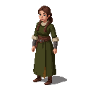

# Kaja Lahekivi (The Messenger)

## Visual Description
Kaja is a young woman in her early twenties, possessing a sharp, intelligent gaze that misses nothing. Her figure is lean and athletic, honed by countless hours spent on horseback. She has long, braided hair the color of dark honey, often kept tied securely to keep it out of her face while riding. Her features are fine, hinting at her noble birth, but her expression is one of fierce determination, not aristocratic softness. Her skin is lightly tanned from the sun and wind.

She has abandoned the fine silks of her past for practical and durable riding clothes. A woman of her era would not wear trousers, so she has adapted her attire for her dangerous work. She typically wears a close-fitting wool kirtle or gown, dyed a practical dark green or brown to blend in with the forests. The gown is sturdy, made for travel rather than court, and features a split skirt, allowing her to ride a horse astride like a man. Underneath, she wears a simple linen chemise. Her boots are high and made of soft, durable leather, protecting her legs on long journeys. The clothes are well-made but functional, often stained with the mud of the road. She moves with a quiet, purposeful grace, her confidence stemming from her competence and conviction, not her lineage.

## Motivations
Kaja is driven by a profound sense of justice and a desire to bridge the gap between the Estonian people and the lower-ranking, but sympathetic, German vassals who are also chafing under the Order's heavy hand. Having grown up in a nobleman's household, she has seen the arrogance and cruelty of the high-ranking lords firsthand and has come to sympathize with the plight of the Estonian peasants. She believes that a just society can only be built on a foundation of mutual respect, and she is willing to risk her life and status to achieve it.

## Ties & Relationships
- **Allies:** She is a trusted lieutenant of **Lembit Helme (The Elder King)** and the primary coordinator of the rebellion's messenger network. She has contacts in both the rebel camps and among certain disaffected minor nobles. Her ability to navigate both worlds makes her an invaluable asset.
- **Enemies:** Her betrayal of her class makes her a particular target of contempt for the Danish and German nobility. To them, she is not just a rebel, but a traitor to her own blood. The **Livonian Order** would see her capture as a major propaganda victory.
- **Initial View of the Main Player (Kalev):** Kaja is pragmatic and observant. She sees Kalev's potential as a warrior and a symbol but is more interested in his character and his ability to think beyond simple vengeance. She will assess whether he is capable of understanding the complex political landscape of the rebellion and whether he can be trusted to act with intelligence and discretion.

## History (Biography)
Kaja is the daughter of a minor German vassal who held a small fiefdom in Läänemaa. She grew up with a foot in two worlds, speaking both German and Estonian. While her father was a stern but fair man, she was exposed to the casual cruelty and disdain that many of his peers showed towards the local population. Her closest childhood friend was an Estonian servant girl, and through her, Kaja came to see the injustice of the system she was born into. When the uprising began, she was faced with a choice. Horrified by the brutality of the Order's response and inspired by the courage of the rebels, she renounced her heritage, stole her father's fastest horse, and rode to join the forces of the Harju Kings, offering her skills as a rider and her knowledge of the land to their cause.

## Daily Routines
Kaja's life is one of constant motion. She rarely stays in one place for long. Her days are spent on the road, carrying messages between the scattered warbands of the rebellion, coordinating movements, and gathering intelligence. She is an expert rider, able to navigate treacherous forest paths and evade Order patrols. When not on the road, she can be found in the rebel camp, poring over maps with Lembit Helme, briefing scouts, or tending to her horse. She is disciplined and focused, knowing that a single delayed message could mean the difference between victory and slaughter.

## Possible Quest Lines
- **The Secret Route:** Kaja needs to establish a new, secret route to smuggle messages to the rebels on Saaremaa. The player must escort her through dangerous, Order-controlled territory to meet with a contact on the coast.
- **A Noble's Plea:** Kaja has received a coded message from a sympathetic minor noble who is trapped in a castle and wants to defect. The player must help her devise a plan to extract the noble and his family.
- **Poisoned Words:** The Order is spreading disinformation and propaganda to turn villages against the rebellion. Kaja tasks the player with intercepting the Order's couriers and replacing their messages with rebel propaganda.
- **The Long Ride:** A vital message must reach a distant rebel warband before a planned Order attack. The player must join Kaja on a desperate, non-stop ride across the countryside, facing ambushes and exhaustion to deliver the warning in time.
