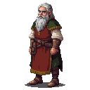

# Lembit Helme (The Elder King)

## Visual Description
Lembit Helme is a man in his early sixties, his face a roadmap of a long and difficult life. He is lean and wiry, with a strength that comes not from bulging muscle but from resilience. His face is deeply wrinkled, particularly around his sharp, intelligent grey eyes that have seen many winters and hold a deep sadness, yet also a flicker of unwavering resolve. A long, flowing white beard reaches his chest, giving him a patriarchal and authoritative presence. His hair is of a similar white, long and often bound by a simple leather strap.

He wears the practical, homespun clothes of a village elder. His attire consists of a dark wool tunic, patched and mended over the years, worn over linen trousers. The colors are those of the earth and forest—dark greens, browns, and greys. He often wears a heavy wool cloak, fastened at the shoulder with a simple bronze pin, to ward off the chill of the Estonian nights. He carries no weapon openly, but his presence alone commands more respect than any sword.

## Motivations
Lembit is driven by a deep, abiding love for his land and his people, and a desire to preserve their ancient traditions. He sees the German lords and the Church not just as oppressors, but as a cultural plague that threatens to erase the Estonian way of life. His motivation is not just for political freedom, but for the survival of his people's soul. He dreams of a day when the sacred groves are once again honored and the songs of his ancestors are sung freely. He is one of the four elected "kings" of the uprising, a title he carries with immense weight and responsibility.

## Ties & Relationships
- **Allies:** He is the most respected of the four **Harju Kings** and acts as their primary spokesman and strategist. He has strong ties to the rural communities and commands the loyalty of the farmers and villagers who make up the bulk of the rebel army. He maintains a secret correspondence with **Martin the Blacksmith** in Reval, relying on him for weapons and intelligence from within the city walls. He is also cautiously open to an alliance with the **Cult of Metsik**.
- **Enemies:** To the **Livonian Order**, he is the face of the rebellion—a dangerous and charismatic leader who must be silenced. Master **Burchard von Dreileben** would see him as the primary target for capture or assassination. The Danish Viceroy also views him as a direct threat to the Crown's authority.
- **Initial View of the Main Player (Kalev):** Lembit sees Kalev as a symbol of a prophecy, a potential "Kalevipoeg" who could unite the people. However, he is a wise and cautious leader. He will observe Kalev's actions, testing his commitment to the cause and his wisdom. He will not grant his trust easily, needing to be convinced that Kalev is more than just a strong arm, but a true leader.

## History (Biography)
Lembit was born in a small village in Harju county. In his youth, he was a farmer, but he quickly became known for his wisdom and his ability to speak. He was chosen as a village elder at a young age and has spent his life mediating disputes, preserving the old traditions, and quietly resisting German encroachment. He witnessed the slow erosion of the old ways, the clearing of sacred groves, and the increasing burden of taxes and tithes. The final catalyst for his move to open rebellion was the desecration of a local holy site by a German knight. He began to travel between villages, his "fire-sermons" in the deep forests igniting the spark of rebellion in the hearts of the people, reminding them of their heritage and their strength. It was his oratory that united the disparate clans of Harju and led to his election as one of the four kings.

## Daily Routines
Lembit's days are consumed with the leadership of the rebellion. He can be found at the main rebel camp, a sprawling, makeshift settlement hidden in the forests. His days are spent in council with the other kings, planning military strategy, meeting with scouts and messengers, and resolving disputes among the rebel fighters. He often walks through the camp, speaking with the men and women, listening to their fears and hopes, and bolstering their morale with his words. He spends his evenings by the fire, studying maps drawn in the dirt and contemplating the difficult choices that lie ahead.

## Possible Quest Lines
- **The Fire Sermon:** The player must escort Lembit to a secret gathering of village elders in a dangerous, Order-patrolled territory, protecting him so he can deliver a speech to convince them to join the uprising.
- **Whispers on the Wind:** Lembit has heard rumors of a new weapon being developed by the Order. He tasks the player with infiltrating an Order-controlled area to gather intelligence on this threat.
- **The King's Council:** The four kings are divided on a crucial strategic decision (e.g., whether to attack a certain castle or seek an alliance with a neutral faction). The player must gather information and persuade the other kings to support Lembit's position.
- **An Alliance of Old and New:** Lembit asks the player to act as an envoy to the Cult of Metsik, to forge a difficult alliance between the more traditional rebels and the chaotic, nature-worshipping cultists.
