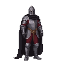
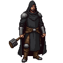

# Lembit Helme (The Blacksmith)

A charismatic blacksmith with a powerful build, often seen with a hammer in hand. He has a determined look, a thick beard, and eyes that burn with rebellious fire. He is a man of action, not words. He is powerfully built, with strong arms and a determined jaw. His face is often smudged with soot, and his clothes are practical and well-worn. He has a ready smile and a quick temper, and he inspires loyalty in those who follow him.
