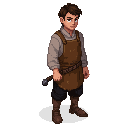

# Martin (The Blacksmith)

## Visual Description
Martin is a young man in his early twenties, lean but wiry, with the defined muscles of an apprentice who has just grown into his full strength. His face is still youthful, often smudged with soot, but his hazel eyes hold a serious, watchful intensity that makes him seem older. He has short, practical brown hair that stays out of his eyes without needing to be tied back.

He wears the simple, functional attire of his trade: a heavy linen shirt, often damp with sweat, dark wool trousers, and a thick leather apron that has saved him from countless burns and scrapes. His clothes are durable and patched, showing signs of constant wear. He moves with a quick, efficient energy, a contrast to the more deliberate power of a master smith.

## Motivations
Martin is motivated by a fierce, youthful idealism. He has grown up hearing the stories of oppression from his elders and believes passionately in the cause of a free Estonia. He sees the rebellion not just as a fight for land, but as a struggle for dignity. He is eager to prove his worth and contribute in any way he can, driven by a desire to build a better future and to be seen as more than just a boy.

## Ties & Relationships
- **Allies:** As a member of the **Black Cloaks**, he is fiercely loyal to the urban rebel cause. He looks up to the more experienced members of the rebellion, seeing them as heroes. He is a skilled smith, and his ability to create and repair weapons makes him a valuable asset.
- **Enemies:** To the city guard and the **Hanseatic League**, he is just another piece of the city's troublesome underclass. They would not see him as a significant threat on his own, which allows him to operate more freely than the known leaders.
- **Initial View of the Main Player (Kalev):** Martin is in awe of Kalev. He sees the legendary name and the smith's strength as a sign of hope. He is eager to please and will follow Kalev's lead without question, looking to him as a mentor and a leader who can turn the tide of the rebellion.

## History (Biography)
Martin was born in Reval's lower town and has known no other life. He was apprenticed to a master blacksmith at a young age and quickly showed a talent for the craft. His master was a quiet sympathizer of the rebel cause, and the forge was a place where whispers of freedom were exchanged over the clang of the hammer. When the uprising began to gather steam, Martin was one of the first to join the Black Cloaks, his youthful energy and skill making him a welcome addition. He has not yet seen open battle, but his commitment to the cause is absolute.

## Daily Routines
By day, Martin works in the forge, performing the duties of an apprentice—manning the bellows, hauling coal, and learning the finer points of the craft. His position allows him to move through the city's lower quarters, observing the movements of guards and merchants. By night, he puts his skills to use for the rebellion, secretly crafting arrowheads, repairing swords, and occasionally joining patrols or acting as a lookout for the Black Cloaks.

## Possible Quest Lines
- **The Apprentice's Test:** A senior member of the Black Cloaks needs a specially crafted item—a unique lockpick or a grappling hook—for a sabotage mission. The player must help Martin acquire the rare materials and forge the item under the nose of the city guard.
- **A Message of Iron:** Martin is tasked with embedding a secret message into the design of a decorative iron gate meant for a merchant known to be a loyalist. The player must help him create the message and install the gate without the merchant discovering the hidden meaning.
- **First Blood:** Martin is assigned to his first real combat mission—an ambush on a small guard patrol. The player can accompany him, acting as a mentor and ensuring the young smith survives his first taste of battle.
- **The Stolen Steel:** A shipment of high-quality steel, meant for the Order, has arrived in the harbor. Martin has a plan to steal a portion of it, and he needs the player's help to create a diversion and transport the heavy materials back to the forge.
