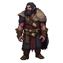

# Urmas Laar (The Seer)

## Visual Description
Urmas is a man of indeterminate age; the harsh life of the marshlands has weathered him in a way that makes him seem both ancient and timeless. He is gaunt and wiry, with long, sinewy limbs. His face is thin, with high cheekbones and a sharp jawline, almost lost beneath a tangle of wild, grey-streaked black hair and a matted beard. His most striking feature is his eyes; they are a pale, almost translucent grey, and seem to be looking at a world beyond the physical. They are unsettling, filled with a fervent, mystical light.

He is draped in a collection of animal skins and furs—wolf, bear, and deer—worn over a simple, dark linen tunic. His clothes are adorned with talismans of bone, feathers, and carved wood. He is the embodiment of the wild, untamed spirit of the land.

## Motivations
Urmas is driven by a divine mission. He is a seer, a mystic who believes he communes with the old gods, particularly Taara. He sees the Christian invaders not merely as political oppressors, but as a spiritual blight that is poisoning the land and silencing the ancient spirits. His motivation is to purge the land of this foreign faith and restore the old ways. He is a zealot, and his conviction is absolute. He believes the uprising is a holy war, a divine instrument to cleanse Estonia.

## Ties & Relationships
- **Allies:** He is one of the four **Harju Kings**, though his role is that of a spiritual guide rather than a political or military leader. He is revered and feared by many of the rural rebels, who believe he can predict the future and call upon the power of the old gods. He has a strong connection with the **Cult of Metsik**, seeing them as the purest adherents to the old ways.
- **Enemies:** To the **Livonian Order** and the Church, Urmas is the epitome of pagan heresy. He is a devil-worshipper, a sorcerer who leads the people astray with demonic visions. He is considered even more dangerous than the other kings, as he fights for the very souls of the people. [Brother Goswin von Herike](order/brother_goswin_von_herike.md) would see his capture and public execution as a paramount objective.
- **Initial View of the Main Player (Kalev):** Urmas sees Kalev through the lens of prophecy. He is immediately convinced that Kalev is the chosen one, the reincarnation of the giant-king destined to save the Estonian people. He will try to guide Kalev, to awaken the latent magical power within him, but his guidance will be cryptic, delivered in riddles and visions. He will be frustrated if Kalev resists his destiny.

## History (Biography)
Urmas was born in the remote eastern marshlands, a place where the old traditions held fast against the tide of Christianity. He was marked from a young age by his visions and his connection to the spirit world. He was apprenticed to the village shaman and learned the ancient rites, the songs of power, and the secrets of the forest. As the influence of the Church grew, he saw the sacred groves cut down and the old ways driven into hiding. He began to preach a message of resistance, a fiery blend of anti-crusader rhetoric and ancient pagan prophecy. His visions of a coming holy war and a promised hero gained him a following, and when the uprising began, he and his followers emerged from the marshes to join the Harju Kings, bringing with them the spiritual fervor that would fuel the rebellion.

## Daily Routines
Urmas's days are spent in ritual and communion with the spirits. He can be found in a secluded part of the rebel camp, tending to a sacred fire, chanting ancient songs, or interpreting omens from the flight of birds or the patterns of smoke. He provides spiritual guidance to the rebel fighters, blessing their weapons and performing rites to protect them in battle. He is often consulted by the other kings for his prophecies, though his cryptic answers are often difficult to decipher. He is a figure of both awe and fear, a man who walks the line between the world of the living and the world of the gods.

## Possible Quest Lines
- **The Sacred Grove:** Urmas needs the player to help him reclaim and reconsecrate a sacred grove that has been desecrated by the Order. This will involve fighting off Order patrols and performing a dangerous ritual to reawaken the grove's ancient power.
- **A Vision of Blood:** Urmas has a vision of a coming battle and sees a weakness in the Order's plan. He gives the player a series of cryptic instructions that, if followed correctly, will lead to a great victory.
- **The Spirit of the Wolf:** To gain the favor of the nature spirits, Urmas sends the player on a spirit quest into the deep wilderness to hunt a legendary wolf and bring back its pelt as an offering.
- **Whispers from the Other Side:** Urmas needs a rare, hallucinogenic mushroom that grows only in the darkest, most dangerous swamps to perform a ritual to speak with the spirits of the fallen kings. The player must brave the treacherous marshes to retrieve it for him.
