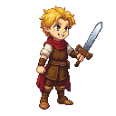

> **Legacy status:** `archive`  
> **Reason:** NPC roster entry outside the seven-character vertical-slice scope.  
> **Current source of truth:** [`README.md`](../../../README.md) - Main cast; approved character briefs in [`docs/CHARACTERS/`](../../../docs/CHARACTERS/).

## Child with a Toy Sword

A young boy who idolizes the blacksmith and often plays with a wooden sword near the forge. He has a mop of blond hair and a cheerful grin.
