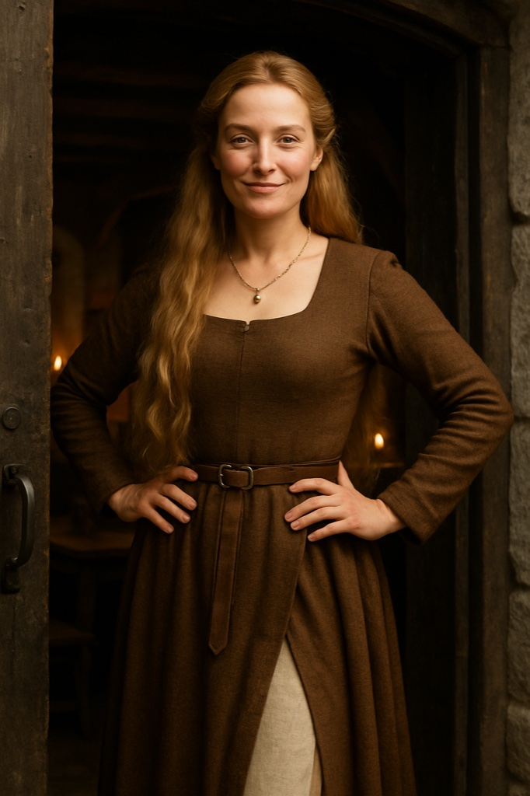

> **Legacy status:** `archive`
> **Reason:** NPC roster entry outside the seven-character vertical-slice scope.
> **Current source of truth:** [`README.md`](../../../README.md) - Main cast; approved character briefs in [`docs/CHARACTERS/`](../../../docs/CHARACTERS/).

# Adelheid

The hostess who greets every guest at the door and remembers every face.

### Visual Description

Adelheid is a woman in her thirties with very long golden-blonde hair and a gold necklace. She wears a belted brown wool gown with a side slit over a linen underdress, and stands with her hands on her hips and a knowing smile.

### Motivations

- **To Know Everyone:** Names and debts are her real currency.
- **To Keep the Peace Between Factions:** Guards, rebels and merchants drink under one roof.

### Ties & Relationships

- **Allies:** Hilde and Katharina; regular merchants.
- **Enemies:** Informers who abuse her hospitality.

### History (Biography)

Once a merchant's widow, Adelheid lost her husband's business to creditors and rebuilt her life by hosting others.

### Daily Routines

Greets arrivals at the door in the evening and settles bills at night.

### In-Game Role & Abilities

Hostess and rumor broker: assigns tables, introduces Kalev to contacts, can warn him of guard raids.

### Animations (planned)

door greet, hands on hips idle, pour, walk, whisper

> Concept portrait replaces a legacy pixel sprite; the new portrait is clothed and period-appropriate. Production task: see the character production epic R-1221.
