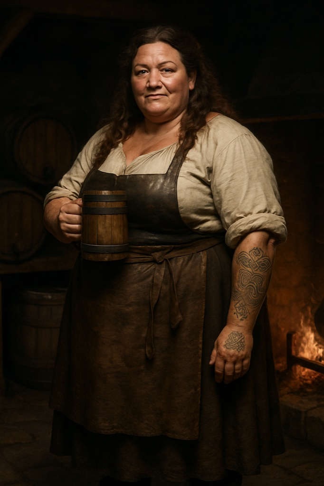

> **Legacy status:** `archive`
> **Reason:** NPC roster entry outside the seven-character vertical-slice scope.
> **Current source of truth:** [`README.md`](../../../README.md) - Main cast; approved character briefs in [`docs/CHARACTERS/`](../../../docs/CHARACTERS/).

# Big Hilde

The tattooed keeper and brewer of the tavern, who rules her hall with a firm hand.

### Visual Description

Hilde is a woman in her forties, broad and strong, with long wavy brown hair and forearms marked with Baltic knotwork tattoos. She wears a white linen blouse with rolled sleeves, a brown wool skirt, a leather apron and sturdy boots, and is rarely seen without a wooden tankard.

### Motivations

- **To Keep Her House Peaceful:** No brawl survives long in Hilde's hall, and she wants it to stay that way.
- **To Brew the Best Ale in Reval:** Her recipes are her pride and her income.

### Ties & Relationships

- **Allies:** Dockworkers and craftsmen who drink in her hall; the smith, who repairs her kettles and hinges.
- **Enemies:** Tax collectors and anyone who waters down her ale.

### History (Biography)

Hilde inherited the brewhouse from her father and turned it into the busiest tavern of the lower town. She has seen the city's moods change with every grain price.

### Daily Routines

Brews at dawn, serves from noon, closes the doors herself at midnight.

### In-Game Role & Abilities

Tavern keeper: sells ale, food and rooms, passes on rumors about guards and the Order, offers brawl-breaker help to Kalev if he has her trust.

### Animations (planned)

idle wipe, pour, carry kegs, break up a fight, laugh

> Concept portrait replaces a legacy pixel sprite; the new portrait is clothed and period-appropriate. Production task: see the character production epic R-1221.
