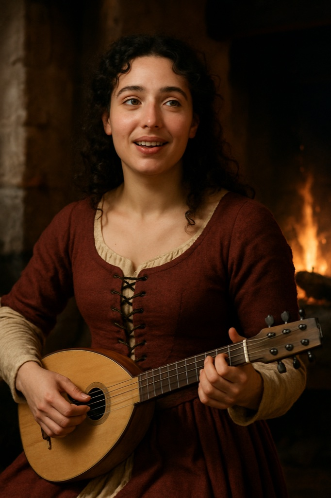

> **Legacy status:** `archive`
> **Reason:** NPC roster entry outside the seven-character vertical-slice scope.
> **Current source of truth:** [`README.md`](../../../README.md) - Main cast; approved character briefs in [`docs/CHARACTERS/`](../../../docs/CHARACTERS/).

# Isolde

A ballad singer who knows every song and every secret whispered after it.

### Visual Description

Isolde is a woman in her mid-twenties with dark curly hair and a warm, expressive face. She wears a burgundy and cream wool dress with a laced bodice and carries a small lute.

### Motivations

- **To Be Remembered:** She wants a song of her own to outlive her.
- **To Collect Stories:** Every drunken confession is a verse in waiting.

### Ties & Relationships

- **Allies:** Hilde; the Blackhead merchants who pay for private songs.
- **Enemies:** Rival minstrels.

### History (Biography)

A cooper's daughter from Lübeck, she followed a troupe to Reval and stayed when the troupe left.

### Daily Routines

Plays at the hearth from dusk until the last guest leaves.

### In-Game Role & Abilities

Bard: her mood songs can calm or stir the tavern crowd; trades gossip for coin.

### Animations (planned)

lute play, sing, bow, idle lean, walk

> Concept portrait replaces a legacy pixel sprite; the new portrait is clothed and period-appropriate. Production task: see the character production epic R-1221.
